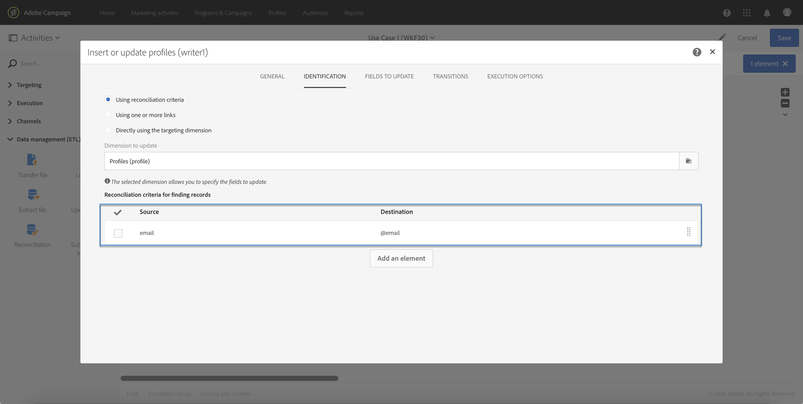

# Calling a workflow with external parameters{#calling-a-workflow-with-external-parameters}

O Campaign Standard permite chamar um fluxo de trabalho com parâmetros (um nome de público-alvo como meta, um nome de arquivo a ser importado, parte do conteúdo da mensagem etc.). Dessa forma, você pode integrar facilmente as automações de campanha com seu sistema externo.

Vejamos o exemplo a seguir, onde queremos enviar emails diretamente de um CMS. Nesse caso, você pode configurar o sistema para selecionar o público-alvo e o conteúdo de email no CMS. Clicar em Enviar irá ligar um fluxo de trabalho da Campanha com esses parâmetros, permitindo usá-los no fluxo de trabalho para definir o público-alvo e o conteúdo do URL para usar na entrega.

O processo para chamar um fluxo de trabalho com parâmetros é o seguinte:

1. Declare the parameters in the **[!UICONTROL External signal]** activity. See [Declaring the parameters in the External signal activity](../../automating/using/calling-a-workflow-with-external-parameters.md#declaring-the-parameters-in-the-external-signal-activity).
1. Configure the **[!UICONTROL End]** activity or the API call to define the parameters and trigger the workflow **[!UICONTROL External signal]** activity.

Após o fluxo de trabalho disparado, os parâmetros são assimilados nas variáveis de eventos do fluxo de trabalho e podem ser usados no fluxo de trabalho. See [Customizing a workflow with external parameters](../../automating/using/calling-a-workflow-with-external-parameters.md#customizing-a-workflow-with-external-parameters).


## Declaring the parameters in the External signal activity {#declaring-the-parameters-in-the-external-signal-activity}

The first step to call a workflow with parameters is to declare them in an **[!UICONTROL External signal]** activity.

1. Open the **[!UICONTROL External signal]** activity, then select the **[!UICONTROL Parameters]** tab.
1. Click the **[!UICONTROL Create element]** button, then specify the name and type of each parameter.

   >[!CAUTION]
   >
   >Make sure that the name and number of parameters are identical to what is defined when calling the workflow (see [Defining the parameters when calling the workflow](../../automating/using/calling-a-workflow-with-external-parameters.md#defining-the-parameters-when-calling-the-workflow)). Além disso, os tipos dos parâmetros devem estar consistentes com os valores esperados.

   

1. Depois que os parâmetros forem declarados, termine a configuração do fluxo de trabalho e execute-a.

## Defining the parameters when calling the workflow {#defining-the-parameters-when-calling-the-workflow}

Esta seção detalha como definir parâmetros ao chamar um fluxo de trabalho. For more on how to perform this operation from an API call, refer to the [REST APIs documentation](https://docs.campaign.adobe.com/doc/standard/en/api/ACS_API.html).

Antes de definir os parâmetros, verifique se:

* The parameters have been declared in the **[!UICONTROL External Signal]** activity. See [Declaring the parameters in the External signal activity](../../automating/using/calling-a-workflow-with-external-parameters.md#declaring-the-parameters-in-the-external-signal-activity).
* O fluxo de trabalho que contém a atividade de sinal está em execução.

To configure the **[!UICONTROL End]** activity, follow the steps below:

1. Open the **[!UICONTROL End]** activity, then select the **[!UICONTROL External signal]** tab.
1. Selecione o fluxo de trabalho e a atividade de sinal externo que deseja chamar.
1. Click the **[!UICONTROL Create element]** button to add a parameter, then fill in its name and value.

   * **[!UICONTROL Name]**: o nome que foi declarado na **[!UICONTROL External signal]** atividade (consulte [Declarar os parâmetros na atividade de sinal Externo](../../automating/using/calling-a-workflow-with-external-parameters.md#declaring-the-parameters-in-the-external-signal-activity)).
   * **[!UICONTROL Value]**: o valor que você deseja atribuir ao parâmetro. The value should follow the **Standard syntax**, described in [this section](../../automating/using/advanced-expression-editing.md#standard-syntax).
   

   >[!CAUTION]
   >
   >Make sure that all the parameters have been declared in the **[!UICONTROL External signal]** activity. Caso contrário, ocorrerá um erro ao executar a atividade.

1. Depois que os parâmetros forem definidos, confirme a atividade e salve seu fluxo de trabalho.

## Monitoring the events variables {#monitoring-the-events-variables}

É possível monitorar as variáveis de eventos disponíveis no fluxo de trabalho, incluindo os parâmetros externos declarados. Para fazer isso, siga as etapas abaixo:

1. Select the activity that follows the **[!UICONTROL External signal]** activity, then click the **[!UICONTROL Log and tasks]** button.
1. In the **[!UICONTROL Tasks]** tab, click  button.

   

1. O contexto de execução da tarefa é exibido (ID, status, duração etc.), incluindo todas as variáveis de eventos que estão disponíveis para uso no fluxo de trabalho.

   

## Customizing a workflow with external parameters {#customizing-a-workflow-with-external-parameters}

Após o fluxo de trabalho disparado, os parâmetros são assimilados nas variáveis de eventos e podem ser usados para personalizar as atividades do fluxo de trabalho.

They can, for example, be used to define which audience to read in the **[!UICONTROL Read audience]** activity, the name of the file to transfer in the **[!UICONTROL Transfer file]** activity, etc.

Activities that can be customized with events variables are detailed in [this section](../../automating/using/calling-a-workflow-with-external-parameters.md#customizing-activities-with-events-variables).

### Using events variables {#using-events-variables}

Events variables are used within an expression that must respect the **[Standard syntax](../../automating/using/advanced-expression-editing.md#standard-syntax)**.

The syntax to use events variables must follow the format below, and use the parameter's name that has been defined in the **[!UICONTROL External signal]** activity (see [Declaring the parameters in the External signal activity](../../automating/using/calling-a-workflow-with-external-parameters.md#declaring-the-parameters-in-the-external-signal-activity)):

```
$(vars/@parameterName)
```

In this syntax, the **$** function returns **string** data type. Se você quiser especificar outro tipo de dados, use as seguintes funções:

* **$ long**: número inteiro.
* **$ float**: número decimal.
* **$ boolean**: verdadeiro/falso.
* **$ datetime**: carimbo de data e hora.

Ao usar uma variável em uma atividade, a interface fornece ajuda para chamá-la.


* : selecione a variável de eventos entre todas as variáveis disponíveis no fluxo de trabalho (consulte).

   

* : expressões de edição que combinam variáveis e funções. For more on the Expression editor, refer to [this section](../../automating/using/advanced-expression-editing.md).

   

**Tópicos relacionados:**

* [Editar uma expressão](../../automating/using/advanced-expression-editing.md#edit-an-expression)
* [Sintaxe padrão](../../automating/using/advanced-expression-editing.md#standard-syntax)
* [Lista de funções](../../automating/using/list-of-functions.md)

### Customizing activities with events variables {#customizing-activities-with-events-variables}

As variáveis de eventos podem ser usadas para personalizar várias atividades, listadas na seção abaixo. For more on how to call a variable from an activity, refer to [this section](../../automating/using/calling-a-workflow-with-external-parameters.md#using-events-variables).

**[!UICONTROL Read audience]** atividade: define o público-alvo para definir metas com base em variáveis de eventos.

For more on how to use the activity, refer to the [dedicated section](../../automating/using/read-audience.md).


**[!UICONTROL Test]** atividade: condições de construção com base em variáveis de eventos.

For more on how to use the activity, refer to the [dedicated section](../../automating/using/test.md).


**[!UICONTROL Transfer file]** atividade: personalize o arquivo para transferir com base em variáveis de eventos.

For more on how to use the activity, refer to the [dedicated section](../../automating/using/transfer-file.md).


**[!UICONTROL Query]** atividade: podem ser referenciados em uma consulta ao usar expressões que combinam variáveis e funções de eventos. To do this, add a rule then click the **[!UICONTROL Advanced mode]** link to access the expression editing window (see [Advanced expression editing](../../automating/using/advanced-expression-editing.md)).

For more on how to use the activity, refer to the [dedicated section](../../automating/using/query.md).


**[!UICONTROL Channels]** atividades: personalizar entregas com base em variáveis de eventos.

>[!NOTE]
>
>Os valores dos parâmetros de entrega são recuperados sempre que a entrega está preparada.
>
>Recurring deliveries preparation is based on the delivery **aggregation period**. Por exemplo, se o período de agregação for "por dia", a entrega será repreparada apenas uma vez por dia. Se o valor de um parâmetro de entrega for modificado durante o dia, ele não será atualizado na entrega, pois já foi preparado uma vez.
>
>If you plan on calling the workflow multiple times a day, use the [!UICONTROL No aggregation] option, so that the delivery parameters are updated each time. For more on recurring deliveries configuration, refer to [this section](/help/automating/using/email-delivery.md#configuration).

Para personalizar uma entrega com base em variáveis de eventos, é necessário declarar primeiro na atividade de entrega as variáveis que você deseja usar:

1. Select the activity, then click the  button to access the settings.
1. Select the **[!UICONTROL General]** tab, then add the events variables that will be available as personalization fields in the delivery.

   

1. Click the **[!UICONTROL Confirm]** button.

Agora, variáveis declaradas estão disponíveis na lista de campos de personalização. Você pode usá-los na entrega para executar as ações abaixo:

* Defina o nome do modelo a ser usado para a entrega.

   >[!NOTE]
   >
   >This action is available for **recurring** deliveries only.

   

* Personalize the delivery: when selecting a personalization field to configure a delivery, events variables are available in the **[!UICONTROL Workflow parameters]** element. Você pode usá-los como qualquer campo de personalização, por exemplo, para definir o assunto da entrega, o remetente etc.

   Delivery personalization is detailed in [this section](../../designing/using/about-personalization.md).

   

**Códigos do segmento**: defina o código do segmento com base em variáveis de eventos.

>[!NOTE]
>
>This action can be performed from any activity that lets you define a segment code like, for example, **[!UICONTROL Query]** or **[!UICONTROL Segmentation]** activities.


**Rótulo de entrega**: definir o rótulo de entrega com base em variáveis de eventos.


## Use case {#use-case}

O caso de uso abaixo mostra como chamar o fluxo de trabalho com parâmetros dentro dos fluxos de trabalho.

O objetivo é acionar um fluxo de trabalho a partir de uma chamada de API com parâmetros externos. Esse fluxo de trabalho carregará os dados no banco de dados a partir de um arquivo e criará um público-alvo associado. Depois que o público-alvo criado, um segundo fluxo de trabalho será acionado para enviar uma mensagem personalizada com os parâmetros externos definidos na chamada da API.

Para executar esse caso de uso, é necessário executar as ações abaixo:

1. **Faça uma chamada de API** para acionar o Fluxo de trabalho 1 com parâmetros externos. See [Step 1: Configuring the API call](../../automating/using/calling-a-workflow-with-external-parameters.md#step-1--configuring-the-api-call).
1. **Criar fluxo de trabalho 1**: o fluxo de trabalho transferirá um arquivo e carregará-o no banco de dados. Em seguida, teste se os dados estão vazios ou não e, eventualmente, salve os perfis em um público-alvo. Finalmente, ele acionará o Fluxo de trabalho 2. See [Step 2: Configuring Workflow 1](../../automating/using/calling-a-workflow-with-external-parameters.md#step-2--configuring-workflow-1).
1. **Criar fluxo de trabalho 2**: o fluxo de trabalho fará uma leitura do público-alvo criado no Workflow 1 e, em seguida, envia uma mensagem personalizada aos perfis, com um código de segmento personalizado com os parâmetros. See [Step 3: Configuring Workflow 2](../../automating/using/calling-a-workflow-with-external-parameters.md#step-3--configuring-workflow-2).


### Prerequisites {#prerequisites}

Before configuring the workflows, you need to create Workflow 1 and 2 with an **[!UICONTROL External signal]** activity in each of them. Dessa forma, você poderá direcionar essas atividades de sinal ao chamar os fluxos de trabalho.

### Step 1: Configuring the API call {#step-1--configuring-the-api-call}

Faça uma chamada de API para acionar o Fluxo de trabalho 1 com parâmetros. For more on the API call syntax, refer to the [Campaign Standard REST APIs documentation](https://docs.campaign.adobe.com/doc/standard/en/api/ACS_API.html).

Em nosso caso, queremos chamar o fluxo de trabalho com os parâmetros abaixo:

* **Filetotarget**: o nome do arquivo que deseja importar para o banco de dados.
* **Discountdesc**: a descrição que queremos exibir na entrega para o desconto.

```
-X POST https://mc.adobe.io/<ORGANIZATION>/campaign/<TRIGGER_URL>
-H 'Authorization: Bearer <ACCESS_TOKEN>' 
-H 'Cache-Control: no-cache' 
-H 'X-Api-Key: <API_KEY>' 
-H 'Content-Type: application/json;charset=utf-8' 
-H 'Content-Length:79' 
-i
-d {
-d "source:":"API",
-d "parameters":{
-d "fileToTarget":"profile.txt",
-d "discountDesc":"Running shoes"
-d } 
```

### Step 2: Configuring Workflow 1 {#step-2--configuring-workflow-1}

O fluxo de trabalho 1 será criado como abaixo:

* **[!UICONTROL External signal]** atividade: onde os parâmetros externos devem ser declarados para serem usados no fluxo de trabalho.
* **[!UICONTROL Transfer file]** atividade: importa o arquivo com o nome definido nos parâmetros.
* **[!UICONTROL Load file]** atividade: carrega dados do arquivo importado para o banco de dados.
* **[!UICONTROL Update data]** atividade: inserir ou atualizar o banco de dados com dados do arquivo importado.
* **[!UICONTROL Test]** atividade: verifica se há dados importados.
* **[!UICONTROL Save audience]** atividade: se o arquivo contiver dados, salve os perfis em um público-alvo.
* **[!UICONTROL End activity]** atividade: chama Fluxo de trabalho 2 com os parâmetros que você deseja usar dentro dele.


Siga as etapas abaixo para configurar o fluxo de trabalho:

1. Declare os parâmetros que foram definidos na chamada da API. To do this, open the **[!UICONTROL External signal]** activity, then add the parameters' names and types.

   

1. Add a **[!UICONTROL Transfer file]** activity to import data into the database.To do this, drag and drop the activity, open it, then select the **[!UICONTROL Protocol]** tab.
1. Select the **[!UICONTROL Use a dynamic file path]** option, then use the **fileToTarget** parameter as the file to transfer:

   ```
   $(vars/@fileToTarget)
   ```

   

1. Carregue os dados do arquivo no banco de dados.

   To do this, drag and drop a **[!UICONTROL Load file]** activity into the workflow, then configure it according to your needs.

1. Insira e atualize o banco de dados com dados do arquivo importado.

   To do this, drag and drop an **[!UICONTROL Update data]** activity, then select the **[!UICONTROL Identification]** tab to add a reconciliation criteria (in our case the **email** field).

   

1. Select the **[!UICONTROL Fields to update]** tab, then specify the fields to update in the database (in our case the **firstname** and **email** fields).

   

1. Verifique se os dados são recuperados do arquivo. To do this, drag and drop a **[!UICONTROL Test]** activity into the workflow, then click the **[!UICONTROL Add an element]** button to add a condition.
1. Dê um nome e defina a condição. Em nosso caso, queremos testar se a transição de saída contém dados com a sintaxe abaixo:

   ```
   $long(vars/@recCount)>0
   ```

   

1. Se os dados são recuperados, salve-os em um público-alvo. To do this, add a **[!UICONTROL Save audience]** activity to the **Target not empty** transition, then open it.
1. Select the **[!UICONTROL Use a dynamic label]** option, then use the **fileToTarget** parameter as the label of the audience:

   ```
   $(vars/@fileToTarget)
   ```

   

1. Drag and drop an **[!UICONTROL End]** activity that will call Workflow 2 with parameters, then open it.
1. Select the **[!UICONTROL External signal]** tab, then specify the workflow to trigger and its associated signal activity.
1. Defina os parâmetros que deseja usar no Workflow 2 e seus valores associados.

   In our case, we want to pass the parameters originally defined in the API call (**fileToTarget** and **discountDesc**), and an additional **segmentCode** parameter with a constant value ("20% discount").

   

O fluxo de trabalho 1 está configurado, agora você pode criar Fluxo de trabalho 2. For more on this, refer to [this section](../../automating/using/calling-a-workflow-with-external-parameters.md#step-3--configuring-workflow-2).

### Step 3: Configuring Workflow 2 {#step-3--configuring-workflow-2}

O fluxo de trabalho 2 será criado como abaixo:

* **[!UICONTROL External signal]** atividade: onde os parâmetros devem ser declarados para serem usados no fluxo de trabalho.
* **[!UICONTROL Read audience]** atividade: lê o público salvo no Workflow 1.
* **[!UICONTROL Email delivery]** atividade: envia uma mensagem recorrente para o público-alvo direcionado, personalizada com parâmetros.


Siga as etapas abaixo para configurar o fluxo de trabalho:

1. Declare os parâmetros que foram definidos no Workflow 1.

   To do this, open the **[!UICONTROL External signal]** activity, then add the name and type of each parameter defined in the **[!UICONTROL End]** activity of Workflow 1.

   

1. Use o público-alvo que foi salvo no Workflow 1. To do this, drag and drop a **[!UICONTROL Read audience]** activity into the workflow, then open it.
1. Select the **[!UICONTROL Use a dynamic audience]** option, then use the **fileToTarget** parameter as the name of the audience to read:

   ```
   $(vars/@fileToTarget)
   ```

   

1. Name the outbound transition according to the **segmentCode** parameter.

   To do this, select the **[!UICONTROL Transition]** tab, then the **[!UICONTROL Use a dynamic segment code]** option.

1. Use the **segmentCode** parameter as the name of the outbound transition:

   ```
   $(vars/@segmentCode)
   ```

   

1. Drag and drop an **[!UICONTROL Email delivery]** activity to send a message to the audience.
1. Identify the parameters to use in the message to personalize it with the **discountDesc** parameter. Para fazer isso, abra as opções avançadas da atividade e adicione o nome e o valor do parâmetro.

   

1. Agora é possível configurar a mensagem. Open the activity, then select **[!UICONTROL Recurring email]**.

   

1. Selecione o modelo a ser usado e defina as propriedades de e-mail de acordo com suas necessidades.
1. Use the **discountDesc** parameter as a personalization field. Para fazer isso, selecione-o na lista de campos de personalização.

   

1. Agora você pode concluir a configuração da mensagem e enviá-la como de costume.

   

### Executing the workflows {#executing-the-workflows}

Depois que os fluxos de trabalho forem criados, você poderá executá-los. Certifique-se de que os dois fluxos de trabalho sejam iniciados antes de executar a chamada da API.
