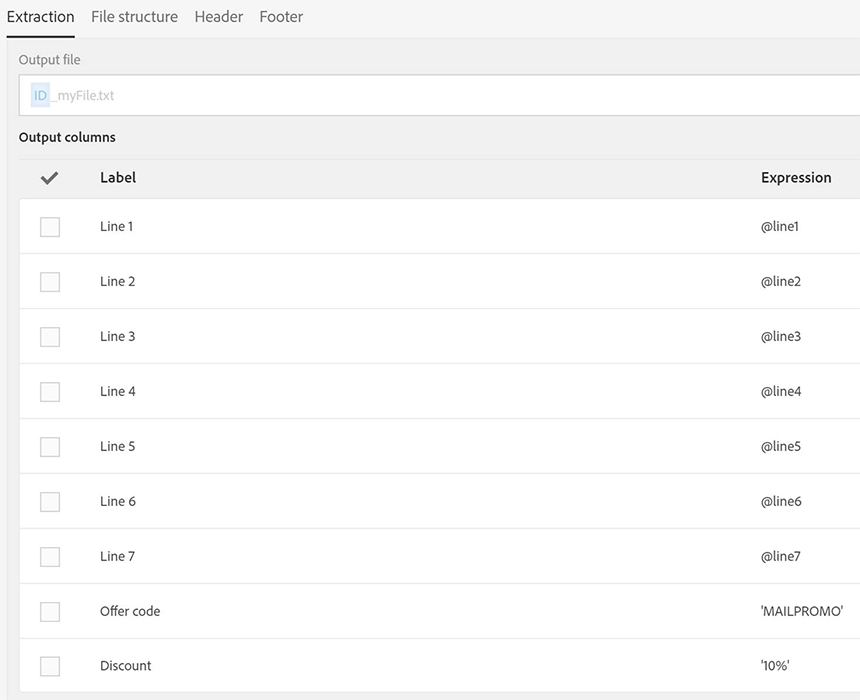
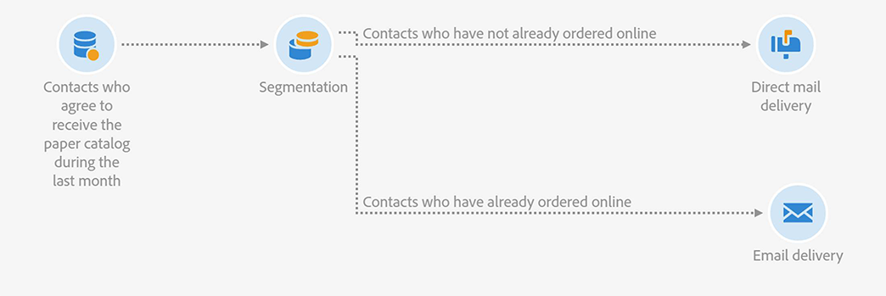

# Junção de entregas de email e de correspondência direta {#coupling-email-direct-mail}

Como comerciante, você pode enviar catálogos por correspondência direta. No catálogo impresso, certas páginas oferecem um desconto de 10% usando um código promocional e um link para comprar o produto no site.

A combinação offline e online é interessante pois alguns clientes preferem visualizar ofertas impressas e fazer pedidos online.

Este é um exemplo de modelo de correspondência direta que pode ser usado para este fim.

Este é um exemplo de fluxo de trabalho que mescla canais de email e correspondência direta.

**Tópicos relacionados:**

* [Atividade de entrega por correspondência direta](../../automating/using/direct-mail-delivery.md)
* [Sobre correspondência direta](../../channels/using/about-direct-mail.md)
