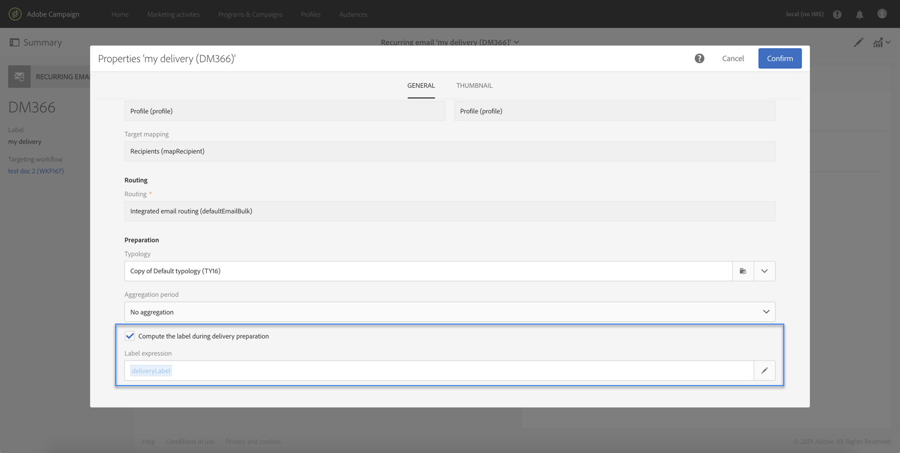

# Customizing a workflow with external parameters {#customizing-a-workflow-with-external-parameters}

Depois que o fluxo de trabalho é acionado, os parâmetros são ingeridos nas variáveis de eventos e podem ser usados para personalizar as atividades do fluxo de trabalho.

Eles podem, por exemplo, ser usados para definir qual audiência ler na **[!UICONTROL Read audience]** atividade, o nome do arquivo a ser transferido na **[!UICONTROL Transfer file]** atividade etc. (see [this page](../../automating/using/customizing-workflow-external-parameters.md)).

## Uso de variáveis de eventos {#using-events-variables}

As variáveis de eventos são usadas em uma expressão que deve respeitar a sintaxe [](../../automating/using/advanced-expression-editing.md#standard-syntax)Padrão.

A sintaxe para usar variáveis de eventos deve seguir o formato abaixo e usar o nome do parâmetro que foi definido na **[!UICONTROL External signal]** atividade (consulte [Declaração dos parâmetros na atividade](../../automating/using/declaring-parameters-external-signal.md)de sinal externo):

```
$(vars/@parameterName)
```

Nessa sintaxe, a função **$** retorna o tipo de dados **de string** . Se desejar especificar outro tipo de dados, use as seguintes funções:

* **$long**: número inteiro.
* **$float**: número decimal.
* **$boolean**: true/false.
* **$datetime**: carimbo de data e hora.

Ao usar uma variável em uma atividade, a interface fornece ajuda para chamá-la.


* : selecione a variável de eventos entre todas as variáveis disponíveis no fluxo de trabalho.

   

* : editar expressões que combinam variáveis e funções (consulte [esta página](../../automating/using/advanced-expression-editing.md)).

   

   Esta lista fornece funções que permitem a execução de filtragem complexa. Essas funções são detalhadas na [presente seção](../../automating/using/list-of-functions.md).

   Além disso, você pode usar as funções abaixo, que estão disponíveis em todas as atividades que permitem usar variáveis de eventos após chamar um fluxo de trabalho com parâmetros externos (consulte [esta seção](../../automating/using/customizing-workflow-external-parameters.md#customizing-activities-with-events-variables)):

   | Nome | Descrição | Sintaxe |
   ---------|----------|---------
   | EndWith | Indica se uma string (primeiro parâmetro) termina com uma string específica (segundo parâmetro). | EndWith(&lt;String>,&lt;String>) |
   | startWith | Indica se um start de string (primeiro parâmetro) com uma string específica (segundo parâmetro). | startWith(&lt;String>,&lt;String>) |
   | Extract | Retorna os primeiros caracteres de uma string usando um separador. | Extract(&lt;String>,&lt;Separador>) |
   | ExtractRight | Retorna os últimos caracteres de uma string usando um separador. | ExtractRight(&lt;String>,&lt;Separador>) |
   | DateFormat | Formata uma data usando o formato especificado no segundo parâmetro (por exemplo:  &#39;%4Y%2M%2D&#39;) | DateFormat(&lt;Date>,&lt;Format>) |
   | FileName | Retorna o nome de um caminho de arquivo. | FileName(&lt;String>) |
   | FileExt | Retorna a extensão de um caminho de arquivo. | FileExt(&lt;String>) |
   | IsNull | Indica se uma string ou uma data é nula. | IsNull(&lt;String/date>) |
   | UrlUtf8Encode | Codifica um URL em UTF8. | UrlUtf8Encode(&lt;String>) |

## Personalização de atividades com variáveis de eventos {#customizing-activities-with-events-variables}

As variáveis de eventos podem ser usadas para personalizar várias atividades, listadas na seção abaixo. Para obter mais informações sobre como chamar uma variável de uma atividade, consulte [esta seção](../../automating/using/customizing-workflow-external-parameters.md#using-events-variables).

**[!UICONTROL Read audience]** atividade: defina a audiência para público alvo com base nas variáveis de eventos. For more on how to use the activity, refer to [this section](../../automating/using/read-audience.md).


**[!UICONTROL Test]** atividade: condições de compilação com base nas variáveis de eventos. For more on how to use the activity, refer to [this section](../../automating/using/test.md).


**[!UICONTROL Transfer file]** atividade: personalize o arquivo a ser transferido com base nas variáveis de eventos. For more on how to use the activity, refer to [this section](../../automating/using/transfer-file.md).


**[!UICONTROL Query]** atividade: parâmetros podem ser referenciados em um query usando as variáveis e funções do evento que combinam o expressão. Para fazer isso, adicione uma regra e clique no **[!UICONTROL Advanced mode]** link para acessar a janela de edição de expressão (consulte Edição [de expressão](../../automating/using/advanced-expression-editing.md)avançada).

For more on how to use the activity, refer to [this section](../../automating/using/query.md).


**[!UICONTROL Channels]** atividades: personalize delivery com base em variáveis de eventos.

>[!NOTE]
>
>Os valores dos parâmetros do delivery são recuperados sempre que o delivery é preparado.
>
>A preparação de delivery recorrentes é baseada no período **de** agregação de delivery. Por exemplo, se o período de agregação for &quot;por dia&quot;, o delivery será repreparado somente uma vez por dia. Se o valor de um parâmetro de delivery for modificado durante o dia, ele não será atualizado no delivery, pois já foi preparado uma vez.
>
>Se você planeja chamar o fluxo de trabalho várias vezes por dia, use a [!UICONTROL No aggregation] opção para que os parâmetros do delivery sejam atualizados sempre. Para obter mais informações sobre a configuração de delivery recorrentes, consulte [esta seção](/help/automating/using/email-delivery.md#configuration).

Para personalizar um delivery com base nas variáveis de eventos, é necessário declarar na atividade do delivery as variáveis que você deseja usar:

1. Selecione a atividade e clique no  botão para acessar as configurações.
1. Selecione a **[!UICONTROL General]** guia e adicione as variáveis de eventos que estarão disponíveis como campos de personalização no delivery.

   

1. Clique no botão **[!UICONTROL Confirm]**.

As variáveis de eventos declaradas agora estão disponíveis na lista de campos de personalização. Você pode usá-los no delivery para executar as ações abaixo:

* Defina o nome do modelo a ser usado para o delivery.

   >[!NOTE]
   >
   >Esta ação está disponível somente para delivery **recorrentes** .

   

* Personalize o delivery: ao selecionar um campo de personalização para configurar um delivery, as variáveis de eventos estão disponíveis no **[!UICONTROL Workflow parameters]** elemento. É possível usá-los como qualquer campo de personalização, por exemplo, para definir o assunto do delivery, o remetente etc.

   Delivery personalization is detailed in [this section](../../designing/using/personalization.md).

   

**Códigos de segmento**: defina o código de segmento com base nas variáveis de eventos.

>[!NOTE]
>
>Essa ação pode ser executada a partir de qualquer atividade que permita definir um código de segmento como, por exemplo, **[!UICONTROL Query]** ou **[!UICONTROL Segmentation]** atividades.


**Etiqueta** do delivery: defina o rótulo do delivery com base nas variáveis de eventos.


