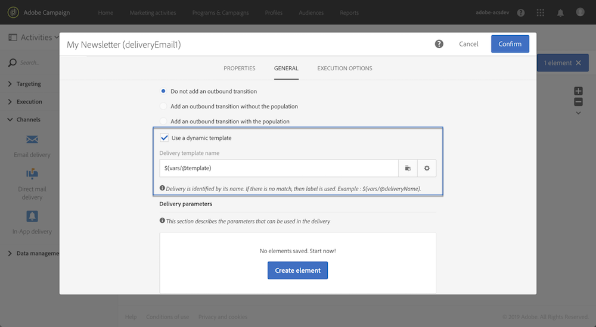

# Personalização de um workflow com parâmetros externos {#customizing-a-workflow-with-external-parameters}

Depois que o fluxo de trabalho é acionado, os parâmetros são assimilados nas variáveis de eventos e podem ser usados para personalizar as atividades do fluxo de trabalho.

Eles podem, por exemplo, ser usados para definir qual público-alvo ler na variável **[!UICONTROL Read audience]** atividade, o nome do arquivo a ser transferido na variável **[!UICONTROL Transfer file]** atividade, etc. (consulte [esta página](../../automating/using/customizing-workflow-external-parameters.md)).

## Uso de variáveis de eventos {#using-events-variables}

As variáveis de eventos são usadas em uma expressão que deve respeitar a [Sintaxe padrão](../../automating/using/advanced-expression-editing.md#standard-syntax).

A sintaxe para usar variáveis de eventos deve seguir o formato abaixo e usar o nome do parâmetro definido na variável **[!UICONTROL External signal]** atividade (consulte [Declaração dos parâmetros na atividade de sinal externo](../../automating/using/declaring-parameters-external-signal.md)):

```
$(vars/@parameterName)
```

Nesta sintaxe, o parâmetro **$** função retorna **string** tipo de dados. Se quiser especificar outro tipo de dados, use as seguintes funções:

* **$long**: número inteiro.
* **$float**: número decimal.
* **$booleano**: verdadeiro/falso.
* **$datetime**: carimbo de hora.

Ao usar uma variável em uma atividade do, a interface fornece ajuda para chamá-la.


* : selecione a variável events entre todas as variáveis disponíveis no workflow.

  

* : edite as expressões que combinam variáveis e funções (consulte [esta página](../../automating/using/advanced-expression-editing.md)).

  

  Essa lista fornece funções que permitem fazer uma filtragem complexa. Essas funções estão detalhadas em [nesta seção](../../automating/using/list-of-functions.md).

  Além disso, você pode usar as funções abaixo, que estão disponíveis em todas as atividades que permitem usar variáveis de eventos depois de chamar um workflow com parâmetros externos (consulte [nesta seção](../../automating/using/customizing-workflow-external-parameters.md#customizing-activities-with-events-variables)):

  | Nome | Descrição | Sintaxe |
  | ---------|----------|---------|
  | EndWith | Indica se uma cadeia de caracteres (primeiro parâmetro) termina com uma cadeia de caracteres específica (segundo parâmetro). | EndWith()&lt;string>,&lt;string>) |
  | startWith | Indica se uma string (primeiro parâmetro) começa com uma string específica (segundo parâmetro). | startWith(&lt;string>,&lt;string>) |
  | Extract | Retorna os primeiros caracteres de uma cadeia de caracteres usando um separador. | Extract(&lt;string>,&lt;separator>) |
  | ExtractRight | Retorna os últimos caracteres de uma cadeia de caracteres usando um separador. | ExtractRight(&lt;string>,&lt;separator>) |
  | DateFormat | Formata uma data usando o formato especificado no segundo parâmetro (exemplo: &#39;%4Y%2M%2D&#39;) | DateFormat(&lt;date>,&lt;format>) |
  | NomeArquivo | Retorna o nome de um caminho de arquivo. | NomeArquivo(&lt;string>) |
  | FileExt | Retorna a extensão de um caminho de arquivo. | FileExt(&lt;string>) |
  | GetOption | Retorna o valor da função especificada. | GetOption()&lt;optionname>) |
  | IsNull | Indica se uma cadeia de caracteres ou uma data é nula. | IsNull(&lt;string date=&quot;&quot;>) |
  | UrlUtf8Encode | Codifica um URL em UTF8. | UrlUtf8Encode(&lt;string>) |

## Personalização de atividades com variáveis de eventos {#customizing-activities-with-events-variables}

As variáveis de eventos podem ser usadas para personalizar várias atividades, listadas na seção abaixo. Para obter mais informações sobre como chamar uma variável de uma atividade, consulte [nesta seção](../../automating/using/customizing-workflow-external-parameters.md#using-events-variables).

**[!UICONTROL Read audience]** atividade: definir o público-alvo para direcionamento com base nas variáveis de eventos. Para obter mais informações sobre como usar a atividade, consulte [nesta seção](../../automating/using/read-audience.md).


**[!UICONTROL Test]** atividade: criar condições com base nas variáveis de eventos. Para obter mais informações sobre como usar a atividade, consulte [nesta seção](../../automating/using/test.md).


**[!UICONTROL Transfer file]** atividade: personalizar o arquivo a ser transferido com base nas variáveis de eventos. Para obter mais informações sobre como usar a atividade, consulte [nesta seção](../../automating/using/transfer-file.md).


**[!UICONTROL Query]** atividade: os parâmetros podem ser referenciados em um query, usando expressões que combinam variáveis de eventos e funções. Para fazer isso, adicione uma regra e clique no link **[!UICONTROL Advanced mode]** para acessar a janela de edição de expressões (consulte [Edição de expressão avançada](../../automating/using/advanced-expression-editing.md)).

Para obter mais informações sobre como usar a atividade, consulte [nesta seção](../../automating/using/query.md).


**[!UICONTROL Channels]** atividades: personalize deliveries com base nas variáveis de eventos.

>[!NOTE]
>
>Os valores dos parâmetros de delivery são recuperados toda vez que o delivery é preparado.
>
>A preparação de deliveries recorrentes é baseada no delivery **período de agregação**. Por exemplo, se o período de agregação for &quot;por dia&quot;, o delivery será preparado novamente apenas uma vez por dia. Se o valor de um parâmetro de delivery for modificado durante o dia, ele não será atualizado no delivery, pois já foi preparado uma vez.
>
>Se você planeja chamar o workflow várias vezes por dia, use o [!UICONTROL No aggregation] para que os parâmetros de delivery sejam atualizados todas as vezes. Para obter mais informações sobre a configuração de deliveries recorrentes, consulte [nesta seção](/help/automating/using/email-delivery.md#configuration).

Para personalizar um delivery com base em variáveis de eventos, primeiro declare na atividade do delivery as variáveis que deseja usar:

1. Selecione a atividade e clique no botão  botão para acessar as configurações.
1. Selecione o **[!UICONTROL General]** e adicione as variáveis de eventos que estarão disponíveis como campos de personalização no delivery.

   

1. Clique no botão **[!UICONTROL Confirm]**.

As variáveis de eventos declarados agora estão disponíveis na lista de campos de personalização. Você pode usá-los no delivery para executar as ações abaixo:

* Defina o nome do template a ser usado para o delivery.

  >[!NOTE]
  >
  >Esta ação está disponível para **recorrente** somente deliveries.

  

* Personalizar o delivery: ao selecionar um campo de personalização para configurar um delivery, as variáveis de eventos estão disponíveis no **[!UICONTROL Workflow parameters]** elemento. Você pode usá-los como qualquer campo de personalização, por exemplo, para definir o assunto do delivery, o remetente etc.

  A personalização da entrega é detalhada em [nesta seção](../../designing/using/personalization.md).

  

**Códigos de segmento**: defina o código de segmento com base nas variáveis de eventos.

>[!NOTE]
>
>Essa ação pode ser executada a partir de qualquer atividade que permite definir um código de segmento como, por exemplo, **[!UICONTROL Query]** ou **[!UICONTROL Segmentation]** atividades.


**Rótulo de entrega**: defina o rótulo do delivery com base nas variáveis de eventos.


