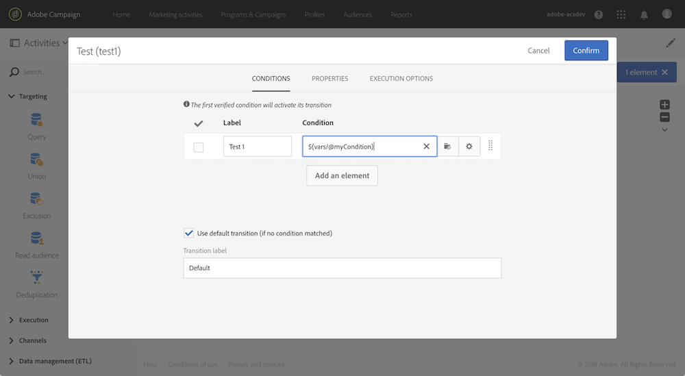

# Personalização de um workflow com parâmetros externos {#customizing-a-workflow-with-external-parameters}

Depois que o fluxo de trabalho é acionado, os parâmetros são assimilados nas variáveis de eventos e podem ser usados para personalizar as atividades do fluxo de trabalho.

Elas podem, por exemplo, ser usadas para definir qual público-alvo deve ler na **[!UICONTROL Read audience]** atividade , o nome do arquivo a ser transferido no **[!UICONTROL Transfer file]** atividade, etc. (consulte [esta página](../../automating/using/customizing-workflow-external-parameters.md)).

## Uso de variáveis de eventos {#using-events-variables}

As variáveis de eventos são usadas em uma expressão que deve respeitar a variável [Sintaxe padrão](../../automating/using/advanced-expression-editing.md#standard-syntax).

A sintaxe para usar as variáveis de eventos deve seguir o formato abaixo e usar o nome do parâmetro que foi definido na variável **[!UICONTROL External signal]** atividade (consulte [Declaração dos parâmetros na atividade External signal](../../automating/using/declaring-parameters-external-signal.md)):

```
$(vars/@parameterName)
```

Nesta sintaxe, a variável **$** retornos da função **string** tipo de dados. Se quiser especificar outro tipo de dados, use as seguintes funções:

* **$long**: número inteiro.
* **$float**: número decimal.
* **$boolean**: true/false.
* **$datetime**: timestamp.

Ao usar uma variável em uma atividade, a interface fornece ajuda para chamá-la.


* : selecione a variável events entre todas as variáveis disponíveis no workflow.

   

* : editar expressões combinando variáveis e funções (consulte [esta página](../../automating/using/advanced-expression-editing.md)).

   

   Esta lista fornece funções que permitem fazer uma filtragem complexa. Essas funções são detalhadas em [esta seção](../../automating/using/list-of-functions.md).

   Além disso, é possível usar as funções abaixo, que estão disponíveis em todas as atividades que permitem usar variáveis de eventos após chamar um workflow com parâmetros externos (consulte [esta seção](../../automating/using/customizing-workflow-external-parameters.md#customizing-activities-with-events-variables)):

   | Nome | Descrição | Sintaxe |
   | ---------|----------|---------|
   | EndWith | Indica se uma string (primeiro parâmetro) termina com uma string específica (segundo parâmetro). | EndWith(&lt;string>,&lt;string>) |
   | startWith | Indica se uma string (primeiro parâmetro) começa com uma string específica (segundo parâmetro). | startWith(&lt;string>,&lt;string>) |
   | Extract | Retorna os primeiros caracteres de uma string usando um separador. | Extract(&lt;string>,&lt;separator>) |
   | ExtractRight | Retorna os últimos caracteres de uma string usando um separador. | ExtractRight(&lt;string>,&lt;separator>) |
   | DateFormat | Formata uma data usando o formato especificado no segundo parâmetro (por exemplo: &#39;%4Y%2M%2D&#39;) | DateFormat(&lt;date>,&lt;format>) |
   | FileName | Retorna o nome de um caminho de arquivo. | FileName(&lt;string>) |
   | FileExt | Retorna a extensão de um caminho de arquivo. | FileExt(&lt;string>) |
   | GetOption | Retorna o valor da função especificada. | GetOption(&lt;optionname>) |
   | IsNull | Indica se uma string ou uma data é nula. | IsNull(&lt;string date=&quot;&quot;>) |
   | UrlUtf8Encode | Codifica um URL em UTF8. | UrlUtf8Encode(&lt;string>) |

## Personalização de atividades com variáveis de eventos {#customizing-activities-with-events-variables}

As variáveis de Eventos podem ser usadas para personalizar várias atividades, listadas na seção abaixo. Para obter mais informações sobre como chamar uma variável de uma atividade, consulte [esta seção](../../automating/using/customizing-workflow-external-parameters.md#using-events-variables).

**[!UICONTROL Read audience]** atividade : defina o público-alvo com base nas variáveis de eventos. Para obter mais informações sobre como usar a atividade , consulte [esta seção](../../automating/using/read-audience.md).


**[!UICONTROL Test]** atividade : crie condições com base nas variáveis de eventos. Para obter mais informações sobre como usar a atividade , consulte [esta seção](../../automating/using/test.md).



**[!UICONTROL Transfer file]** atividade : personalize o arquivo a ser transferido com base nas variáveis de eventos. Para obter mais informações sobre como usar a atividade , consulte [esta seção](../../automating/using/transfer-file.md).


**[!UICONTROL Query]** atividade : parâmetros podem ser referenciados em uma query usando expressões que combinam variáveis e funções de eventos. Para fazer isso, adicione uma regra e clique no botão **[!UICONTROL Advanced mode]** link para acessar a janela de edição de expressão (consulte [Edição de expressão avançada](../../automating/using/advanced-expression-editing.md)).

Para obter mais informações sobre como usar a atividade , consulte [esta seção](../../automating/using/query.md).


**[!UICONTROL Channels]** atividades: personalize deliveries com base em variáveis de eventos.

>[!NOTE]
>
>Os valores dos parâmetros de delivery são recuperados toda vez que o delivery for preparado.
>
>A preparação de deliveries recorrentes é baseada no delivery **período de agregação**. Por exemplo, se o período de agregação for &quot;por dia&quot;, o delivery será repreparado apenas uma vez por dia. Se o valor de um parâmetro de delivery for modificado durante o dia, ele não será atualizado no delivery, pois já foi preparado uma vez.
>
>Se você planeja chamar o workflow várias vezes por dia, use a variável [!UICONTROL No aggregation] para que os parâmetros de delivery sejam atualizados sempre. Para obter mais informações sobre a configuração de deliveries recorrentes, consulte [esta seção](/help/automating/using/email-delivery.md#configuration).

Para personalizar um delivery com base nas variáveis de eventos, primeiro declare na atividade de delivery as variáveis que deseja usar:

1. Selecione a atividade e clique no botão  para acessar as configurações.
1. Selecione o **[!UICONTROL General]** , em seguida, adicione as variáveis de eventos que estarão disponíveis como campos de personalização no delivery.

   

1. Clique no botão **[!UICONTROL Confirm]**.

As variáveis de eventos declaradas agora estão disponíveis na lista de campos de personalização. Você pode usá-los no delivery para executar as ações abaixo:

* Defina o nome do template a ser usado para o delivery.

   >[!NOTE]
   >
   >Esta ação está disponível para **recorrente** somente deliveries.

   

* Personalize o delivery: ao selecionar um campo de personalização para configurar um delivery, as variáveis de eventos são disponibilizadas na variável **[!UICONTROL Workflow parameters]** elemento. Você pode usá-los como qualquer campo de personalização, por exemplo, para definir o assunto do delivery, o remetente etc.

   A personalização do delivery é detalhada em [esta seção](../../designing/using/personalization.md).

   

**Códigos de segmento**: defina o código do segmento com base nas variáveis de eventos.

>[!NOTE]
>
>Essa ação pode ser executada de qualquer atividade que permita definir um código de segmento como, por exemplo, **[!UICONTROL Query]** ou **[!UICONTROL Segmentation]** atividades.


**Rótulo da entrega**: defina o rótulo do delivery com base nas variáveis de eventos.


