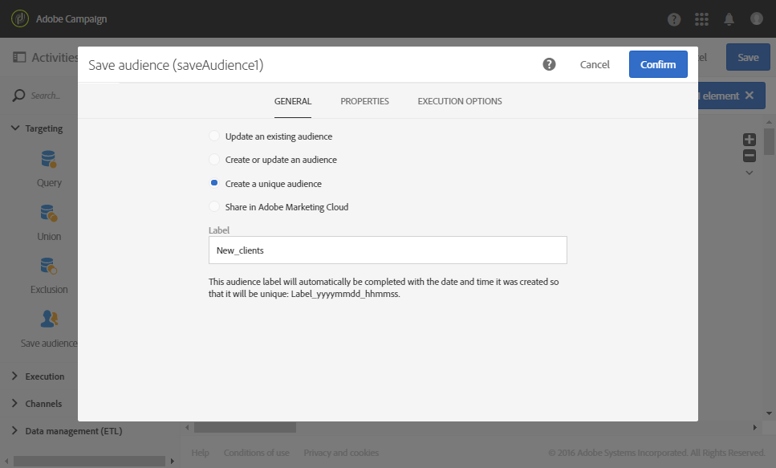

# Atualização de dados usando reconciliação {#data-update-reconciliation}

O exemplo a seguir demonstra um fluxo de trabalho que cria um público-alvo de perfis diretamente de um arquivo importado que contém novos clientes. Ele é composto pelas seguintes atividades:


* A [Carregar arquivo](../../automating/using/load-file.md) atividade, que carrega e detecta os dados do arquivo a ser importado. O arquivo importado contém os seguintes dados:

   ```
   lastname;firstname;email;dateofbirth
   jackman;megan;megan.jackman@testmail.com;07/08/1975
   phillips;edward;phillips@testmail.com;09/03/1986
   weaver;justin;justin_w@testmail.com;11/15/1990
   martin;babeth;babeth_martin@testmail.net;11/25/1964
   reese;richard;rreese@testmail.com;02/08/1987
   cage;nathalie;cage.nathalie227@testmail.com;07/03/1989
   xiuxiu;andrea;andrea.xiuxiu@testmail.com;09/12/1992
   grimes;daryl;daryl_890@testmail.com;12/06/1979
   tycoon;tyreese;tyreese_t@testmail.net;10/08/1971
   ```

* A [Reconciliação](../../automating/using/reconciliation.md) atividade, que vincula cada coluna do arquivo carregado a uma coluna de dimensão de perfil. Os registros de arquivo que não podem ser identificados (dados ausentes, tipos de dados incompatíveis etc.) são ignorados para preservar a integridade dos dados finais do público-alvo.

   

* A [Salvar público-alvo](../../automating/using/save-audience.md) atividade, que salva o público-alvo dos perfis.

   
