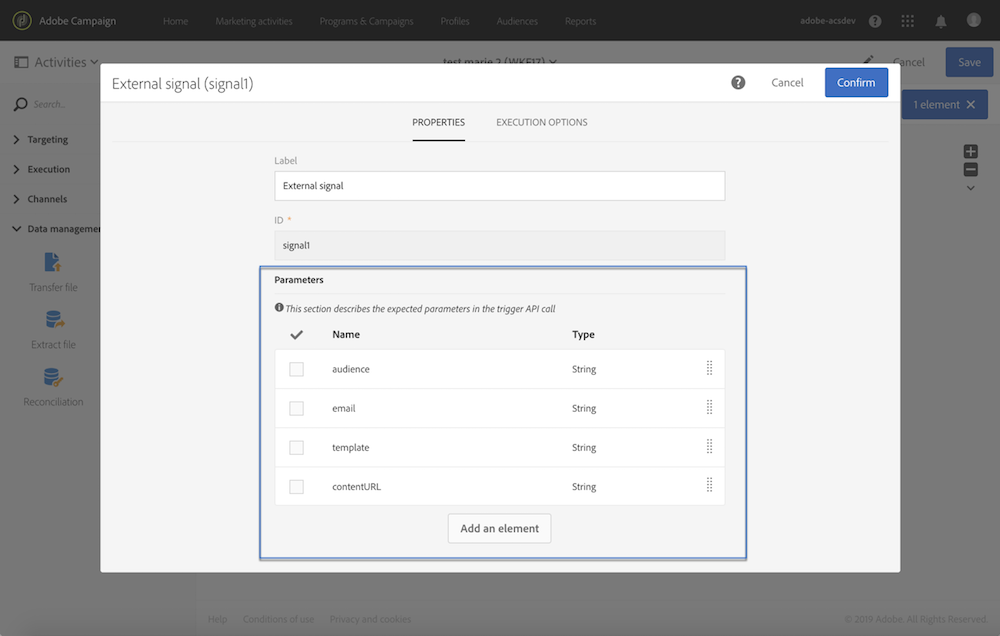

# Declaração dos parâmetros na atividade de sinal externo {#declaring-the-parameters-in-the-external-signal-activity}

A primeira etapa para chamar um fluxo de trabalho com parâmetros é declará-los em uma atividade **[!UICONTROL External signal]**.

1. Abra a atividade **[!UICONTROL External signal]** e selecione a guia **[!UICONTROL Parameters]**.
1. Clique no botão **[!UICONTROL Create element]** e especifique o nome e o tipo de cada parâmetro.

   >[!CAUTION]
   >
   >Verifique se o nome e a quantidade de parâmetros são idênticos ao definido ao chamar o fluxo de trabalho (consulte [esta página](../../automating/using/defining-parameters-calling-workflow.md)). Além disso, os tipos de parâmetros devem ser consistentes com os valores esperados.

   

1. Depois que os parâmetros forem declarados, conclua a configuração do workflow e execute-o.
