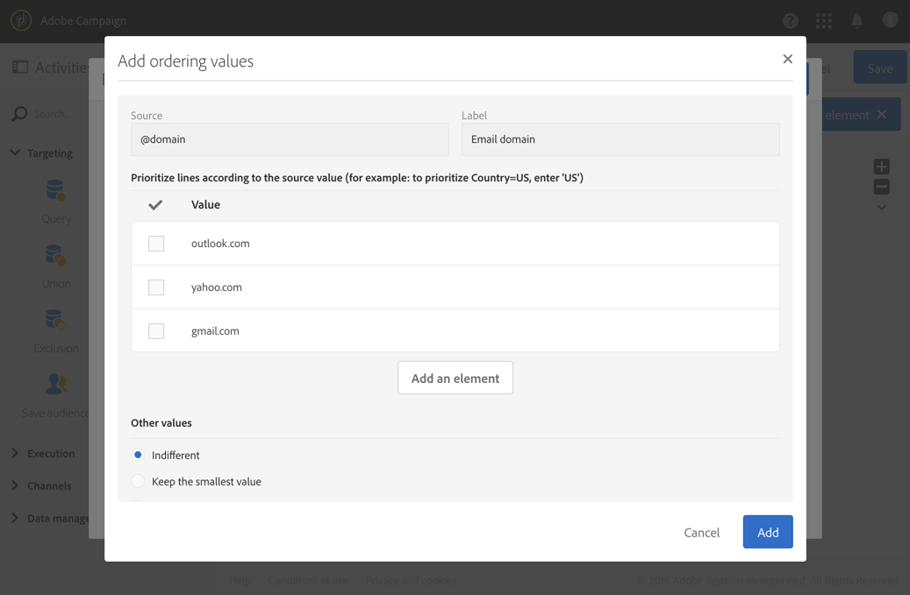

# Eliminação de duplicação{#deduplication}

## Descrição {#description}


A **[!UICONTROL Deduplication]** atividade permite excluir duplicados nos resultados das atividades de entrada.

## Contexto de utilização {#context-of-use}

A **[!UICONTROL Deduplication]** atividade é geralmente usada após atividades de definição de metas ou após a importação de um arquivo e antes das atividades que permitem o uso de dados direcionados.

Durante o desduplicação-duplicado, as transições de entrada são processadas separadamente. Por exemplo, se o perfil &#39;A&#39; estiver presente no resultado do query 1 e também no resultado do query 2, ele não será desduplicado.

Por conseguinte, é aconselhável que um desduplicação-duplicado tenha apenas uma transição de entrada. Para fazer isso, você pode combinar seus diferentes query usando atividades que correspondam às suas necessidades de direcionamento, como uma atividade de união, uma atividade de interseção etc. Por exemplo:


## Configuração {#configuration}

Para configurar uma atividade desduplicação-duplicada, é necessário inserir um rótulo, o método e os critérios desduplicação-duplicados, bem como as opções relacionadas ao resultado.

1. Arraste e solte uma **[!UICONTROL Deduplication]** atividade no seu fluxo de trabalho.
1. Selecione a atividade e abra-a usando o  botão das ações rápidas que aparecem.

   

1. Selecione o **[!UICONTROL Resource type]** objeto do desduplicação-duplicado:

   * **[!UICONTROL Database resource]** se o desduplicação-duplicado for realizado com dados que já existem na base de dados. Selecione o **[!UICONTROL Filtering dimension]** e o **[!UICONTROL Targeting dimension]**, dependendo dos dados que você deseja desduplicar. Por padrão, é desduplicação-duplicado nos **perfis**.
   * **[!UICONTROL Temporary resource]** se o desduplicação-duplicado for executado nos dados temporários do fluxo de trabalho: selecione os dados **[!UICONTROL Targeted set]** que contêm os dados a serem desduplicados. Esse caso de uso pode ser encontrado após a importação de um arquivo ou se os dados no banco de dados foram enriquecidos (com um código de segmento, por exemplo).

1. Selecione o **[!UICONTROL Number of unique records to keep]**. O valor padrão para esse campo é 1. O valor 0 permite manter todos os duplicados.

   Por exemplo, se os registros A e B forem considerados duplicados do registro Y e um registro C for considerado um duplicado do registro Z:

   * Se o valor do campo for 1: apenas os registros Y e Z são mantidos.
   * Se o valor do campo for 0: todos os registros são mantidos.
   * Se o valor do campo for 2: os registros C e Z são mantidos e dois registros de A, B e Y são mantidos, por acaso ou em função do método desduplicação-duplicado selecionado posteriormente.

1. Defina os **[!UICONTROL Duplicate identification]** critérios adicionando condições na lista fornecida. Especifique os campos e/ou expressões cujos valores idênticos permitem a identificação dos duplicados: endereço de email, nome, sobrenome etc. A ordem das condições permite que você especifique as condições para serem processadas primeiro.
1. Na lista suspensa, selecione a opção **[!UICONTROL Deduplication method]** a ser usada:

   * **[!UICONTROL Choose for me]**: seleciona aleatoriamente o registro a ser mantido fora dos duplicados.
   * **[!UICONTROL Following a list of values]**: permite definir uma prioridade de valor para um ou mais campos. Para definir os valores, selecione um campo ou crie uma expressão e adicione o(s) valor(s) à tabela apropriada. Para definir um novo campo, clique no botão **[!UICONTROL Add]** localizado acima da lista de valores.

      

   * **[!UICONTROL Non-empty value]**: permite manter registros para os quais o valor da expressão selecionada não está vazio como uma prioridade.

      

   * **[!UICONTROL Using an expression]**: isso permite manter os registros nos quais o valor da expressão inserida é o menor ou o maior.

      

1. Se necessário, gerencie as [Transições](../../automating/using/activity-properties.md) de atividade para acessar as opções avançadas para a população de saída.
1. Confirme a configuração da atividade e salve o fluxo de trabalho.

## Exemplo 1: Identificação de duplicados antes de um delivery {#example-1--identifying-duplicates-before-a-delivery}

O exemplo a seguir ilustra uma desduplicação-duplicada que permite excluir os duplicados de um público alvo antes de enviar um email. Isso significa que você evita enviar uma comunicação várias vezes para o mesmo perfil.

O fluxo de trabalho é composto de:


* Uma **[!UICONTROL Query]** opção que permite definir o público alvo do email. Aqui, o fluxo de trabalho público alvo todos os perfis com idade entre 18 e 25 anos que estão no banco de dados do cliente por mais de um ano.

   

* Uma **[!UICONTROL Deduplication]** atividade, que permite identificar os duplicados que vêm do query anterior. Neste exemplo, apenas um registro é salvo para cada duplicado. Os duplicados são identificados usando o endereço de email. Isso significa que o delivery de email só pode ser enviado uma vez para cada endereço de email que esteja presente na definição de metas.

   O método desduplicação-duplicado selecionado é **[!UICONTROL Non-empty value]**. Isso permite garantir que, entre os registros mantidos em caso de duplicados, seja dada prioridade àqueles em que foi fornecido o **nome** . Isso tornará mais coerente se o nome for usado nos campos de personalização do conteúdo do email.

   Além disso, uma transição extra é adicionada para manter os duplicados e ser capaz de lista.

   

* Um **[!UICONTROL Email delivery]** colocado depois da transição de saída principal do desduplicação-duplicado. A configuração para delivery de e-mail é detalhada na seção delivery [de e-](../../automating/using/email-delivery.md) mail.
* Uma **[!UICONTROL Save audience]** atividade colocada após a transição adicional do desduplicação-duplicado para salvar os duplicados em uma audiência de **Duplicados** . Essa audiência pode ser reutilizada para excluir diretamente seus membros de cada delivery de email.

## Exemplo 2: Desduplicando os dados de um arquivo importado {#example-2--deduplicating-the-data-from-an-imported-file}

Este exemplo mostra como desduplicar dados de um arquivo importado antes de carregar os dados no banco de dados. Esse procedimento melhora a qualidade dos dados carregados no banco de dados.

O fluxo de trabalho é composto de:


* Um arquivo que contém uma lista de perfis é importado usando uma **[!UICONTROL Load file]** atividade. Neste exemplo, o arquivo importado está no formato .csv e contém 10 perfis:

   ```
   lastname;firstname;dateofbirth;email
   Smith;Hayden;23/05/1989;hayden.smith@example.com
   Mars;Daniel;17/11/1987;dannymars@example.com
   Smith;Clara;08/02/1989;hayden.smith@example.com
   Durance;Allison;15/12/1978;allison.durance@example.com
   Lucassen;Jody;28/03/1988;jody.lucassen@example.com
   Binder;Tom;19/01/1982;tombinder@example.com
   Binder;Tommy;19/01/1915;tombinder@example.com
   Connor;Jade;10/10/1979;connor.jade@example.com
   Mack;Clarke;02/03/1985;clarke.mack@example.com
   Ross;Timothy;04/07/1986;timross@example.com
   ```

   Esse arquivo também pode ser usado como um arquivo de amostra para detectar e definir o formato das colunas. Na **[!UICONTROL Column definition]** guia, verifique se cada coluna do arquivo importado está configurada corretamente.

   

* A **[!UICONTROL Deduplication]** activity. O Desduplicação-duplicado é realizado diretamente após a importação do arquivo e antes da inserção dos dados no banco de dados. Deve, por conseguinte, basear-se no **[!UICONTROL Temporary resource]** resultado da **[!UICONTROL Load file]** atividade.

   Neste exemplo, queremos manter uma única entrada por endereço de email exclusivo contido no arquivo. A identificação do Duplicado é, portanto, realizada na coluna de **email** do recurso temporário. No entanto, dois endereços de email são exibidos duas vezes no arquivo. Por conseguinte, serão consideradas duplicados duas linhas.

   

* Uma **[!UICONTROL Update data]** atividade permite inserir os dados mantidos do processo desduplicação-duplicado no banco de dados. Somente quando os dados são atualizados é que os dados importados são identificados como pertencendo à dimensão do perfil.

   Aqui, gostaríamos de ver **[!UICONTROL Insert only]** os perfis que ainda não existem no banco de dados. Vamos fazer isso usando a coluna de e-mail do arquivo e o campo de e-mail da dimensão do **Perfil** como a chave de reconciliação.

   

   Especifique os mapeamentos entre as colunas do arquivo a partir das quais deseja inserir os dados e os campos do banco de dados na **[!UICONTROL Fields to update]** guia.

   

Em seguida, start o fluxo de trabalho. Os registros salvos do processo desduplicação-duplicado são adicionados aos perfis no banco de dados.
