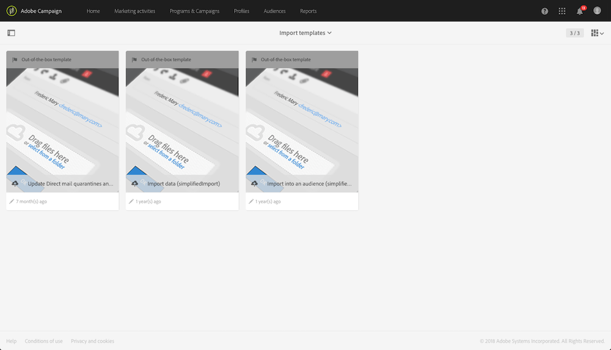
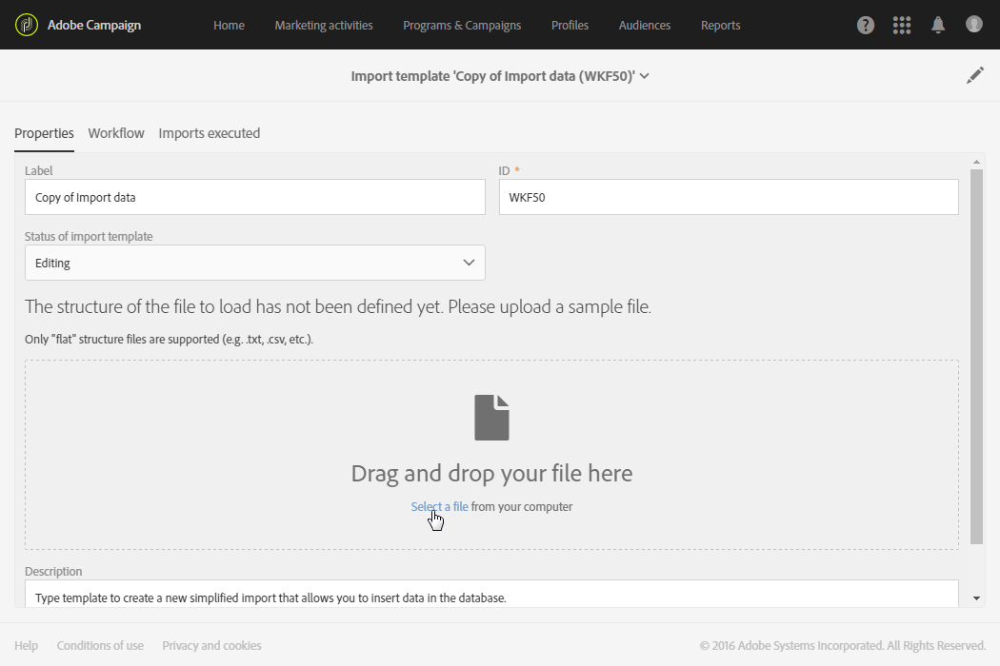
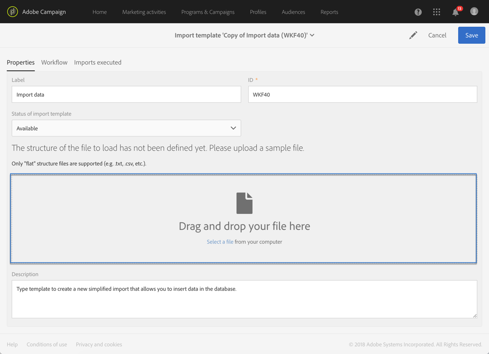
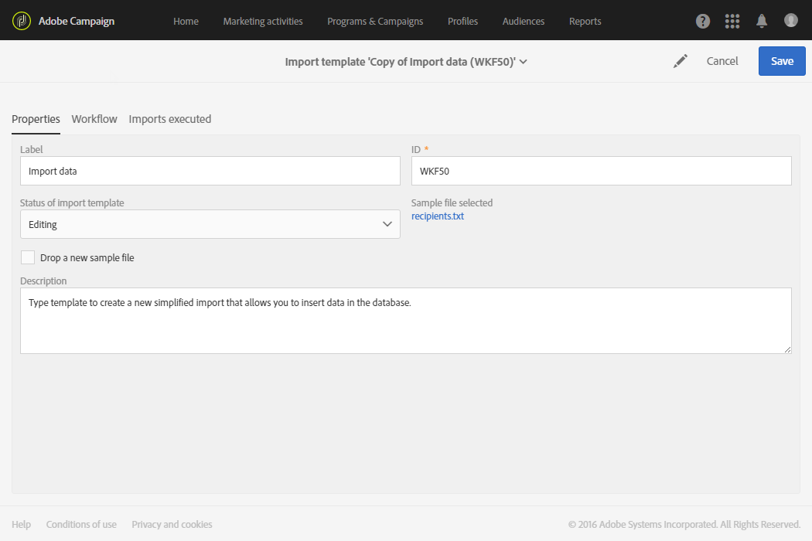
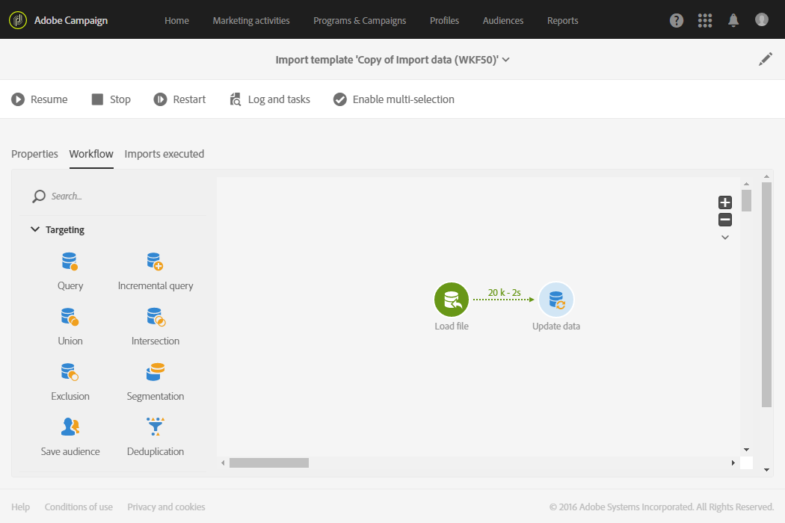

# Definição de modelos de importação{#defining-import-templates}

Os modelos de importação permitem que o administrador predefina um certo número de configurações técnicas de importação. Esses modelos depois podem ser disponibilizados para os usuários padrão executarem e fazerem upload de arquivos.

Um modelo de importação é definido pelo administrador funcional e pode ser gerenciado no menu **[!UICONTROL Resources]** > **[!UICONTROL Templates]** > **[!UICONTROL Import templates]**.

Três modelos padrão somente leitura estão disponíveis:

* **[!UICONTROL Update Direct mail quarantines and delivery logs]**: este modelo pode servir como base das novas importações para atualizar quarentenas e logs de entrega de correspondência direta. O fluxo de trabalho do modelo contém as seguintes atividades:
* **[!UICONTROL Import data]**: este modelo pode servir como base das novas importações para inserir dados de um arquivo no banco de dados. O fluxo de trabalho desse modelo contém as seguintes atividades:

  * **[!UICONTROL Load file]**: esta atividade permite fazer upload de um arquivo no servidor do Adobe Campaign.
  * **[!UICONTROL Update data]**: esta atividade permite inserir dados do arquivo no banco de dados.

* **[!UICONTROL Import list]**: este modelo pode servir como base das novas importações para criar um público-alvo do tipo **Lista** dos dados de um arquivo. O fluxo de trabalho desse modelo contém as seguintes atividades:

  * **[!UICONTROL Load file]**: esta atividade permite fazer upload de um arquivo no servidor do Adobe Campaign.
  * **[!UICONTROL Reconciliation]**: esta atividade permite vincular uma dimensão de direcionamento aos dados importados. Depois, é possível criar um público-alvo do tipo **Lista**. Se a dimensão de direcionamento dos dados importados não for conhecida, o público-alvo será do tipo **File**. Consulte [Dimensões de direcionamento e recursos](../../automating/using/query.md#targeting-dimensions-and-resources).
  * **[!UICONTROL Save audience]**: esta atividade permite salvar os dados importados na forma de um público-alvo do tipo **Lista**. O nome do público-alvo salvo corresponde ao nome do arquivo importado pelo usuário, e um sufixo que especifica a data e hora da importação será adicionado. Por exemplo: &#39;profiles_20150406_151448&#39;.

Esses modelos padrão são somente leitura e não estão visíveis para usuários padrão. Para criar um modelo que estará disponível aos usuários, siga estas etapas:

1. Duplique um modelo padrão. O modelo duplicado contém três guias:

   * **[!UICONTROL Properties]**: os parâmetros gerais do modelo de importação. Essa guia permite ativar o modelo e fazer upload de um arquivo de amostra.
   * **[!UICONTROL Workflow]**: fluxo de trabalho de importação. Essa guia permite definir as atividades do fluxo de trabalho. Essas atividades não estão visíveis durante as importações simplificadas feitas pelos usuários.
   * **[!UICONTROL Executed imports]**: lista das importações feitas com este modelo. Você pode exibir o status, os detalhes e os resultados de cada importação feita usando este modelo. Você pode acessar o fluxo de trabalho diretamente (feito de maneira transparente para o usuário) desta lista.

1. Na guia **[!UICONTROL Properties]**, renomeie o modelo e adicione uma descrição. Os usuários poderão exibir a descrição quando o modelo estiver disponível.

   

1. Acesse a guia **[!UICONTROL Workflow]**. Aqui você pode enriquecer o fluxo de trabalho oferecido por padrão adicionando novas atividades de acordo com suas necessidades.

   Para saber mais sobre como configurar as atividades de fluxo de trabalho, consulte o caso de uso descrito nesta seção: [Exemplo: importar modelo de fluxo de trabalho](../../automating/using/creating-import-workflow-templates.md). Esse caso de uso ajuda a configurar um workflow que pode ser reutilizado para importar perfis provenientes de um CRM no banco de dados do Adobe Campaign.

1. Salve o modelo para que a configuração do fluxo de trabalho seja considerada corretamente.
1. Carregue um arquivo de amostra da guia **[!UICONTROL Properties]**. O arquivo carregado só poderá ter colunas necessárias para importações futuras ou dados de amostra. Os dados no arquivo de amostra permitem testar a importação simplificada assim que o fluxo de trabalho for definido.

   

   Esse arquivo de amostra estará disponível para quem usa o modelo para fazer uma importação. Os usuários poderão baixá-lo nos computadores, por exemplo, para preenchê-lo com os dados a serem importados. Considere isso ao adicionar um arquivo de amostra.

1. Salve o modelo. O arquivo de amostra agora é considerado. Você poderá baixá-lo a qualquer momento no computador para verificar o conteúdo ou modificá-lo marcando a opção **[!UICONTROL Drop a new sample file]**.

   

1. Retorne à guia **[!UICONTROL Workflow]** e abra a atividade **[!UICONTROL Load file]** para verificar e ajustar a configuração da coluna do arquivo de amostra que foi carregado na etapa anterior.
1. Teste a importação iniciando o fluxo de trabalho. O arquivo de amostra carregado na etapa **5** deve conter dados.

   Em seguida, os dados do arquivo de amostra são importados. Verifique se os dados usados são pequenos e fictícios para não comprometer seu banco de dados.

1. Vá para o log de execução do fluxo de trabalho, disponível na barra de ação. Se encontrar um erro, verifique se as atividades estão configuradas corretamente.

   

1. Na guia **[!UICONTROL Properties]**, defina o **[!UICONTROL Import template status]** como **[!UICONTROL Available]** e salve o modelo. Para interromper o uso desse template, você pode definir o **[!UICONTROL Import template status]** como **[!UICONTROL Archived]**.

O fluxo de trabalho do modelo pode ser modificado fazendo novamente o upload do arquivo de amostra e verificando a configuração **[!UICONTROL Load file]**.

O modelo de importação agora está disponível para os usuários e pode ser usado para fazer upload de arquivos.

**Tópicos relacionados:**

* [Fluxos de trabalho](../../automating/using/get-started-workflows.md)
* [Importação e exportação de dados](../../automating/using/about-data-import-and-export.md)
* [Exemplo: importar template de fluxo de trabalho](../../automating/using/creating-import-workflow-templates.md)

