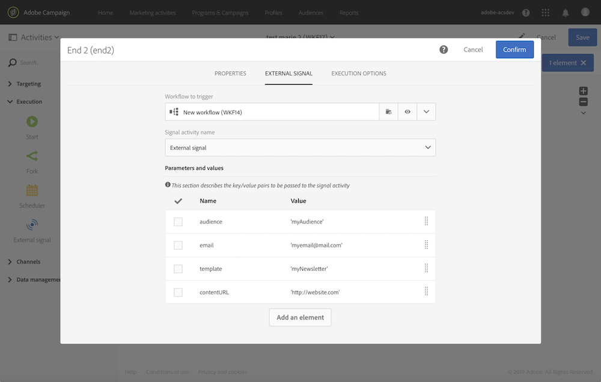

# Definição dos parâmetros ao chamar o fluxo de trabalho {#defining-the-parameters-when-calling-the-workflow}

Esta seção detalha como definir parâmetros ao chamar um workflow. Para obter mais informações sobre como executar esta operação a partir de uma chamada à API, consulte a [documentação sobre APIs REST](../../api/using/triggering-a-signal-activity.md).

Antes de definir os parâmetros, verifique se:

* Os parâmetros foram declarados na atividade **[!UICONTROL External Signal]**. Consulte [esta página](../../automating/using/declaring-parameters-external-signal.md).
* O fluxo de trabalho que contém a atividade de sinal está em execução.

Para configurar a atividade **[!UICONTROL End]**, siga as etapas abaixo:

1. Abra a atividade **[!UICONTROL End]** e selecione a guia **[!UICONTROL External signal]**.
1. Selecione a atividade de workflow e sinal externo que deseja chamar.
1. Clique no botão **[!UICONTROL Create element]** para adicionar um parâmetro e, em seguida, preencha seu nome e valor.

   * **[!UICONTROL Name]**: o nome declarado na atividade **[!UICONTROL External signal]** (consulte [esta página](../../automating/using/declaring-parameters-external-signal.md)).
   * **[!UICONTROL Value]**: o valor que você deseja atribuir ao parâmetro. O valor deve seguir a **Sintaxe padrão**, descrita em [esta seção](../../automating/using/advanced-expression-editing.md#standard-syntax).

   

   >[!CAUTION]
   >
   >Verifique se todos os parâmetros foram declarados na atividade **[!UICONTROL External signal]**. Caso contrário, ocorrerá um erro ao executar a atividade.

1. Depois que os parâmetros forem definidos, confirme a atividade e salve o workflow.
