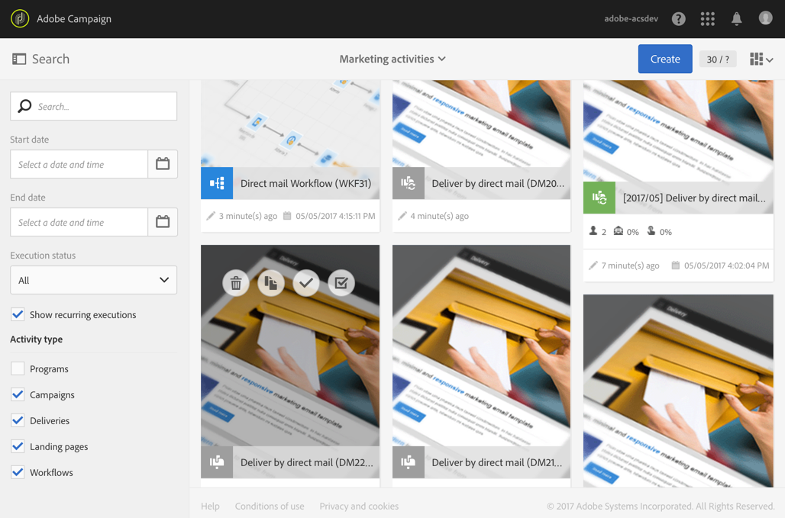

# Delivery de correspondência direta{#direct-mail-delivery}

## Descrição {#description}

A atividade **[!UICONTROL Direct mail delivery]** permite configurar e preparar um arquivo contendo dados de perfil que você deseja usar para uma campanha de correspondência direta. Pode ser uma correspondência direta que é utilizada apenas uma vez ou pode ser uma correspondência direta recorrente.

* **Correspondências diretas padrão são enviadas uma vez.**
* **Emails recorrentes permitem enviar a mesma correspondência direta várias vezes para públicos-alvos diferentes em um período definido.** Você pode agregar os deliveries por período para obter relatórios que correspondam às suas necessidades.

## Contexto de uso {#context-of-use}

A atividade **[!UICONTROL Direct mail delivery]** geralmente é usada para automatizar a preparação de um arquivo que contém dados de perfil. Esse arquivo pode ser enviado para um parceiro/provedor responsável pela correspondência direta.

Quando vinculada a um scheduler, você pode definir malas diretas recorrentes.

Os recipients da correspondência direta são definidos no sentido upstream da atividade, no mesmo workflow, por meio de atividades de direcionamento, como consultas, interseções etc. Perfis cujo endereço de correspondência não é especificado são excluídos automaticamente quando essa correspondência direta é preparada.

A preparação da mensagem é acionada de acordo com os parâmetros de execução do workflow. No painel da mensagem, você pode selecionar se deseja solicitar ou não uma confirmação manual para enviar a mensagem (obrigatório por padrão). Você pode iniciar o workflow manualmente ou colocar uma atividade de scheduler no workflow para automatizar a execução.

**Tópicos relacionados:**

* [Caso de uso: Junção de deliveries de email e de correspondência direta](../../automating/using/coupling-email-direct-mail.md)
* [Sobre correspondência direta](../../channels/using/about-direct-mail.md)

## Configuração {#configuration}

1. Arraste e solte uma atividade **[!UICONTROL Direct mail delivery]** no seu fluxo de trabalho.
1. Selecione e abra a atividade usando o botão  das ações rápidas exibidas.

   >[!NOTE]
   >
   >Você pode acessar as propriedades gerais e as opções avançadas da atividade (e não do delivery propriamente dito) por meio do botão  nas ações rápidas da atividade. Esse botão é específico para as atividades de canal. As propriedades da correspondência direta podem ser acessadas pela barra de ações no painel de correspondência direta.

1. Selecione o modo de envio da correspondência direta:

   * **[!UICONTROL Direct mail]**: a correspondência direta é enviada uma única vez. Aqui, você pode especificar se deseja ou não adicionar uma transição de saída à atividade. Os diferentes tipos de transições estão detalhados na etapa 7 deste procedimento.
   * **[!UICONTROL Recurring direct mail]**: a correspondência direta é enviada várias vezes, de acordo com a frequência definida em uma atividade **[!UICONTROL Scheduler]**. Selecione o período de agregação dos envios. Você pode agrupar todos os envios que ocorrerem durante o período definido em uma única correspondência direta, também chamada de **Execução recorrente**, e que pode ser acessada na lista de atividade de marketing do aplicativo.

      Por exemplo, para uma mensagem de aniversário recorrente, que é processada diariamente, você pode optar pela agregação dos envios por mês. Ela permite receber relatórios sobre o delivery mensalmente, embora a correspondência seja processada todos os dias.

      >[!NOTE]
      >
      >Para malas diretas recorrentes, um novo arquivo é gerado em cada execução do workflow. O período de agregação selecionado não afeta esse comportamento.

1. Selecione um tipo de correspondência direta. Os tipos de correspondência direta vêm de templates definidos no menu **[!UICONTROL Resources]** > **[!UICONTROL Templates]** > **[!UICONTROL Delivery templates]**.
1. Insira as propriedades gerais da correspondência direta. Também é possível anexá-la a uma campanha existente. O rótulo da atividade de delivery do workflow é atualizado com o rótulo da correspondência direta.
1. Definição do conteúdo da correspondência direta. Consulte a seção sobre [edição de conteúdo](../../designing/using/personalization.md).
1. Por padrão, a atividade **[!UICONTROL Direct mail delivery]** não inclui transições de saída. Se quiser adicionar uma transição de saída à sua atividade **[!UICONTROL Direct mail delivery]**, acesse a guia **[!UICONTROL General]** das opções avançadas da atividade (o botão  nas ações rápidas da atividade) e depois marque uma das seguintes opções:

   * **[!UICONTROL Add outbound transition without the population]**: permite gerar uma transição de saída que contém exatamente a mesma população da transição de entrada. Essa transição contém o arquivo gerado pela atividade de correspondência direta e a população bruta recebida pela atividade de correspondência direta.
   * **[!UICONTROL Add outbound transition with the population]**: permite gerar uma transição de saída que contém a população para a qual a correspondência direta será enviada. Os membros do público-alvo foram excluídos durante a preparação da correspondência direta (quarentena, endereço inválido, etc.) são excluídos dessa transição. A transição também contém o arquivo gerado pela correspondência direta.

1. Confirme a configuração da sua atividade e salve o fluxo de trabalho.

Ao reabrir a atividade, você é levado diretamente ao painel da correspondência direta. Somente seu conteúdo pode ser editado.

Por padrão, iniciar um workflow de delivery aciona somente a preparação da mensagem. O envio de mensagens criadas a partir de um workflow ainda precisará ser confirmado depois que o workflow for iniciado. Porém, no painel de mensagens, e somente se a mensagem tiver sido criada a partir de um workflow, você poderá desativar a opção **[!UICONTROL Request confirmation before sending messages]**. Ao desmarcar essa opção, as mensagens são enviadas sem aviso prévio após a preparação.

## Observações {#remarks}

Os deliveries criados em um workflow podem ser acessados na lista de atividade de marketing do aplicativo. Você pode visualizar o status de execução do workflow usando o painel. Os links no painel de resumo da correspondência direta permitem acessar diretamente os elementos vinculados (workflow, campanha, delivery pai no caso de uma correspondência direta recorrente).

As execuções de deliveries recorrentes são mascaradas por padrão. Para visualizá-las, marque a opção **[!UICONTROL Show recurring executions]** no painel de pesquisa das atividades de marketing.

Nos deliveries pai, que podem ser acessados na lista de atividades de marketing ou diretamente por meio das execuções recorrentes associadas, é possível visualizar o número total de correspondências que foram processadas (de acordo com o período de agregação especificado quando a atividade **[!UICONTROL Direct mail delivery]** foi configurada). Para fazer isso, abra a visualização detalhada do bloco pai do delivery **[!UICONTROL Deployment]** selecionando o botão .

