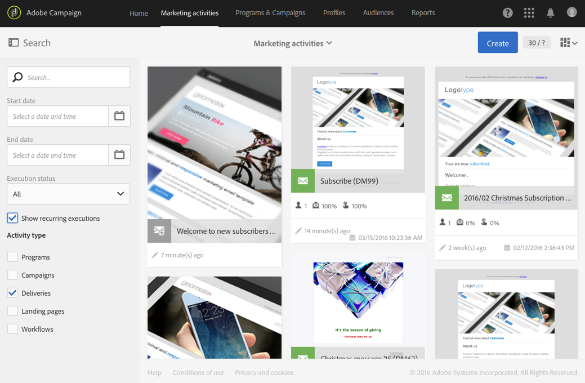

# Delivery por email{#email-delivery}

## Descrição {#description}

A atividade **[!UICONTROL Email delivery]** permite configurar o envio de um email em um workflow. Pode ser um email de **envio único** e enviado apenas uma vez, ou um email **recorrente**.

Emails de envio único são emails padrão, enviados uma vez.

Emails recorrentes permitem enviar o mesmo email várias vezes para públicos-alvos diferentes em um período definido. Você pode agregar os deliveries por período para obter relatórios que correspondam às suas necessidades.

## Contexto de uso {#context-of-use}

A atividade **[!UICONTROL Email delivery]** é geralmente usada para automatizar o envio de um email para um público-alvo calculado no mesmo workflow.

Quando vinculada a um scheduler, você pode definir emails recorrentes.

Os recipients do email são definidos no sentido upstream da atividade, no mesmo workflow, por meio de atividades de direcionamento, como consultas, interseções etc.

A preparação da mensagem é acionada de acordo com os parâmetros de execução do workflow. No painel da mensagem, você pode selecionar se deseja solicitar ou não uma confirmação manual para enviar a mensagem (obrigatório por padrão). Você pode iniciar o workflow manualmente ou colocar uma atividade de scheduler no workflow para automatizar a execução.

**Tópicos relacionados:**

* [Caso de uso: criar delivery por email uma vez por semana](../../automating/using/workflow-weekly-offer.md)
* [Caso de uso: criar um delivery segmentado na localização](../../automating/using/workflow-segmentation-location.md)
* [Caso de uso: criar deliveries com um complemento](../../automating/using/workflow-created-query-with-complement.md)
* [Caso de uso: workflow de redirecionamento enviando um novo delivery para não abridores](../../automating/using/workflow-cross-channel-retargeting.md)
* [Caso de uso: Delivery de aniversário](../../automating/using/birthday-delivery.md)

## Configuração {#configuration}

1. Arraste e solte uma atividade **[!UICONTROL Email delivery]** no seu workflow.
1. Selecione e abra a atividade usando o botão  das ações rápidas exibidas.

   >[!NOTE]
   >
   >Você pode acessar as propriedades gerais e as opções avançadas da atividade (e não do delivery propriamente dito) por meio do botão  nas ações rápidas da atividade. Esse botão é específico para a atividade **[!UICONTROL Email delivery]**. As propriedades do email podem ser acessadas pela barra de ações no painel de email.

1. Selecione o modo de envio do email:

   * **[!UICONTROL Email]**: o email é enviado uma única vez. Aqui, você pode especificar se deseja ou não adicionar uma transição de saída à atividade. Os diferentes tipos de transições estão detalhados na etapa 7 deste procedimento.
   * **[!UICONTROL Recurring email]**: o email é enviado várias vezes, de acordo com a frequência definida em uma atividade **[!UICONTROL Scheduler]**. Selecione o período de agregação dos envios. Assim, você pode agrupar todos os envios que ocorrerem durante o período definido em um único email, também chamado de **Execução recorrente**, e que pode ser acessado na lista de atividade de marketing do aplicativo.

      Por exemplo, para um email de aniversário recorrente, que é enviado diariamente, você pode optar por agregar os envios por mês. Ele permite receber relatórios sobre o delivery mensalmente, embora o email seja enviado todos os dias.
   >[!NOTE]
   >
   >Os delivery recorrentes são preparados com base no período **de** agregação. Por exemplo, se o período de agregação for &quot;por dia&quot;, o delivery será repreparado somente uma vez por dia. Se você planeja chamar esse fluxo de trabalho várias vezes por dia, use [!UICONTROL No aggregation].

1. Selecione um tipo de email. Os tipos de email são provenientes de templates de email definidos no menu **[!UICONTROL Resources]** > **[!UICONTROL Templates]** > **[!UICONTROL Delivery templates]**.
1. Insira as propriedades gerais do email. Também é possível anexá-la a uma campanha existente. O rótulo da atividade de entrega do workflow é atualizado com o rótulo do email.
1. Defina o conteúdo do email. Consulte a seção sobre [edição de conteúdo](../../designing/using/designing-content-in-adobe-campaign.md).
1. Por padrão, a atividade **[!UICONTROL Email delivery]** não inclui transições de saída. Se quiser adicionar uma transição de saída à sua atividade **[!UICONTROL Email delivery]**, acesse a guia **[!UICONTROL General]** das opções avançadas da atividade (o botão  nas ações rápidas da atividade) e depois marque uma das seguintes opções:

   * **[!UICONTROL Add outbound transition without the population]**: permite gerar uma transição de saída que contém exatamente a mesma população da transição de entrada.
   * **[!UICONTROL Add outbound transition with the population]**: permite gerar uma transição de saída que contém a população para a qual o email foi enviado. Os membros do público-alvo excluídos durante a preparação do delivery (quarentena, email inválido etc.) são excluídos dessa transição.

1. Confirme a configuração da sua atividade e salve o fluxo de trabalho.

Ao reabrir a atividade, você será direcionado diretamente ao painel do email. Somente seu conteúdo pode ser editado.

Por padrão, iniciar um workflow de delivery aciona somente a preparação da mensagem. O envio de mensagens criadas a partir de um workflow ainda precisará ser confirmado depois que o workflow for iniciado. Porém, no painel de mensagens, e somente se a mensagem tiver sido criada a partir de um workflow, você poderá desativar a opção **[!UICONTROL Request confirmation before sending messages]**. Ao desmarcar essa opção, as mensagens são enviadas sem aviso prévio após a preparação.

## Observações {#remarks}

Os deliveries criados em um workflow podem ser acessados na lista de atividade de marketing do aplicativo. Você pode visualizar o status de execução do workflow usando o painel. Os links no painel de resumo do email permitem acessar diretamente os elementos vinculados (workflow, campanha, entrega pai no caso de um email recorrente).

No entanto, as execuções de deliveries recorrentes são mascaradas por padrão. Para visualizá-las, marque a opção **[!UICONTROL Show recurring executions]** no painel de pesquisa das atividades de marketing.

Nas entregas pai, que podem ser acessadas na lista de atividades de marketing ou diretamente por meio das execuções recorrentes associadas, é possível visualizar o número total de envios que foram processados (de acordo com o período de agregação especificado quando a atividade **[!UICONTROL Email delivery]** foi configurada). Para fazer isso, abra a visualização detalhada do bloco **[!UICONTROL Deployment]** da entrega pai, selecionando .

