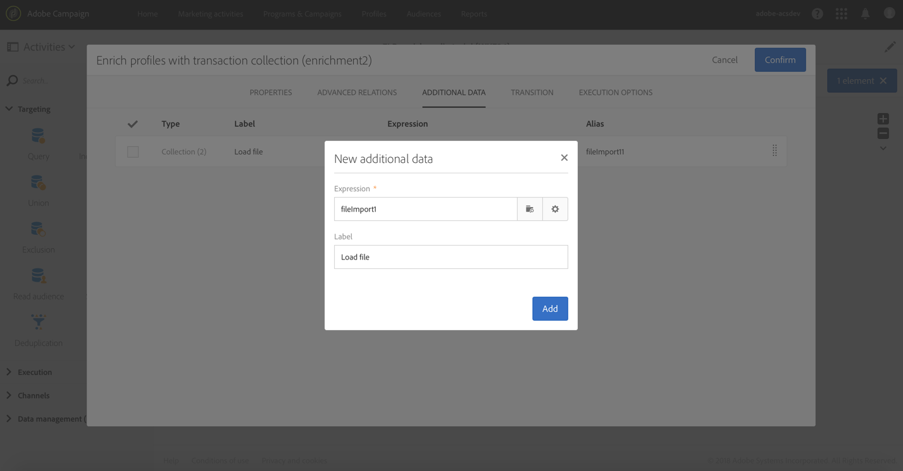
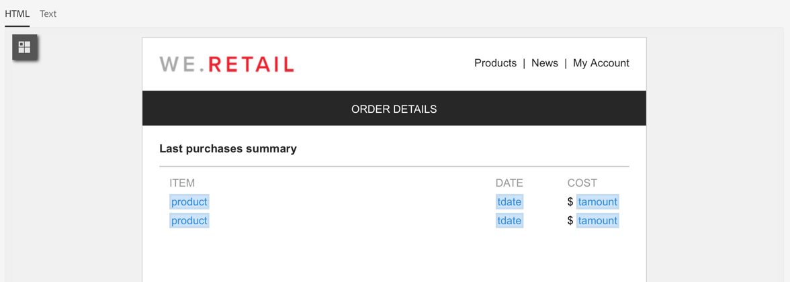

# Enriquecimento dos dados do perfil com os dados contidos em um arquivo {#enriching-profile-data-with-data-contained-in-a-file}

Este exemplo mostra como enriquecer os dados do perfil com os dados de compra contidos em um arquivo.Consideramos aqui que os dados de compra são armazenados em um sistema de terceiros. Cada perfil pode ter várias compras armazenadas no arquivo. O objetivo final do fluxo de trabalho é enviar um email aos perfis do público alvo que comprou pelo menos dois itens para agradecer sua lealdade.

O fluxo de trabalho é configurado da seguinte maneira:


* A [Query](../../automating/using/query.md) activity that targets the profiles who will receive the message.
* A [Load file](../../automating/using/load-file.md) activity that loads the purchase data. Por exemplo:

   ```
   tcode;tdate;customer;product;tamount
   aze123;21/05/2017;dannymars@example.com;TV;799
   aze124;28/05/2017;dannymars@example.com;Headphones;8
   aze125;31/07/2017;john.smith@example.com;Headphones;8
   aze126;14/12/2017;john.smith@example.com;Plastic Cover;4
   aze127;02/01/2018;dannymars@example.com;Case Cover;79
   aze128;04/03/2017;clara.smith@example.com;Phone;149
   ```

   Com esse arquivo de exemplo, usaremos o endereço de email para reconciliar os dados com os perfis do banco de dados. Você também pode ativar IDs exclusivas conforme descrito [neste documento](../../developing/using/configuring-the-resource-s-data-structure.md#generating-a-unique-id-for-profiles-and-custom-resources).

* An [Enrichment](../../automating/using/enrichment.md) activity that creates a link between the transaction data loaded from the file and the profiles selected in the **[!UICONTROL Query]**. O link é definido na guia **[!UICONTROL Advanced relations]** da atividade. O link é baseado na transição proveniente da atividade **[!UICONTROL Load file]**. Ele usa o campo &quot;email&quot; do recurso de perfil e a coluna &quot;cliente&quot; do arquivo importado como critérios de reconciliação.

   

   Depois que o link é criado, dois conjuntos de **[!UICONTROL Additional data]** são incluídos:

   * Uma coleção de duas linhas correspondentes às duas últimas transações de cada perfil. Para essa coleção, o nome do produto, a data da transação e o preço do produto são incluídos como dados adicionais. Uma classificação decrescente é aplicada aos dados. Para criar a coleção, na guia **[!UICONTROL Additional data]**:

      Selecione o link definido anteriormente na guia **[!UICONTROL Advanced relations]** da atividade.

      

      Marque **[!UICONTROL Collection]** e especifique o número de linhas a serem recuperadas (2, neste exemplo). Nesta tela, você pode personalizar o **[!UICONTROL Alias]** e o **[!UICONTROL Label]** da coleção. Esses valores estarão visíveis nas seguintes atividades do fluxo de trabalho ao se referirem a esta coleção.

      

      Quanto aos **[!UICONTROL Data]** a serem mantidos para a coleção, selecione as colunas que serão usadas no delivery final.

      

      Aplique uma classificação decrescente na data da transação para garantir a recuperação das transações mais recentes.

      

   * Uma agregação conta o número total de transações para cada perfil. Essa agregação será usada posteriormente para filtrar perfis que tenham pelo menos duas transações registradas. Para criar a agregação, na guia **[!UICONTROL Additional data]**:

      Selecione o link definido anteriormente na guia **[!UICONTROL Advanced relations]** da atividade.

      

      Selecione **[!UICONTROL Aggregate]**.

      

      Quanto aos **[!UICONTROL Data]** a serem mantidos, defina uma agregação **Count All**. Se necessário, especifique um apelido personalizado para encontrá-lo com mais rapidez nas atividades posteriores.

      

* A [Segmentation](../../automating/using/segmentation.md) activity with only one segment, that retrieves profiles of the initial target that have at least two transactions recorded. Perfis com somente uma transação são excluídos. Para isso, a consulta da segmentação é feita na agregação definida anteriormente.

   

* An [Email delivery](../../automating/using/email-delivery.md) activity that uses the additional data defined in the **[!UICONTROL Enrichment]** to dynamically retrieve the two last purchases made by the profile. Os dados adicionais podem ser encontrados no nó **Additional data (TargetData)** ao adicionar um campo de personalização.

   

**Tópicos relacionados:**

* [Enriquecimento de perfis de clientes com dados externos](https://helpx.adobe.com/br/campaign/kb/simplify-campaign-management.html#Managedatatofuelengagingexperiences)
