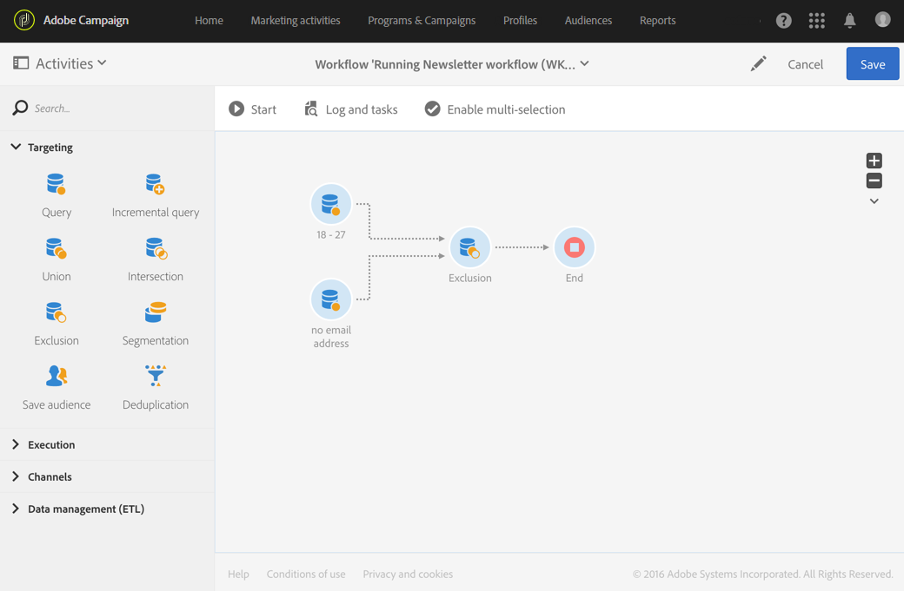

# Regras de{#exclusion}

## Descrição {#description}

A atividade **[!UICONTROL Exclusion]** permite excluir elementos de uma população de acordo com determinados critérios.

## Contexto de uso {#context-of-use}

A atividade **[!UICONTROL Exclusion]** é usada basicamente para filtrar ainda mais as populações de transições de entrada.

Um conjunto principal é definido entre as transições de entrada. Os membros de outras transições de entrada são excluídos do conjunto principal. A transição de saída da atividade de exclusão contém apenas os membros do conjunto principal que não foram encontrados nas outras transições de entrada.

## Configuração {#configuration}

1. Arraste e solte uma atividade **[!UICONTROL Exclusion]** no seu fluxo de trabalho.
1. Selecione e abra a atividade usando o botão  das ações rápidas exibidas.
1. Selecione **[!UICONTROL Primary set]** entre as transições entrada. Esse é o conjunto a partir do qual os elementos são excluídos. Os outros conjuntos correspondem a elementos antes de serem excluídos do conjunto principal.

   >[!NOTE]
   >
   >As transições de entrada devem conter o mesmo tipo de população. Por exemplo, se o conjunto principal tiver perfis de teste, as outras transições também deverão conter perfis de teste.

1. Se necessário, gerencie as [Transições](../../automating/using/activity-properties.md) de atividade para acessar as opções avançadas para a população de saída.
1. Confirme a configuração da sua atividade e salve o fluxo de trabalho.

## Exemplo {#example}

O exemplo a seguir mostra duas atividades de consulta configuradas para filtrar perfis do banco de dados do Adobe Campaign que têm entre 18 e 27 anos e têm um endereço de email inválido. Os perfis com endereços de email inválidos são excluídos do primeiro conjunto. Essa exclusão permite que você envie um email, por exemplo.

