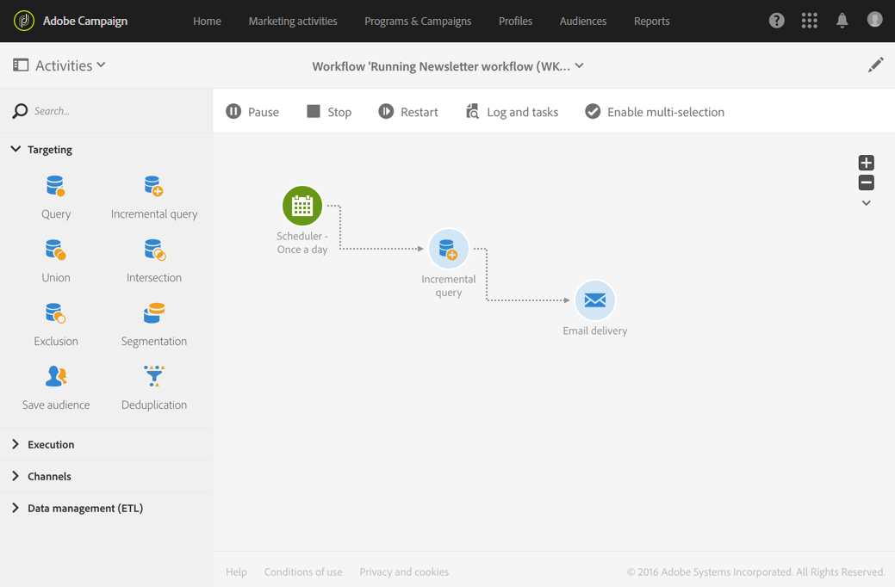

# Comandos de execução {#execution-commands}

Os ícones na barra de ações permitem iniciar, rastrear e modificar a execução de um fluxo de trabalho. Consulte [Barra de ação](../../automating/using/workflow-interface.md#action-bar).

As opções disponíveis são as seguintes:

**Start**

O botão  inicia a execução de um fluxo de trabalho, que assume o status **Em andamento** (azul). Se o workflow tiver sido pausado, ele será retomado, caso contrário, será iniciado e as atividades iniciais serão ativadas.

>[!NOTE]
>
>Iniciar é um processo assíncrono: a solicitação é salva e será processada o mais rápido possível pelo mecanismo de execução do workflow.

**Pause**

O botão  pausa a execução. O fluxo de trabalho assume o status **Aviso** (amarelo). Nenhuma nova atividade será ativada até que seja retomada, mas as operações em andamento não são suspensas.

**Stop**

O botão  interrompe um fluxo de trabalho que está sendo executado, que assumirá o status **Concluído** (verde). As operações em andamento são interrompidas, se possível, e as importações ou consultas SQL em andamento são canceladas imediatamente. Não é possível retomar do fluxo de trabalho a partir do mesmo local em que ele foi interrompido.

**Restart**

O botão  envolve parar e reiniciar um fluxo de trabalho. Na maioria dos casos, isso permite reiniciar mais rápido. Também pode ser útil automatizar a reinicialização quando a interrupção leva um determinado tempo, pois o botão  só está disponível quando a interrupção é efetiva.

Quando uma ou várias atividades em um workflow são selecionadas, há outras ações que você pode executar, como:

**Execução imediata**

O botão  inicia todas as atividades pendentes selecionadas assim que possível.

**Execução normal**

O botão  reativa qualquer atividade pausada ou desativada.

**Execução suspensa**

O botão  pausa o fluxo de trabalho na atividade selecionada: essa tarefa, bem como todas as tarefas que a seguem (na mesma ramificação), não são executadas.

**Nenhuma execução**

O botão  desativa todas as atividades selecionadas.

>[!NOTE]
>
>As ações rápidas permitem que você acesse ações diferentes referentes a uma atividade específica e sejam exibidas quando uma atividade for selecionada.
