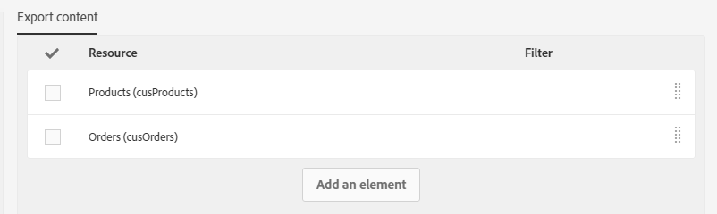

# Exportação/importação de recursos personalizados {#exporting-importing-custom-resources}

Este tutorial explica como exportar e importar um pacote de recursos personalizados de um ambiente de desenvolvimento para um ambiente de produção.

Este exemplo destina-se aos administradores funcionais vinculados ao Adobe Campaign.

Os pré-requisitos são:

* **Um ou vários recursos personalizados** que estão disponíveis e publicados.

   Além disso, é preciso que haja uma chave exclusiva definida para esses recursos, pois as chaves primárias automáticas não são exportadas nos pacotes. O recurso pode, portanto, ter uma chave primária e uma chave única adicional para garantir a exclusividade dos registros.
* **Os direitos necessários** para criar e exportar um pacote.

Recursos adicionais:

* [Gerenciamento de pacotes](../../automating/using/managing-packages.md)
* [Implantação de pacotes: princípio de funcionamento](../../developing/using/data-model-concepts.md)
* [Adicionar ou estender um recurso](../../developing/using/key-steps-to-add-a-resource.md)

## Exportação da estrutura {#exporting-the-structure}

Nesta seção, faremos uma primeira exportação de pacote que detalha a estrutura física dos dados de recursos personalizados.

Este exemplo tem dois recursos personalizados: **Produtos** e **Pedidos**.

1. Acesse o menu **[!UICONTROL Administration]** / **[!UICONTROL Deployment]** / **[!UICONTROL Package exports]**.

   Vamos criar um novo pacote para exportar o **[!UICONTROL Custom resource (cusResource)]** filtrado com os dois recursos personalizados, &quot;Produtos&quot; e &quot;Pedidos&quot;.

1. Na página **[!UICONTROL Package exports]**, clique em **[!UICONTROL Create]** para criar um novo pacote.
1. Preencha o rótulo e clique em **[!UICONTROL Create element]**.

   

1. Procure e selecione o **[!UICONTROL Custom resource (cusResource)]**.

   

1. Configure os detalhes do **[!UICONTROL Custom resource]** selecionando os dois recursos, **Produtos** e **Pedidos**, nas condições de filtragem.

   Não se esqueça de alterar o operador lógico. O valor deve ser definido como **OU** para que a estrutura do recurso de produtos e do recurso de pedidos seja integrada no pacote.

   

1. Confirme e salve a definição do pacote.

Clique agora em **[!UICONTROL Start export]**.

O pacote gerado está disponível na pasta Downloads. O nome do arquivo zip é gerado aleatoriamente. Você pode renomeá-lo.

## Exportação dos dados {#exporting-the-data}

Essa segunda exportação possibilita a exportação dos dados dos recursos personalizados **Produtos** e **Pedidos**.

Com base no mesmo tipo de exportação que a exportação da estrutura, você criará um segundo pacote que contenha os dados.

1. Na página **[!UICONTROL Package exports]**, clique em **[!UICONTROL Create]** para criar um novo pacote.
1. Preencha o rótulo com **[!UICONTROL Export data of my resources]** e clique **[!UICONTROL Create element]** na guia **[!UICONTROL Export content]**.
1. Procure e selecione o recurso **Produtos**.

   

1. Configure uma **condição de filtragem** avançada com **@Label NOT NULL**.

   

1. Verifique a contagem.

   

1. Repita a mesma operação para o recurso personalizado **Pedidos**.

   

1. Confirme e salve a definição do pacote.

Clique agora em **[!UICONTROL Start export]**.

O pacote gerado está disponível na pasta Downloads. O nome do arquivo zip é gerado aleatoriamente. Você pode renomeá-lo.

## Importação da estrutura {#importing-the-structure}

### Importação do pacote {#importing-the-structure-package}

1. Conecte-se à **instância do público-alvo** na qual deseja importar os pacotes recém-criados.
1. Acesse o menu **[!UICONTROL Administration]** / **[!UICONTROL Deployment]** / **[!UICONTROL Package imports]** para criar um novo pacote para importar o arquivo da primeira exportação.
1. Arraste e solte o **arquivo de estrutura** na zona disponível para essa finalidade. Os formatos aceitos são ZIP ou XML.

   

1. Altere o rótulo, por exemplo, **Importar estrutura**, e clique em **[!UICONTROL Save]**.
1. Clique em **[!UICONTROL Start import]**.

   

### Publicação {#publish-structure}

1. Acesse o menu **[!UICONTROL Administration]** / **[!UICONTROL Development]** / **[!UICONTROL Publication]**.
1. Clique em **[!UICONTROL Prepare publication]** e em **[!UICONTROL Publish]** para atualizar a instância com os dados dos novos recursos personalizados.
1. As entradas de menu correspondentes ao pacote instalado serão inseridas no menu **[!UICONTROL Client data]**.

   

## Importação de dados {#importing-the-data}

Nesta seção, vamos **importar os dados** vinculados ao pacote instalado na instância na etapa anterior.

Da mesma forma que na etapa anterior, a importação divide-se em duas partes: a importação do pacote e a publicação.

### Importação do pacote {#importing-the-data-package}

1. Acesse o menu **[!UICONTROL Administration]** / **[!UICONTROL Deployment]** / **[!UICONTROL Package imports]** para criar um novo pacote para importar o arquivo que contenha os dados.
1. Arraste e solte o arquivo de dados na zona disponível para essa finalidade. Os formatos aceitos são ZIP ou XML.
1. Altere o rótulo, por exemplo &quot;Importar dados&quot;, e clique em **[!UICONTROL Save]**.
1. Clique em **[!UICONTROL Start import]**.

   

### Publicação {#publish-data}

1. Acesse o menu **[!UICONTROL Administration]** / **[!UICONTROL Development]** / **[!UICONTROL Publication]**.
1. Clique em **[!UICONTROL Prepare publication]** e em **[!UICONTROL Publish]** para atualizar a instância com os dados dos recursos personalizados.
