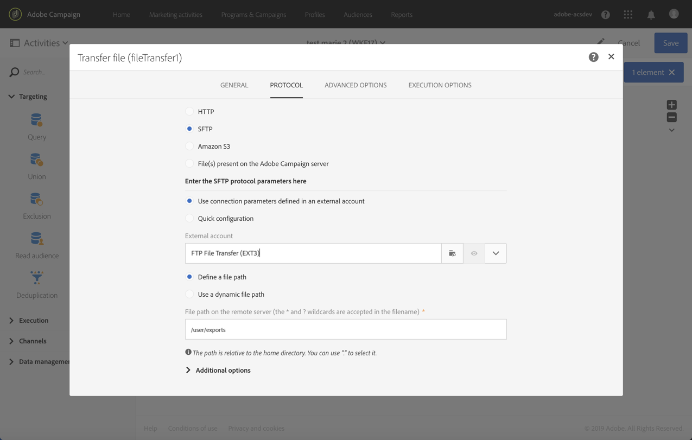

# Exportar perfis em um arquivo externo {#exporting-profiles-external-file}

O exemplo a seguir ilustra como configurar uma atividade **[!UICONTROL Extract file]** após uma atividade **[!UICONTROL Query]**.

O objetivo desse fluxo de trabalho é exportar uma lista de perfis como um arquivo externo para que os dados sejam usados fora do Adobe Campaign.

1. Drag and drop an [Extract file](../../automating/using/extract-file.md) activity into your workflow and place it after the [Query](../../automating/using/query.md) activity.

   Neste exemplo, o query é realizado em todos os perfis entre 18 e 30 anos.

1. Open the **[!UICONTROL Extract file]** activity to edit it.
1. Nomeie o arquivo de saída.
1. Adicione colunas de saída.

   Neste exemplo, o email, a idade, a data de nascimento, o nome e o sobrenome dos perfis são adicionados como colunas de saída.

   

1. Clique na guia **[!UICONTROL File structure]** para definir:

   * O formato de saída CSV

      

   * O formato de data

      

1. Confirme sua atividade.
1. Drag and drop a [Transfer file](../../automating/using/transfer-file.md) activity after the **[!UICONTROL Extract file]** activity to recover the extract file on an external account.
1. Abra a atividade e escolha a ação **[!UICONTROL File upload]**.

   

1. Selecione a conta externa e insira o caminho da pasta no servidor.

   

1. Confirme sua atividade e salve o fluxo de trabalho.
1. Inicie o fluxo de trabalho.

   Quando o fluxo de trabalho for executado corretamente, o arquivo extraído estará disponível na conta externa.
