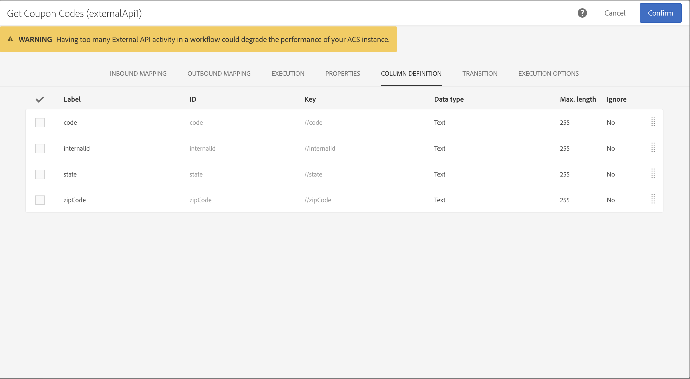
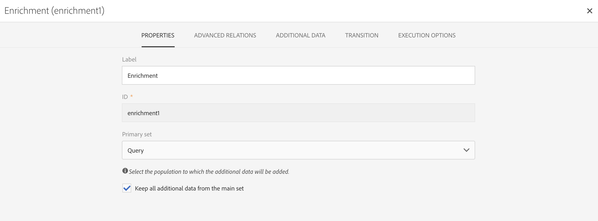

# API externa {#external-api}

## Descrição {#description}

A atividade **[!UICONTROL External API]** traz dados para o workflow de um **sistema externo** por meio de uma chamada à **API HTTP**.

Os pontos de extremidade do sistema externo podem ser pontos de extremidade de API públicos, sistemas de gerenciamento de clientes ou instâncias de aplicativos sem servidor (por exemplo, [Adobe I/O Runtime](https://www.adobe.io/apis/experienceplatform/runtime.html)), para mencionar algumas categorias.

>[!NOTE]
>
>Por motivos de segurança, o uso de JSSPs não é compatível com o Campaign Standard. Se você precisar executar um código, poderá chamar uma instância do Adobe I/O Runtime por meio da atividade API externa.

As principais características dessa atividade são:

* Capacidade de transmitir dados em um formato JSON para um ponto de extremidade de API REST de terceiros
* Capacidade de receber uma resposta JSON de volta, mapeá-la para tabelas de saída e transmiti-la downstream para outras atividades do workflow.
* Gerenciamento de falhas com uma transição específica de saída

### Avisos de compatibilidade com versões anteriores {#from-beta-to-ga}

Com a versão do Campaign Standard 20.4, o limite de tamanho dos dados de resposta http e as medidas de proteção do tempo limite de resposta foram reduzidos para se alinharem às práticas recomendadas - consulte [Limitações e medidas de proteção](#guardrails). Essas modificações nas medidas de proteção não entrarão em vigor nas atividades de API externas existentes; portanto, é recomendado substituir as atividades de API externas existentes por novas versões em todos os workflows.

Ao substituir as atividades de API externas, adicione a nova atividade ao workflow, copie manualmente os detalhes de configuração e exclua a atividade antiga.

>[!NOTE]
>
>Não será possível copiar os valores do cabeçalho específicos da atividade, pois eles são mascarados dentro da atividade.

### Limitações e medidas de proteção {#guardrails}

Aplicam-se a esta atividade as seguintes medidas de proteção:

* Limite de tamanho de dados de resposta http de 5 MB (observação: é uma alteração do limite de 50 MB na versão anterior)
* O tempo de espera da solicitação é de 1 minuto (observação: é uma alteração do tempo limite de 10 minutos na versão anterior)
* Não são permitidos redirecionamentos HTTP
* São rejeitados Urls que não sejam HTTPS
* São permitidos cabeçalho de solicitação “Accept: application/json” e cabeçalho de resposta “Content-Type: application/json”

Foram colocadas em prática medidas de proteção específicas:

* **Profundidade máx. JSON**: limite a profundidade máxima de um JSON aninhado e personalizado que pode ser processado para 10 níveis.
* **Extensão máx. da chave JSON**: limite o comprimento máximo da chave interna gerada para 255. Essa chave está associada à ID da coluna.
* **Chaves máximas de duplicação JSON permitidas**:  limite o número total máximo de nomes de propriedades JSON do duplicado usados como ID da coluna para 150.

>[!CAUTION]
>
>A atividade de API externa se destina à busca de dados em toda a campanha (último conjunto de ofertas, últimas pontuações, etc.), e não para a recuperação de informações específicas para cada perfil, pois pode resultar na transferência de grandes quantidades de dados. Se o caso de uso exigir, recomenda-se usar a atividade [Transferir arquivo](../../automating/using/transfer-file.md).

## Configuração {#configuration}

Arraste e solte uma atividade **[!UICONTROL External API]** no seu workflow e abra a atividade para iniciar a configuração.

### Mapeamento de entrada

O mapeamento de entrada é uma tabela temporária gerada por uma atividade de entrada anterior que será exibida e enviada como JSON na interface.
Com base nessa tabela temporária, o usuário pode fazer modificações nos dados de entrada.

A lista suspensa **Recurso de entrada** permite selecionar a atividade de query que criará a tabela temporária.

A caixa de seleção **Adicionar parâmetro de contagem** adicionará um valor de contagem para cada linha proveniente da tabela temporária. Observe que essa caixa de seleção só estará disponível se a atividade de entrada estiver gerando uma tabela temporária.

A seção **Colunas de entrada** permite que o usuário adicione quaisquer campos a partir da tabela de transição de entrada. As colunas selecionadas serão as chaves no objeto de dados. O objeto de dados no JSON será uma lista de matriz contendo dados para colunas selecionadas de cada linha da tabela de transição de entrada.

A caixa de texto **personalizar parâmetro** permite adicionar um JSON válido com dados adicionais necessários para a API externa. Esses dados adicionais serão adicionados ao objeto params no JSON gerado.

### Mapeamento de saída

Essa guia permite que você defina a **estrutura JSON** de amostra retornada pela chamada à API.

O analisador de JSON foi projetado para hospedar tipos padrão de estrutura JSON, com algumas exceções. Um exemplo de padrão é:`{“data”:[{“key”:“value”}, {“key”:“value”},...]}`

A definição do JSON de amostra deve ter as **seguintes características**:

* Os **elementos da matriz** devem conter propriedades de primeiro nível (níveis mais profundos não são compatíveis).
   Os **nomes de propriedades** acabarão se tornando nomes de colunas para o schema de saída da tabela temporária de saída.
* Os **elementos JSON** capturados devem estar em 10 ou menos níveis de aninhamento na resposta JSON.
* A definição do **nome da coluna** é baseada no primeiro elemento da matriz &quot;data&quot;.
A definição de colunas (adicionar/remover) e o valor de tipo da propriedade podem ser editados na guia **Definição de coluna**.

Comportamento da **Caixa de seleção Nivelar**:

A caixa de seleção Nivelar (desmarcada por padrão) é fornecida para indicar se o JSON deve ser nivelado em um mapa de chave/valor.

* Quando a **caixa de seleção estiver desativada** (desmarcada), a amostra JSON será analisada para procurar um objeto de matriz. O usuário precisará fornecer uma versão reduzida do formato JSON de amostra de resposta da API para que o Adobe Campaign possa determinar exatamente qual matriz o usuário está interessado em usar. No momento da criação do workflow, o caminho para o objeto de matriz aninhado será determinado e registrado, para que possa ser usado no tempo de execução para acessar esse objeto de matriz pelo corpo de resposta JSON recebido da chamada de API.

* Quando a **caixa de seleção estiver ativada** (marcada), a amostra JSON será nivelada e todas as propriedades especificadas na amostra JSON fornecida serão usadas para criar colunas da tabela temporária de saída, e serão exibidas na guia Definições de coluna. Observe que se houver algum objeto de matriz na amostra JSON, todos os elementos desses objetos de matriz também serão nivelados.

Se a **análise for validada**, será exibida uma mensagem com um convite para personalizar o mapeamento de dados na guia &quot;Definição de coluna&quot;. Caso contrário, uma mensagem de erro será exibida.

### Execução

Essa guia permite que você defina o ponto de extremidade da conexão. O campo **[!UICONTROL URL]** permite definir o **Ponto de extremidade HTTPS** com o qual o Campaign Standard se comunicará.

Se necessário para o ponto de extremidade, dois tipos de método de autenticação estão disponíveis:

* Autenticação básica: insira suas informações de nome de usuário/senha na seção **[!UICONTROL Request Header(s)]** .

* Autenticação OAuth: Ao clicar em **[!UICONTROL Use connection parameters defined in an external account]** em uma conta externa, é possível selecionar uma conta externa na qual a autenticação OAuth é definida. Para obter mais informações, consulte a seção [Contas externas](../../administration/using/external-accounts.md).

### Propriedades

Essa guia permite controlar as **propriedades gerais** na atividade externa da API, como o rótulo exibido na interface. A ID interna não é personalizável.

### Definição de coluna

>[!NOTE]
>
>Essa guia é exibida quando o **formato de dados de resposta** é concluído e validado na guia Mapeamento de saída.

A guia **Definição de coluna** permite especificar com precisão a estrutura dos dados de cada coluna para importar dados que não contenham erros e fazer a correspondência deles com os tipos presentes no banco de dados do Adobe Campaign para operações futuras.

Por exemplo, você pode alterar o rótulo de uma coluna, selecionar o tipo (sequência, número inteiro, data etc.) ou até mesmo especificar o processamento de erros.

Para obter mais informações, consulte a seção [Carregar arquivo](../../automating/using/load-file.md).

### Transição

Essa guia permite ativar a **transição de saída** e seu rótulo. Essa transição específica é útil em caso de **tempo de espera** ou se a carga exceder o **limite de tamanho de dados**.

### Opções de execução

Esta guia está disponível na maioria das atividades de workflow. Para obter mais informações, consulte a seção [Propriedades de atividade](../../automating/using/activity-properties.md).

## Teste

Para testar a funcionalidade da API externa com um terminal de teste simples, você pode usar o Postman Echo: https://docs.postman-echo.com.

## Solução de problemas

Existem dois tipos de mensagens de log adicionados a esta nova atividade de workflow: informações e erros. Elas podem ser úteis na solução de possíveis problemas.

### Informações

Essas mensagens de log são usadas para registrar informações sobre pontos de verificação úteis durante a execução da atividade do workflow.
<table> 
 <thead> 
  <tr> 
   <th> Formato de mensagem  </th> 
   <th> Exemplo  </th> 
  </tr> 
 </thead> 
 <tbody> 
  <tr> 
   <td> Invoking API URL '%s'.</td> 
   <td> 
Chamando o URL da API 'https://example.com/api/v1/web-coupon?count=2'.
</td> 
  </tr> 
  <tr> 
   <td> Retrying API URL '%s' due to %s in %d ms, attempt %d.</td> 
   <td> 
Repetindo o URL da API 'https://example.com/api/v1/web-coupon?count=0' devido a HTTP - 401 em 2364 ms, tentativa 2.
</td>
  </tr> 
  <tr> 
   <td> Transferring content from '%s' (%s / %s).</td> 
   <td> 
Transferência de conteúdo de 'https://example.com/api/v1/web-coupon?count=2' (1234 / 1234).
</td> 
  </tr>
  <tr> 
   <td> Using cached access token for provider ID '%s'.</td> 
   <td> 
Usando token de acesso em cache para a ID do provedor 'EXT25'. Observação: EXT25 é a ID (ou o nome) da conta externa. 
</td> 
  </tr>
  <tr> 
   <td> Fetched access token from server for provider ID '%s'.</td> 
   <td> 
Foi obtido um token de acesso do servidor para a ID do provedor 'EXT25'. Observação: EXT25 é a ID (ou o nome) da conta externa.
</td> 
  </tr>
  <tr> 
   <td> Refreshing OAuth access token due to error (HTTP: '%d').</td> 
   <td> 
Atualização do token de acesso OAuth devido a um erro (HTTP: '401').
</td> 
  </tr>
  <tr> 
   <td> Error refreshing OAuth access token (error: '%d'). </td> 
   <td> 
Erro ao atualizar o token de acesso OAuth (erro: '404').
</td> 
  </tr>
  <tr> 
   <td> Failed to fetch the OAuth access token using the specified external account on attempt %d, retrying in %d ms.</td> 
   <td> 
Falha ao buscar o token de acesso OAuth usando a conta externa especificada na tentativa 1, tentando novamente em 1387 min.
</td> 
  </tr>
 </tbody> 
</table>

### Erros

Essas mensagens de log são usadas para registrar informações sobre condições de erro inesperadas, que eventualmente podem causar falha na atividade do workflow.

<table> 
 <thead> 
  <tr> 
   <th> Código - Formato da mensagem  </th> 
   <th> Exemplo  </th> 
  </tr> 
 </thead> 
 <tbody> 
  <tr> 
   <td> WKF-560250 - API request body exceeded limit (limit: '%d').</td> 
   <td> 
O corpo da solicitação de API excedeu o limite (limite: '5242880').
</td> 
  </tr> 
  <tr> 
   <td> WKF-560239 -  API response exceeded limit (limit: '%d').</td> 
   <td> 
O limite de resposta da API excedido (limite: 5242880').
</td> 
  </tr> 
  <tr> 
   <td> WKF-560245 - API URL could not be parsed (error: '%d').</td> 
   <td> 
O URL da API não pôde ser analisado (erro: "-2010").

   
 Observação: esse erro é registrado quando o URL da API apresenta falha nas regras de validação.
</td>
  </tr> 
  <tr>
   <td> WKF-560244 - API URL host must not be 'localhost', or IP address literal (URL host: '%s').</td> 
   <td> 
O host do URL da API não deve ser “localhost” nem o endereço IP literal (Host de URL: ‘localhost’).

    
O host do URL da API não deve ser “localhost” nem o endereço IP literal (Host de URL: '192.168.0.5').

    
O host do URL da API não deve ser “localhost” nem o endereço IP literal (Host de URL: '[2001]').
</td>
  </tr> 
  <tr> 
   <td> WKF-560238 - API URL must be a secure URL (https) (requested URL: '%s').</td> 
   <td> 
O URL da API deve ser um URL seguro (https) (URL solicitado: 'https://example.com/api/v1/web-coupon?count=2').
</td> 
  </tr> 
  <tr> 
   <td> WKF-560249 - Falha ao criar o corpo de solicitação JSON. Error when adding '%s'.</td> 
   <td> 
Falha ao criar o corpo de solicitação JSON. Erro ao adicionar 'params'.

    
Falha ao criar o corpo de solicitação JSON. Erro ao adicionar 'data'.
</td>
  </tr> 
  <tr> 
   <td> WKF-560246 - HTTP header key is bad (header key: '%s').</td> 
   <td> 
HTTP header key is bad (header key: '%s').

   
 Observação: este erro é registrado quando a chave do cabeçalho personalizado falha na validação de acordo com a <a href="https://tools.ietf.org/html/rfc7230#section-3.2.html">RFC</a>
</td> 
  </tr>
 <tr> 
   <td> WKF-560248 - HTTP header key is not allowed (header key: '%s').</td> 
   <td> 
A chave do cabeçalho HTTP não é permitida (chave do cabeçalho: 'Accept').
</td> 
  </tr> 
  <tr> 
   <td> WKF-560247 - Um valor de cabeçalho HTTP é incorreto (valor do cabeçalho: '%s').</td> 
   <td> 
O valor do cabeçalho HTTP é incorreto (valor do cabeçalho: '%s'). 

    
Observação: este erro é registrado quando o valor do cabeçalho personalizado falha na validação de acordo com a <a href="https://tools.ietf.org/html/rfc7230#section-3.2.html">RFC</a>
</td> 
  </tr> 
  <tr> 
   <td> WKF-560240 - JSON payload has bad property '%s'.</td> 
   <td> 
A carga JSON tem uma propriedade incorreta 'blah'.
</td>
  </tr> 
  <tr>
   <td> WKF-560241 - Malformed JSON or unacceptable format.</td> 
   <td> 
Formato JSON malformado ou inaceitável.

   
Observação: esta mensagem se aplica somente à análise do corpo da resposta a partir da API externa e é registrada ao tentar validar se o corpo da resposta está em conformidade com o formato JSON determinado por essa atividade.
</td>
  </tr>
  <tr> 
   <td> WKF-560246 - Activity failed (reason: '%s').</td> 
   <td> 
Quando a atividade falha devido à resposta de erro HTTP 401 - Falha na atividade (motivo: 'HTTP - 401')

        
Quando a atividade falha devido a uma falha na chamada interna - Falha na atividade (motivo: 'iRc - -Nn').

        
Quando a atividade falha devido a um cabeçalho de tipo de conteúdo inválido. - Falha na atividade (motivo: 'Content-Type - application/html’).
</td> 
  </tr>
  <tr> 
   <td> WKF-560278 - "Error initializing OAuth helper (error: '%d')" .</td> 
   <td> 
Esse erro indica que a atividade não pôde inicializar o recurso auxiliar OAuth2.0 interno, devido a um erro no uso dos atributos configurados na conta externa para inicializar o auxiliar.
</td>
  </tr>
  <tr> 
   <td> WKF-560279 - "HTTP header key is not allowed (header key: '%s')."</td> 
   <td> 
Essa mensagem de aviso (não de erro) indica que a conta externa OAuth 2.0 foi configurada para adicionar uma credencial como cabeçalho HTTP, mas a chave de cabeçalho usada não é permitida porque é uma chave de cabeçalho reservada.
</td>
  </tr>
  <tr> 
   <td> WKF-560280 - External account of '%s' ID cannot be found.</td> 
   <td> 
Não é possível localizar a conta externa da ID 'EXT25'.  Observação: esse erro indica que a atividade está configurada para usar uma conta externa, que não pode mais ser encontrada. Isso provavelmente acontece quando a conta é excluída do banco de dados e, como tal, não é provável que aconteça em circunstâncias normais de operação.
</td>
  </tr>
  <tr> 
   <td> WKF-560281 - External account of '%s' ID is disabled.</td> 
   <td> 
A conta externa da ID 'EXT25' está desativada. Observação: esse erro indica que a atividade está configurada para usar uma conta externa, mas essa conta foi desativada (ou marcada como inativa).
</td>
  </tr>
  <tr> 
   <td> WKF-560282 - Protocol not supported.</td> 
   <td> 
Esse erro indica que a conta externa associada à atividade não é uma conta externa OAuth2.0. Dessa forma, é improvável que esse erro ocorra, a menos que haja alguma corrupção ou alteração manual na configuração da atividade.
</td>
  </tr>
  <tr> 
   <td> WKF-560283 - Failed to fetch the OAuth access token.</td> 
   <td> 
A causa mais comum desse erro é a configuração incorreta da conta externa (por exemplo, usando a conta externa sem testar se a conexão foi bem-sucedida). Talvez seja possível que url/credenciais na conta externa sejam alteradas.
</td>
  </tr>
  <tr> 
   <td> CRL-290199 - Cannot reach page at: %s.</td> 
   <td> 
Esta mensagem de erro é exibida na tela da interface do usuário da conta externa ao configurá-la para OAuth. Isso significa que o URL do servidor de autorização externo está incorreto, alterado ou a resposta do servidor é Página não encontrada.
</td>
  </tr>
  <tr> 
   <td> CRL-290200 - Incomplete/Incorrect credentials.</td> 
   <td> 
Esta mensagem de erro é exibida na tela da interface do usuário da conta externa ao configurá-la para OAuth. Isso significa que as credenciais estão incorretas ou faltam outras credenciais necessárias para se conectar ao servidor de autenticação.

</td>
  </tr>
 </tbody> 
</table>

<!--
## Example: Managing coupons with External API Activity

This example illustrates how to **add coupon value** retrieving by a REST call to profiles and then sending an email containing these coupon values.

The workflow is presented as follows:

1. Drag and drop an **External API** activity
    1. Parse the JSON sample responsa as {"data":[{"code":"value"}]}.
    1. Add the **Rest endpoint URL** and define authentication setting if needed
    
    1. In the **column definition** tab, add a new column called **code** that will store the code value.
        
    1. Enabled an **outbound transition** to manage request failures.
1. Drag and drop a **Query** activity
    1. Configure the **Target** tab to query all the **@adobe.com** email. For different Query samples, refer to the [Query](../../automating/using/query.md) section.
    1. In the **additional data** tab, add a new column based on **rowId()** function. This additional column allows you to reconciliate coupon code with the profile ID..
        

        >[!NOTE]
        >
        >This reconciliation approach means that the profile query number is equal to the number of coupon values returned by the REST call.
1. Once this two activities are configured, drag and drop an **Enrichment** activity to associate coupon values with profiles.
    1. Select the previous Query activity in the **primarySet** field.
        
    1. Create a new relation in the **Advanced relations** tab, and add the following reconciliation criteria:
    1. **@expr1** coming grom the Query activity in the source expression field.
    1. **@lineNum** as an expression that returns the line number for each coupon value in the destination field.
        
        More information on the enrichment activity are available [here](../../automating/using/enrichment.md)

    1. The transition **Data Structure** will contain:
        
1. Finally drag and drop a **Send via Email** activity.
    You can modify your email template by adding the **code** personnalized field.

-->
