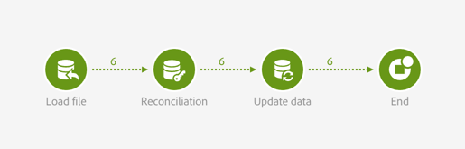

# External signal and data import {#external-signal-data-import}

O exemplo a seguir ilustra a atividade **[!UICONTROL External signal]** em um caso de uso comum. Uma importação de dados é realizada em um workflow de origem. Quando a importação for concluída e o banco de dados for atualizado, um segundo workflow será acionado. Esse segundo workflow é usado para atualizar uma agregação nos dados importados.

O workflow de origem é apresentado da seguinte maneira:

* Uma atividade [Load file](../../automating/using/load-file.md) carrega um arquivo contendo novos dados de compra. Observe que o [banco de dados foi estendido](../../developing/using/data-model-concepts.md) de acordo, pois dados de compra não estão presentes por padrão no datamart.

   Por exemplo:

   ```
   tcode;tdate;customer;product;tamount
   aze123;21/05/2015;dannymars@example.com;A2;799
   aze124;28/05/2015;dannymars@example.com;A7;8
   aze125;31/07/2015;john.smith@example.com;A7;8
   aze126;14/12/2015;john.smith@example.com;A10;4
   aze127;02/01/2016;dannymars@example.com;A3;79
   aze128;04/03/2016;clara.smith@example.com;A8;149
   ```

* Uma atividade de [Reconciliação](../../automating/using/reconciliation.md) cria os links entre os dados importados e o banco de dados para que os dados de transações sejam conectados corretamente a perfis e produtos.
* Uma atividade [Atualizar dados](../../automating/using/update-data.md) insere e atualiza o recurso Transações do banco de dados com os dados recebidos.
* An [End](../../automating/using/start-and-end.md) activity triggers the destination workflow, which is used to update aggregates.



O workflow de destino é apresentado da seguinte forma:

* An [External signal](../../automating/using/external-signal.md) activity waits for the source workflow to be successfully finished.
* Uma atividade de [Query](../../automating/using/query.md#enriching-data) é direcionada a perfis e os enriquece com uma coleção definida para recuperar a data da última compra.
* Uma atividade [Atualizar dados](../../automating/using/update-data.md) armazena os dados adicionais em um campo personalizado dedicado. Observe que o recurso de perfil foi estendido para adicionar o campo **Last purchase date**.


