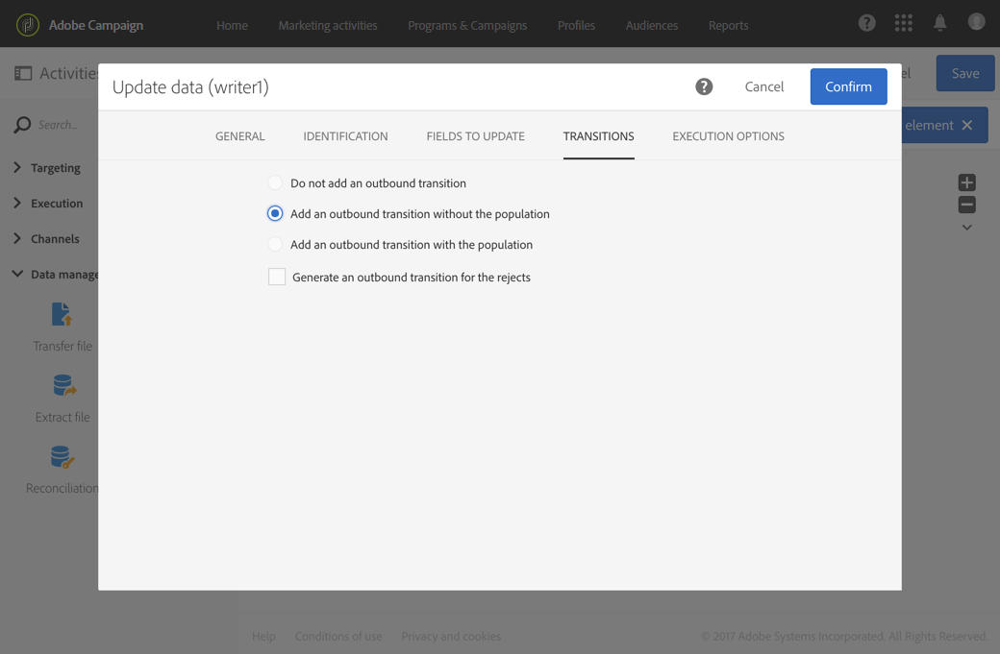

# Sinal externo{#external-signal}

## Descrição {#description}

A **[!UICONTROL External signal]** atividade aciona um fluxo de trabalho quando algumas condições são atendidas com êxito em outro fluxo de trabalho ou a partir de uma chamada REST API.

## Contexto de utilização {#context-of-use}

A **[!UICONTROL External signal]** atividade é usada para organizar e orquestrar diferentes processos que fazem parte da mesma jornada do cliente para workflows diferentes. Ele permite start de um fluxo de trabalho de outro, permitindo suportar jornadas de clientes mais complexas, ao mesmo tempo que pode monitorar e reagir melhor em caso de problema.

A **[!UICONTROL External signal]** atividade foi projetada para ser colocada como a primeira atividade de um fluxo de trabalho. Ele pode ser acionado a partir da **[!UICONTROL End]** atividade de outro fluxo de trabalho ou de uma chamada REST API (para obter mais informações, consulte a documentação [da](../../api/using/triggering-a-signal-activity.md)API).

Quando acionados, os parâmetros externos podem ser definidos e estar disponíveis nas variáveis de eventos de fluxo de trabalho. O processo para chamar um fluxo de trabalho com parâmetros externos está detalhado [nesta seção](../../automating/using/calling-a-workflow-with-external-parameters.md).

>[!NOTE]
>
>A atividade não pode ser acionada com mais frequência do que a cada 10 minutos.

Observe que uma **[!UICONTROL External signal]** atividade pode ser acionada a partir de vários eventos diferentes. Nesse caso, o evento **[!UICONTROL External signal]** é acionado assim que um dos workflows de origem ou uma chamada de API é executada. Não é necessário que todos os workflows de origem sejam concluídos.

**Tópicos relacionados**

* [Caso de uso: atividade do sinal externo e importação](../../automating/using/external-signal-data-import.md)de dados.
* [Caso de uso: Como chamar um fluxo de trabalho para criar uma audiência a partir de um arquivo usando parâmetros externos](../../automating/using/calling-a-workflow-with-external-parameters.md#use-case)

## Configuração {#configuration}

Ao configurar um sinal externo, é importante primeiro configurar a **[!UICONTROL External signal]** atividade no fluxo de trabalho de destino. Quando essa configuração for concluída, a **[!UICONTROL External signal]** atividade desse fluxo de trabalho ficará disponível para configurar a **[!UICONTROL End]** atividade do fluxo de trabalho de origem.

1. Arraste e solte uma **[!UICONTROL External signal]** atividade no fluxo de trabalho de destino.
1. Selecione a atividade e abra-a usando o  botão das ações rápidas que aparecem.
1. Edite o rótulo da atividade. Esse rótulo é necessário ao configurar o fluxo de trabalho de origem que aciona o **[!UICONTROL External signal]**.

   Se você quiser chamar o fluxo de trabalho com parâmetros, use a **[!UICONTROL Parameters]** área para declará-los. Para obter mais informações, consulte [esta seção](../../automating/using/calling-a-workflow-with-external-parameters.md#declaring-the-parameters-in-the-external-signal-activity).

   

1. Confirme a configuração da atividade, adicione qualquer outra atividade necessária e salve o fluxo de trabalho.

   >[!NOTE]
   >
   >Se você quiser acionar o fluxo de trabalho de destino a partir de outro fluxo de trabalho, continue com as etapas a seguir. Se você quiser acionar o fluxo de trabalho de destino a partir de uma chamada REST API, consulte a documentação [da](../../api/using/triggering-a-signal-activity.md) API para obter mais detalhes.

1. Abra o fluxo de trabalho de origem e selecione uma **[!UICONTROL End]** atividade. Se não houver **[!UICONTROL End]** atividade disponível, adicione uma após a última atividade de uma ramificação do fluxo de trabalho.

   Algumas atividades não têm nenhuma transição de saída por padrão. Na **[!UICONTROL Properties]** guia dessas atividades, é possível adicionar uma transição de saída.

   Por exemplo, em uma **[!UICONTROL Update data]** atividade, vá até a **[!UICONTROL Transitions]** guia e marque a opção **[!UICONTROL Add an outbound transition without the population]** . Essa opção permite adicionar uma transição que não contenha dados e não consuma espaço desnecessário no sistema. Ele é usado apenas para conectar a **[!UICONTROL End]** atividade extra que aciona o fluxo de trabalho de destino.

   

1. Na **[!UICONTROL External signal]** guia da **[!UICONTROL End]** atividade, selecione o fluxo de trabalho de destino, bem como a **[!UICONTROL External signal]** atividade a ser acionada dentro desse fluxo de trabalho.

   Quando você define uma **[!UICONTROL End]** atividade para acionar outro fluxo de trabalho, seu ícone é atualizado com um símbolo de sinal adicional.

   Se você quiser chamar o fluxo de trabalho com parâmetros, use a **[!UICONTROL Parameters and values]** área. Para obter mais informações, consulte [esta seção](../../automating/using/calling-a-workflow-with-external-parameters.md#defining-the-parameters-when-calling-the-workflow).

   

1. Salve o fluxo de trabalho de origem.

Depois que a **[!UICONTROL End]** atividade do fluxo de trabalho de origem ou da chamada REST API é executada, o fluxo de trabalho de destino é automaticamente disparado da **[!UICONTROL External signal]** atividade.

>[!NOTE]
>
>O fluxo de trabalho de destino deve ser iniciado manualmente antes de poder ser acionado. Quando iniciado, o **[!UICONTROL External activity]** é ativado e aguarda o sinal do fluxo de trabalho de origem.
