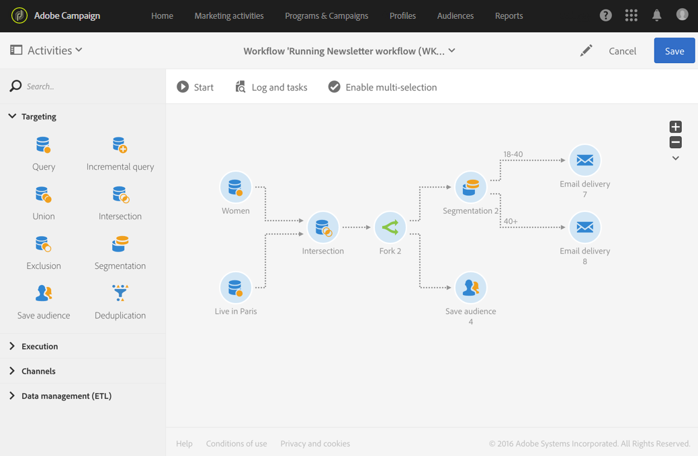

# Bifurcação{#fork}

## Descrição {#description}

A atividade **[!UICONTROL Fork]** permite criar transições de saída para iniciar várias atividades ao mesmo tempo.

## Contexto de uso {#context-of-use}

A atividade **[!UICONTROL Fork]** permite realizar várias atividades diferentes de maneira independente no mesmo fluxo de trabalho.

## Configuração {#configuration}

1. Arraste e solte uma atividade **[!UICONTROL Fork]** no seu fluxo de trabalho.
1. Conecte-a às outras atividades anteriores a ela, como consultas.
1. Selecione e abra a atividade usando o botão  das ações rápidas exibidas.
1. Especifique o número de transições de saída criando, excluindo ou duplicando-as. Você também pode atribuir um nome e um rótulo a elas.
1. Confirme a configuração da sua atividade e salve o fluxo de trabalho.

## Exemplo {#example}

O exemplo a seguir mostra uma intersecção de duas atividades de consulta que segmenta perfis do banco de dados do Adobe Campaign, neste caso, mulheres morando em Paris. A atividade Fork, portanto, permite que você use várias atividades ao mesmo tempo: uma que salva o público-alvo para lembrar a população calculada, e outra que segmenta a população para enviar dois emails diferentes com um conteúdo direcionado para cada segmento. O primeiro email é enviado para mulheres parisienses entre 18 e 40 anos e outro para mulheres parisienses com mais de 40 anos.

