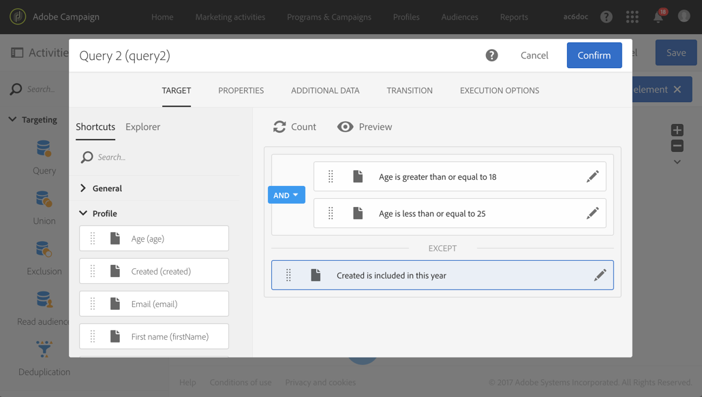

# Identificação de duplicações antes de um delivery {#identifying-duplicates-before-a-delivery}

O exemplo a seguir ilustra uma desduplicação que possibilita excluir os duplicados de um público alvo antes de enviar um email. Isso significa evitar o envio de uma comunicação várias vezes para o mesmo perfil.

Este fluxo de trabalho é composto por:

* Um [Query](../../automating/using/query.md) que permite definir o público alvo do email. Aqui, o fluxo de trabalho segmenta todos os perfis com idade entre 18 e 25 anos que estão no banco de dados do cliente por mais de um ano.

   

* Uma atividade [Desduplicação-duplicada](../../automating/using/deduplication.md), que permite identificar os duplicados que vêm do query anterior. Neste exemplo, somente um registro é salvo para cada duplicata. As duplicatas são identificadas usando o endereço de email. Isso significa que o delivery de email só pode ser enviado uma vez para cada endereço que esteja presente no direcionamento.

   O método de desduplicação selecionado é **[!UICONTROL Non-empty value]**. Esse método assegura que, entre os registros mantidos em caso de duplicatas, seja dada prioridade àqueles em que foi fornecido o **nome**. Esse método se tornará mais coerente se o nome for usado nos campos de personalização do conteúdo do email.

   Além disso, uma transição adicional é incluída para manter as duplicatas e poder listá-las.

   

* Um [delivery de e-mail](../../automating/using/email-delivery.md) colocado depois da transição de saída principal do desduplicação-duplicado.
* Uma atividade [Salve a audiência](../../automating/using/save-audience.md) colocada após a transição adicional do desduplicação-duplicado para salvar os duplicados em uma audiência **Duplicados**. Esse público-alvo pode ser reutilizado para excluir diretamente membros de cada delivery de email.
