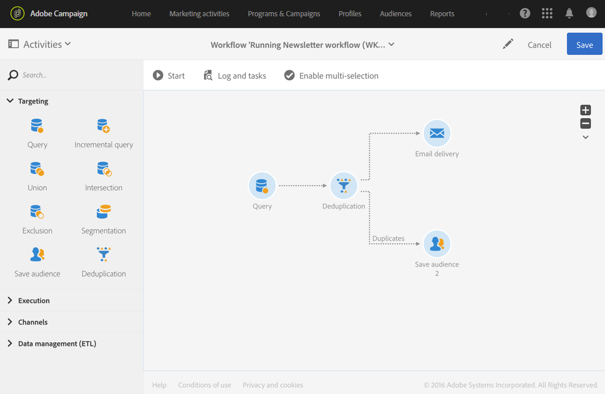
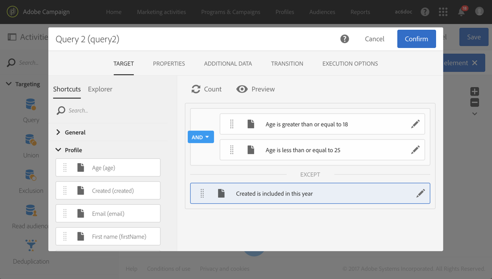
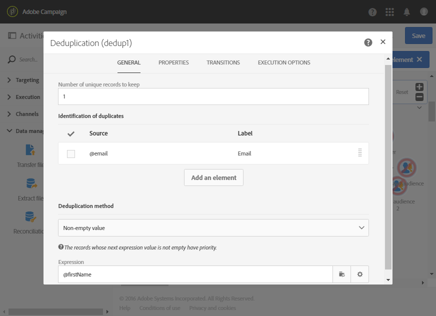

# Identificação de duplicações antes de uma entrega {#identifying-duplicates-before-a-delivery}

O exemplo a seguir ilustra uma desduplicação que possibilita excluir os duplicados de um público alvo antes de enviar um email. Isso significa evitar o envio de uma comunicação várias vezes para o mesmo perfil.

Este fluxo de trabalho é composto por:

* Uma [Consulta](../../automating/using/query.md) que permite definir o destino do email. Aqui, o fluxo de trabalho segmenta todos os perfis com idade entre 18 e 25 anos que estão no banco de dados do cliente por mais de um ano.

  

* Uma atividade [Deduplication](../../automating/using/deduplication.md), que permite identificar os duplicados que vêm da consulta anterior. Neste exemplo, somente um registro é salvo para cada duplicado. Os duplicados são identificados usando o endereço de email. Isso significa que a entrega de email só pode ser enviada uma vez para cada endereço que esteja presente no direcionamento.

  O método de desduplicação selecionado é **[!UICONTROL Non-empty value]**. Esse método assegura que, entre os registros mantidos em caso de duplicados, seja dada prioridade àqueles em que foi fornecido o **nome**. Esse método se tornará mais coerente se o nome for usado nos campos de personalização do conteúdo do email.

  Além disso, uma transição adicional é incluída para manter os duplicados e poder listá-los.

  

* Uma [Entrega de email](../../automating/using/email-delivery.md) colocada após a transição de saída principal da desduplicação.
* Uma atividade [Save audience](../../automating/using/save-audience.md) foi colocada após a transição adicional da desduplicação para salvar as duplicatas em um público-alvo **Duplicates**. Esse público-alvo pode ser reutilizado para excluir diretamente membros de cada entrega de email.
