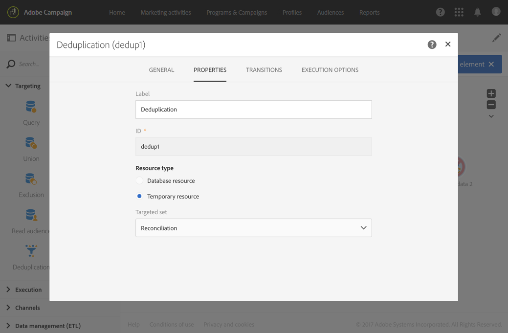

# Importing data{#importing-data}

## Collecting data {#collecting-data}

É possível coletar dados de um arquivo para processá-lo e/ou importá-lo no banco de dados do Adobe Campaign.

* The **[!UICONTROL Load file]** activity allows you to import data in one structured form to use this data in Adobe Campaign. Os dados são importados temporariamente e outra atividade é necessária para integrá-la definitivamente no banco de dados do Adobe Campaign.
* The **[!UICONTROL Transfer file]** activity allows you to receive or send files, test whether there are files present, or list files in Adobe Campaign.

   You can use this activity before a **[!UICONTROL Load file]** in case you need to retrieve the file from an external source.

## Import best practices {#import-best-practices}

Ser cauteloso e seguir as poucas regras simples detalhadas abaixo ajudará a garantir a consistência dos dados no banco de dados e a evitar erros comuns durante a atualização do banco de dados ou exportações de dados.

### Using import templates {#using-import-templates}

Most import workflows should contain the following activities: **[!UICONTROL Load file]**, **[!UICONTROL Reconciliation]**, **[!UICONTROL Segmentation]**, **[!UICONTROL Deduplication]**, **[!UICONTROL Update data]**.

O uso de modelos de importação torna muito conveniente preparar importações similares e garantir a consistência dos dados no banco de dados.

In many projects, imports are built without **[!UICONTROL Deduplication]** activity because the files used in the project do not have duplicates. As duplicatas às vezes aparecem de importar arquivos diferentes. A remoção da duplicação é difícil. Portanto, uma etapa de desduplicação é uma boa precaução em todos os fluxos de trabalho de importação.

Não deixe de considerar que os dados de entrada sejam consistentes e corretos, ou que o departamento de TI ou o supervisor do Adobe Campaign resolverão isso. Durante o projeto, lembre-se da limpeza dos dados. Desduplicar, reconciliar e manter consistência ao importar dados.

An example of a generic workflow template designed for importing data is available in the [Example: Import workflow template](../../automating/using/importing-data.md#example--import-workflow-template) section.

>[!NOTE]
>
>You can also use [import templates](../../automating/using/importing-data-with-import-templates.md). São modelos de fluxo de trabalho definidos por um administrador que, uma vez ativada, oferecem somente a possibilidade de especificar o arquivo que contém os dados a serem importados.

### Using flat file formats {#using-flat-file-formats}

O formato mais eficiente para importações é arquivos simples. Arquivos simples podem ser importados no modo em massa no nível do banco de dados.

Por exemplo:

* Separador: tab ou ponto e vírgula
* Primeira linha com cabeçalhos
* Sem delimitador de string
* Formato de data: AAAA/MM/DD HH: mm: SS

Exemplo de arquivo a ser importado:

```
lastname;firstname;birthdate;email;crmID
Smith;Hayden;23/05/1989;hayden.smith@example.com;124365
Mars;Daniel;17/11/1987;dannymars@example.com;123545
Smith;Clara;08/02/1989;hayden.smith@example.com;124567
Durance;Allison;15/12/1978;allison.durance@example.com;120987
```

### Using compression {#using-compression}

Use arquivos compactados para importações e exportações quando possível. O GZIP é suportado por padrão. You can add pre-processing when importing files or post-processing when extracting data, respectively in the **[!UICONTROL Load file]** and **[!UICONTROL Extract file]** workflow activities.

### Importing in Delta mode {#importing-in-delta-mode}

As importações regulares devem ser realizadas no modo delta. Isso significa que apenas os dados modificados ou novos são enviados para o Adobe Campaign, em vez de toda a tabela toda vez.

As importações completas devem ser usadas apenas para a carga inicial.

### Maintaining consistency {#maintaining-consistency}

Para manter a consistência dos dados no banco de dados do Adobe Campaign, siga os seguintes princípios:

* Se os dados importados corresponderem a uma tabela de referência no Adobe Campaign, isso deve ser reconciliado com a tabela no fluxo de trabalho. Registros que não correspondem devem ser rejeitados.
* Ensure that the imported data is always **"normalized"** (email, phone number, direct mail address) and that this normalization is reliable and will not change over the years. Se esse não for o caso, algumas duplicatas provavelmente aparecerão no banco de dados e, como o Adobe Campaign não fornecer ferramentas para fazer a correspondência "fuzzy", será muito difícil gerenciá-las e removê-las.
* Os dados transacionais devem ter uma chave de reconciliação e ser reconciliados com os dados existentes para evitar a criação duplicata.
* **Importe arquivos relacionados em ordem**. Se a importação for composta por vários arquivos que dependem uns dos outros, o fluxo de trabalho deve garantir que os arquivos sejam importados na ordem correta. Quando um arquivo falha, os outros arquivos não são importados.
* **Desduplicar**, reconciliar e manter consistência ao importar dados.

## Example: Import workflow template {#example--import-workflow-template}

Usar um modelo de importação é uma prática recomendada se você precisar importar regularmente arquivos com a mesma estrutura.

Este exemplo mostra como pré-definir um fluxo de trabalho que pode ser reutilizado para importar perfis provenientes de um CRM no banco de dados do Adobe Campaign.

1. Create a new workflow template from **[!UICONTROL Resources > Templates > Workflow templates]**.
1. Adicione as seguintes atividades:

   * **[!UICONTROL Load file]**: Defina a estrutura esperada do arquivo que contém os dados a serem importados.

      >[!NOTE]
      >
      >Só é possível importar dados de um único arquivo. If the workflow has multiple **[!UICONTROL Load file]** activities, the same file will be used each time.

   * **[!UICONTROL Reconciliation]**: Concilie os dados importados com os dados do banco de dados.
   * **[!UICONTROL Segmentation]**: Crie filtros para processar registros de forma diferente, dependendo se eles poderiam ser conciliados ou não.
   * **[!UICONTROL Deduplication]**: Remova os dados do arquivo recebido antes de ser inserido no banco de dados.
   * **[!UICONTROL Update data]**: Atualize o banco de dados com os perfis importados.
   

1. Configure the **[!UICONTROL Load file]** activity:

   * Defina a estrutura esperada fazendo upload de um arquivo de amostra. O arquivo de amostra deve conter apenas algumas linhas, mas todas as colunas necessárias para a importação. Verifique e edite o formato de arquivo para verificar se o tipo de coluna está definido corretamente: texto, data, número inteiro etc. Por exemplo:

      ```
      lastname;firstname;birthdate;email;crmID
      Smith;Hayden;23/05/1989;hayden.smith@mailtest.com;123456
      ```

   * In the **[!UICONTROL File to load]** section, select **[!UICONTROL Upload a new file from the local machine]** and leave the field blank. Sempre que um novo fluxo de trabalho é criado a partir desse modelo, você pode especificar aqui o arquivo que desejar, desde que corresponda à estrutura definida.

      Você pode usar qualquer uma das opções, mas é necessário modificar o modelo de acordo. For example, if you select **[!UICONTROL Use the file specified in the inbound transition]**, you can add a **[!UICONTROL Transfer file]** activity before to retrieve the file to import from a FTP/SFTP server.

      If you want users to be able to download a file containing errors that occurred during an import, check the **[!UICONTROL Keep the rejects in a file]** option and specify the **[!UICONTROL File name]**.

      

1. Configure the **[!UICONTROL Reconciliation]** activity. A finalidade dessa atividade neste contexto é identificar os dados de entrada.

   * In the **[!UICONTROL Relations]** tab, select **[!UICONTROL Create element]** and define a link between the imported data and the recipients targeting dimension (see [Targeting dimensions and resources](../../automating/using/query.md#targeting-dimensions-and-resources)). In this example, the **CRM ID** custom field is used to create the join condition. Use o campo ou combinação de campos que você precisa quanto tempo ele permita para identificar registros exclusivos.
   * In the **[!UICONTROL Identification]** tab, leave the **[!UICONTROL Identify the document from the working data]** option unchecked.
   

1. Configure the **[!UICONTROL Segmentation]** activity to retrieve reconciled recipients in one transition and recipients that could not be reconciled but who have enough data in a second transition.

   A transição com destinatários reconciliados pode ser usada para atualizar o banco de dados. A transição com destinatários desconhecidos pode ser usada para criar novas entradas de destinatários no banco de dados se um conjunto mínimo de informações estiver disponível no arquivo.

   Os destinatários que não podem ser conciliados e não têm dados suficientes são selecionados em uma transição de complemento complementar e podem ser exportados em um arquivo separado ou simplesmente ignorados.

   * In the **[!UICONTROL General]** tab of the activity, set the **[!UICONTROL Resource type]** to **[!UICONTROL Temporary resource]** and select **[!UICONTROL Reconciliation]** as the targeted set.
   * In the **[!UICONTROL Advanced options]** tab, check the **[!UICONTROL Generate complement]** option to be able to see if any record cannot be inserted in the database. Se necessário, você pode aplicar mais processamento aos dados complementares: exportação de arquivos, atualização de lista etc.
   * In the first segment of the **[!UICONTROL Segments]** tab, add a filtering condition on the inbound population to select only records for which the profile's CRM ID is not equal to 0. Dessa forma, os dados do arquivo que são conciliados com perfis do banco de dados são selecionados nesse subconjunto.

      

   * Adicione um segundo segmento que selecione registros unificados que tenham dados suficientes para serem inseridos no banco de dados. Por exemplo: endereço de e-mail, nome e sobrenome. Os registros que não são conciliados têm o valor de ID de CRM do perfil igual a 0.

      

   * All records that are not selected in the first two subsets are selected in the **[!UICONTROL Complement]**.

1. Configure the **[!UICONTROL Update data]** activity located after the first outbound transition of the **[!UICONTROL Segmentation]** activity configured previously.

   * Select **[!UICONTROL Update]** as **[!UICONTROL Operation type]** since the inbound transition only contains recipients already present in the database.
   * In the **[!UICONTROL Identification]** tab, select **[!UICONTROL Using reconciliation criteria]** and define a key between the **[!UICONTROL Dimension to update]** - Profiles in this case - and the link created in the **[!UICONTROL Reconciliation]** activity. In this example, the **CRM ID** custom field is used.

      

   * In the **[!UICONTROL Fields to update]** tab, indicate the fields from the Profiles dimension to update with the value of the corresponding column from the file. Se os nomes das colunas do arquivo forem idênticos ou quase idênticos aos nomes dos campos de dimensão destinatários, você pode usar a varinha mágica para corresponder automaticamente aos diferentes campos.

      

      >[!NOTE]
      >
      >Se você planeja enviar emails diretos a esses perfis, certifique-se de incluir um endereço postal, já que essas informações são essenciais para o provedor de mala direta. Also make sure that the **[!UICONTROL Address specified]** box in your profiles' information is checked. To update this option from a workflow, simply add an element to the fields to update, and specify **1** as **[!UICONTROL Source]** and select the **postalAddress/@addrDefined** field as **[!UICONTROL Destination]**. For more on direct mail and the use of the **[!UICONTROL Address specified]** option, see [this document](../../channels/using/about-direct-mail.md#recommendations).

1. Configure the **[!UICONTROL Deduplication]** activity located after the transition containing unreconciled profiles:

   * In the **[!UICONTROL Properties]** tab, set the **[!UICONTROL Resource type]** to the temporary resource generated from the **[!UICONTROL Reconciliation]** activity of the workflow.

      

   * Neste exemplo, o campo de email é usado para encontrar perfis exclusivos. Você pode usar qualquer campo que tenha certeza e fizer parte de uma combinação exclusiva.
   * Choose a **[!UICONTROL Deduplication method]**. Nesse caso, o aplicativo decide automaticamente quais registros são mantidos no caso de duplicatas.
   

1. Configure the **[!UICONTROL Update data]** activity located after the **[!UICONTROL Deduplication]** activity configured previously.

   * Select **[!UICONTROL Insert only]** as **[!UICONTROL Operation type]** since the inbound transition only contains profiles not present in the database.
   * In the **[!UICONTROL Identification]** tab, select **[!UICONTROL Using reconciliation criteria]** and define a key between the **[!UICONTROL Dimension to update]** - Profiles in this case - and the link created in the **[!UICONTROL Reconciliation]** activity. In this example, the **CRM ID** custom field is used.

      

   * In the **[!UICONTROL Fields to update]** tab, indicate the fields from the Profiles dimension to update with the value of the corresponding column from the file. Se os nomes das colunas do arquivo forem idênticos ou quase idênticos aos nomes dos campos de dimensão destinatários, você pode usar a varinha mágica para corresponder automaticamente aos diferentes campos.

      

      >[!NOTE]
      >
      >Se você planeja enviar emails diretos a esses perfis, certifique-se de incluir um endereço postal, já que essas informações são essenciais para o provedor de mala direta. Also make sure that the **[!UICONTROL Address specified]** box in your profiles' information is checked. To update this option from a workflow, simply add an element to the fields to update, and specify **1** as **[!UICONTROL Source]** and select the **[postalAddress/@addrDefined]** field as **[!UICONTROL Destination]**. For more on direct mail and the use of the **[!UICONTROL Address specified]** option, see [this document](../../channels/using/about-direct-mail.md#recommendations).

1. After the third transition of the **[!UICONTROL Segmentation]** activity, add a **[!UICONTROL Extract file]** activity and a **[!UICONTROL Transfer file]** activity if you want to keep track of data not inserted in the database. Configure essas atividades para exportar a coluna necessária e transferir o arquivo em um servidor FTP ou SFTP, no qual você pode recuperá-lo.
1. Add an **[!UICONTROL End]** activity and save the workflow template.

Agora, o modelo pode ser usado e está disponível para cada novo fluxo de trabalho. All is needed is then to specify the file containing the data to import in the **[!UICONTROL Load file]** activity.


