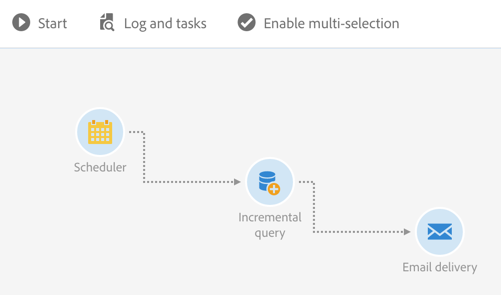
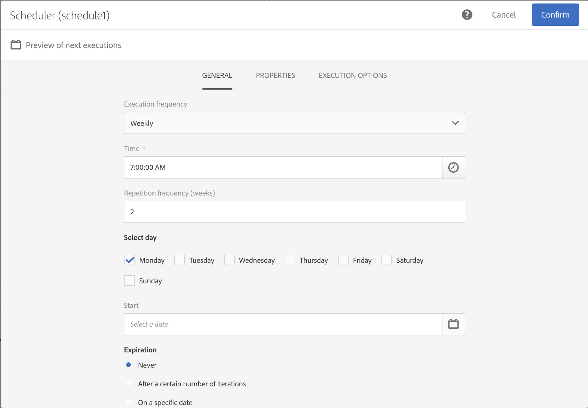
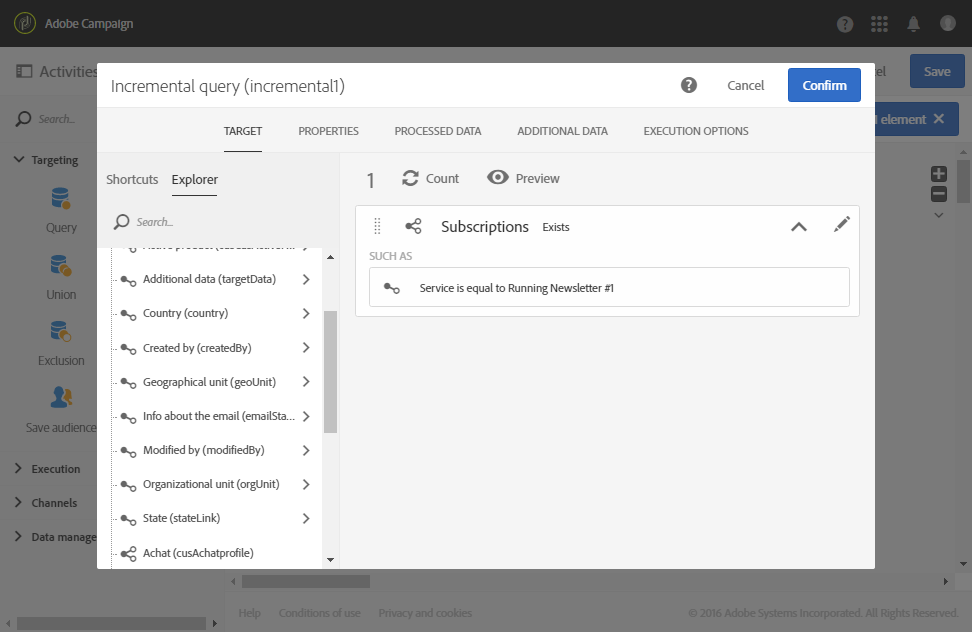

# Consulta incremental para assinantes de um serviço {#example--incremental-query-on-subscribers-to-a-service}

O exemplo a seguir mostra a configuração de uma atividade **[!UICONTROL Incremental query]** que filtra os perfis no banco de dados do Adobe Campaign que estão inscritos no serviço **Running Newsletter** para enviar um email de boas-vindas contendo um código promocional.

O fluxo de trabalho é composto pelos seguintes elementos:

* Uma atividade [Scheduler](../../automating/using/scheduler.md), para executar o fluxo de trabalho todas as segundas-feiras às 6 horas.

  

* Uma atividade [Query incremental](../../automating/using/incremental-query.md), que segmenta todos os assinantes atuais durante a primeira execução e depois somente os novos assinantes daquela semana durante as execuções a seguir.

  

* Uma atividade de [Entrega de email](../../automating/using/email-delivery.md). O fluxo de trabalho é executado uma vez por semana, mas você pode agregar os emails enviados e os resultados por mês, por exemplo, para gerar relatórios durante um período de um mês inteiro e não apenas uma única semana.

  Para fazer isso, escolha criar um **[!UICONTROL Recurring email]** aqui, reagrupando os emails e os resultados **[!UICONTROL By month]**.

  Defina o conteúdo do seu email e insira o código promocional de boas-vindas. Para obter mais informações, consulte as [seções Definição do conteúdo do email](../../designing/using/personalization.md).

Em seguida, inicie a execução do fluxo de trabalho. Todas as semanas, os novos assinantes receberão o email de boas-vindas com o código promocional.
