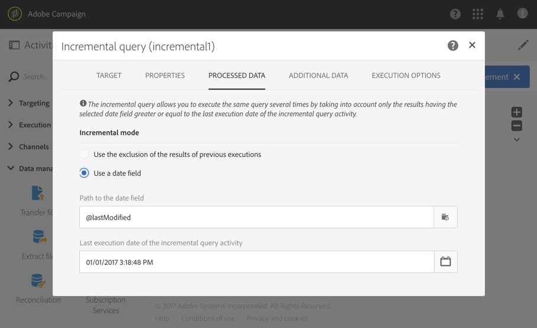

# Query incremental{#incremental-query}

## Descrição {#description}

A atividade **[!UICONTROL Incremental query]** permite filtrar e extrair uma população de elementos do banco de dados do Adobe Campaign. Todas as vezes que essa atividade é executada, os resultados das execuções anteriores são excluídos. Ela permite direcionar somente elementos novos.

Você pode definir **[!UICONTROL Additional data]** para a população direcionada em uma guia dedicada. Esses dados são armazenados em colunas adicionais e só podem ser usados para o workflow em andamento.

A atividade usa a ferramenta Editor de consultas. Essa ferramenta é detalhada em uma [seção dedicada](../../automating/using/editing-queries.md#about-query-editor).

## Contexto de uso {#context-of-use}

Um evento **[!UICONTROL Incremental query]** deve estar vinculado a um evento **[!UICONTROL Scheduler]** para definir a frequência de execução do workflow e, portanto, do query.

A guia **[!UICONTROL Processed data]**, que é específica para essa atividade, permite visualizar os resultados das execuções anteriores da atividade, se necessário.

A atividade **[!UICONTROL Incremental query]** pode ser usada para várias finalidades:

* Segmentação de indivíduos para definir o público-alvo ou o público de uma mensagem, etc.

* Exportação de dados.

   Você pode usar uma atividade **[!UICONTROL Incremental query]** para exportar regularmente novos logs em arquivos. Pode ser útil, por exemplo, se você quiser usar seus dados de log em ferramentas externas de BI ou geração de relatórios. Um exemplo completo está disponível na seção [Exportar logs](../../automating/using/exporting-logs.md).

**Tópicos relacionados**

* [Caso de uso: Query incremental dos assinantes de um serviço](../../automating/using/incremental-query-on-subscribers.md)

## Configuração {#configuration}

1. Arraste e solte uma atividade **[!UICONTROL Incremental query]** no seu workflow.
1. Selecione e abra a atividade usando o botão  das ações rápidas exibidas.
1. Se você quiser executar um query em um recurso diferente do perfil, vá para a guia **[!UICONTROL Properties]** da atividade e selecione um **[!UICONTROL Resource]** e um **[!UICONTROL Targeting dimension]**.

   O **[!UICONTROL Resource]** permite refinar os filtros exibidos na paleta, enquanto o **[!UICONTROL Targeting dimension]**, contextual em relação ao recurso selecionado, corresponde ao tipo de população que você gostaria de obter (perfis identificados, deliveries, dados vinculados ao recurso selecionado, etc.).

1. Na guia **[!UICONTROL Target]**, execute o query definindo e combinando regras.
1. Na guia **[!UICONTROL Processed data]**, escolha o modo incremental que deseja usar para as próximas execuções do workflow:

   * **[!UICONTROL Use the exclusion of the results of previous executions]**: os resultados das execuções anteriores para cada nova execução são excluídos.
   * **[!UICONTROL Use a date field]**: as execuções seguintes levarão em conta apenas os resultados que tiverem o campo de data selecionado maior que ou igual à data da última execução da atividade **[!UICONTROL Incremental query]**. Você pode selecionar qualquer campo de data pertencente ao recurso selecionado na guia **[!UICONTROL Properties]**. Esse modo tem melhor desempenho ao consultar recursos grandes, como dados de log.

      Após a primeira execução do workflow, você poderá ver nesta guia a última data de execução que será usada para a próxima execução. Ela é atualizada automaticamente todas as vezes que o workflow é executado. Você ainda tem a possibilidade de substituir esse valor, inserindo manualmente um novo para que ele se ajuste às suas necessidades.
   >[!NOTE]
   >
   >O modo **[!UICONTROL Use a date field]** permite mais flexibilidade dependendo do campo de data selecionado. Por exemplo, se o campo selecionado corresponder a uma data de modificação, o modo de campo de data permitirá recuperar dados que foram atualizados recentemente, enquanto o outro modo simplesmente excluirá gravações que já foram direcionadas para uma execução anterior, mesmo que elas tenham sido modificadas desde a última execução do workflow.

   

1. Você pode definir **[!UICONTROL Additional data]** para a população direcionada em uma guia dedicada. Esses dados são armazenados em colunas adicionais e só podem ser usados para o workflow em andamento. Especificamente, você pode adicionar dados das tabelas do banco de dados do Adobe Campaign vinculadas ao targeting dimension do query. Consulte a seção [Enriquecimento de dados](../../automating/using/query.md#enriching-data).
1. Confirme a configuração da sua atividade e salve o fluxo de trabalho.

## Enriquecimento de dados {#enriching-data}

Assim como para um query, você pode enriquecer os dados de um **[!UICONTROL Incremental query]**. Consulte a seção [Enriquecimento de dados](../../automating/using/query.md#enriching-data).
