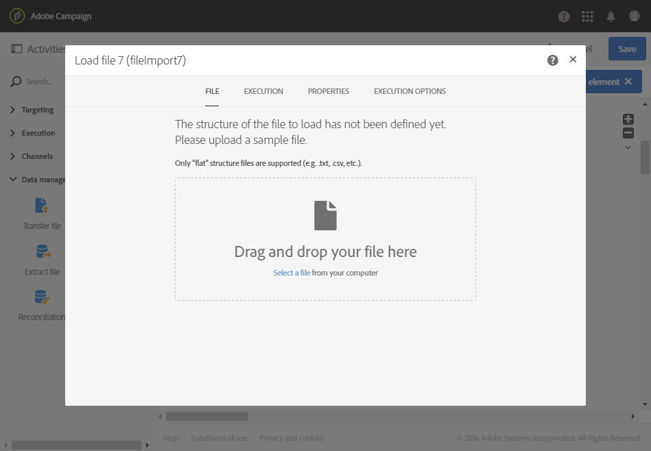
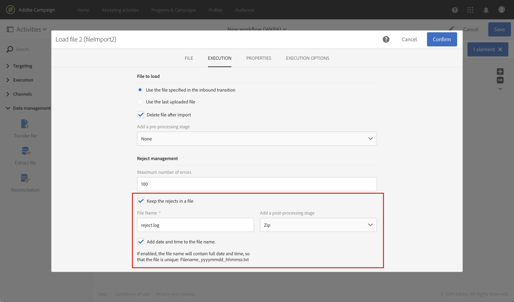

# Carregar arquivo {#load-file}

## Descrição {#description}

>[!CAUTION]
>
>Lembre-se dos limites do armazenamento SFTP, Armazenamento DB e perfil ativo conforme o contrato da Adobe Campaign ao usar essa funcionalidade.

A atividade **[!UICONTROL Load file]** permite importar dados em um formulário estruturado para usá-los no Adobe Campaign. Os dados são temporariamente importados e outra atividade é necessária para integrá-los definitivamente ao banco de dados do Adobe Campaign.

## Contexto de uso {#context-of-use}

O modo de extração de dados é definido quando a atividade é configurada. O arquivo que será carregado pode ser uma lista de contatos, por exemplo.

Você pode:

* Usar a estrutura do arquivo para aplicá-la aos dados de outro arquivo (recuperados pela atividade **[!UICONTROL Transfer file]**) ou
* Usar a estrutura e os dados do arquivo para importá-lo para o Adobe Campaign.

>[!IMPORTANT]
>
>Somente arquivos de estrutura “simples” são considerados, como arquivos .txt, .csv etc., por exemplo.

**Tópicos relacionados:**

* [Caso de uso: Atualização do banco de dados com dados externos](../../automating/using/update-database-file.md)
* [Caso de uso: Atualização de dados com base em um download automático de arquivo](../../automating/using/update-data-automatic-download.md)
* [Caso de uso: Envio de um email com campos aprimorados](../../automating/using/sending-email-enriched-fields.md)
* [Caso de uso: Reconciliar uma audiência de arquivo com o banco de dados](../../automating/using/reconcile-file-audience-with-database.md)

## Configuração {#configuration}

A configuração da atividade envolve duas etapas. Primeiro, é necessário definir a estrutura de arquivo esperada fazendo upload de um arquivo de amostra. Depois disso, você poderá especificar a origem do arquivo cujos dados serão importados.

>[!NOTE]
>
>Os dados do arquivo de amostra são usados para configurar a atividade, mas não são importados. Recomendamos usar um arquivo de amostra com poucos dados.

1. Arraste e solte uma atividade **[!UICONTROL Load file]** no seu fluxo de trabalho.
1. Selecione e abra a atividade usando o botão  das ações rápidas exibidas.
1. Faça upload do arquivo de amostra que permitirá definir a estrutura esperada ao importar o arquivo final.

   

   Depois que o arquivo de dados for carregado, duas novas guias serão exibidas na atividade: **[!UICONTROL File structure]** e **[!UICONTROL Column definition]**.

1. Acesse a guia **[!UICONTROL File structure]** para exibir a estrutura que é detectada automaticamente do arquivo de amostra.

   Se a estrutura do arquivo tiver sido detectada de modo incorreto, use uma das opções a seguir para corrigir possíveis erros:

   * Você pode optar por usar a estrutura de outro arquivo selecionando a opção **[!UICONTROL Detect structure from a new file]**.
   * Você pode modificar os parâmetros de detecção padrão para adaptá-los ao seu arquivo. O campo **[!UICONTROL File type]** permite especificar se o arquivo que você quer importar é composto de colunas com comprimento fixo. Nesse caso, você também deve especificar o número máximo de caracteres para cada coluna na guia **[!UICONTROL Column definition]**.

      Todas as opções de detecção necessárias para recuperar corretamente os dados do arquivo são reagrupadas em **[!UICONTROL File format]**. Você pode modificá-las e detectar novamente a estrutura do último arquivo carregado na atividade considerando essas novas configurações. Para fazer isso, use o botão **[!UICONTROL Apply configuration]**. Por exemplo, você pode especificar um separador de coluna diferente.

      >[!NOTE]
      >
      >Essa operação considera o último arquivo que foi carregado na atividade. Se o arquivo detectado for grande, a pré-visualização de dados mostrará apenas as 30 primeiras linhas.

      

      Na seção **[!UICONTROL File format]**, a opção **[!UICONTROL Check columns from file against column definitions]** permite verificar se as colunas do arquivo que você está fazendo upload correspondem à definição da coluna.

      Se o número e/ou o nome da coluna não corresponderem à definição da coluna, uma mensagem de erro será exibida na execução do fluxo de trabalho. Se a opção não estiver ativada, avisos serão exibidos no arquivo de log.

      

1. Acesse a guia **[!UICONTROL Column definition]** para verificar o formato dos dados de cada coluna e ajuste os parâmetros, se necessário.

   A guia **[!UICONTROL Column definition]** permite especificar com precisão a estrutura dos dados de cada coluna para importar dados que não contenham erros (por exemplo, usando o gerenciamento nulo) e fazer a correspondência deles com os tipos presentes no banco de dados do Adobe Campaign para operações futuras.

   Por exemplo, você pode alterar o rótulo de uma coluna, selecionar o tipo (sequência, número inteiro, data etc.) ou até mesmo especificar o processamento de erros.

   Para saber mais, consulte a seção [Formato da coluna](#column-format).

   

1. Na guia **[!UICONTROL Execution]**, especifique se o arquivo deve ser processado para carregar dados:

   * É proveniente de uma transição de entrada no fluxo de trabalho.
   * É o que você carregou durante a etapa anterior.
   * É um novo arquivo para upload do computador local. A opção **[!UICONTROL Upload a new file from local machine]** será exibida se o upload de um primeiro arquivo já tiver sido definido no fluxo de trabalho. Isso permitirá que você faça upload de outro arquivo que será processado se o arquivo atual não atender às suas necessidades.

      

1. Se o arquivo do qual você deseja carregar os dados for compactado em um arquivo GZIP (.gz), selecione a opção **[!UICONTROL Decompression]** no campo **[!UICONTROL Add a pre-processing step]**. Isso permitirá descompactar o arquivo antes de carregar os dados. Essa opção só estará disponível se o arquivo for proveniente da transição de entrada da atividade.

   O **[!UICONTROL Add a pre-processing step]** campo também permite descriptografar um arquivo antes de importá-lo para o banco de dados. For more on how to work with encrypted files, refer to [this section](../../automating/using/managing-encrypted-data.md)

1. A opção **[!UICONTROL Keep the rejects in a file]** permite baixar um arquivo com erros que ocorreram durante a importação e aplicar a ele uma etapa de pós-processamento. Quando a opção está ativada, a transição de saída é renomeada como “Rejects”.

   >[!NOTE]
   >
   >A opção **[!UICONTROL Add date and time to the file name]** permite adicionar data e hora ao nome do arquivo que contém as rejeições.

   

1. Confirme a configuração da sua atividade e salve o fluxo de trabalho.

Se ocorrer algum erro com a atividade após a execução do fluxo de trabalho, consulte os logs para obter mais detalhes sobre os valores que estão incorretos no arquivo. Para saber mais sobre logs de fluxo de trabalho, consulte [esta seção](../../automating/using/monitoring-workflow-execution.md).

## Formato da coluna {#column-format}

Ao carregar um arquivo de amostra, o formato da coluna é automaticamente detectado com os parâmetros padrão para cada tipo de dados. Você pode modificar esses parâmetros padrão para definir os processos específicos que serão aplicados aos dados, principalmente quando há um erro ou um valor vazio.

Para fazer isso, selecione **[!UICONTROL Edit properties]** nas ações rápidas da coluna cujo formato você quer definir. A janela de detalhes do formato da coluna será aberta.

Em seguida, você poderá modificar a formatação de cada coluna.

A formatação de coluna permite definir o processamento de valor de cada coluna:

* **[!UICONTROL Ignore column]**: não processa essa coluna durante o carregamento de dados.
* **[!UICONTROL Data type]**: especifica o tipo de dados esperado para cada coluna.
* **[!UICONTROL Format and separators]**, **Propriedades**: especifique as propriedades de um texto, a hora, a data e o formato do valor numérico, bem como o separador especificado pelo contexto da coluna.

   * **[!UICONTROL Maximum number of characters]**: especifica o número máximo de caracteres para colunas do tipo sequência.

      Esse campo deve ser preenchido no carregamento de arquivos compostos de colunas com comprimento fixo.

   * **[!UICONTROL Letter case management]**: define se um processo de caso de caractere precisa ser aplicado aos dados de **Text**.
   * **[!UICONTROL White space management]**: especifica se determinados espaços precisam ser ignorados em uma sequência para os dados de **Text**.
   * **[!UICONTROL Time format]**, **[!UICONTROL Date format]**: especifique o formato dos dados de **Date**, **Time** e **Date and time**.
   * **[!UICONTROL Format]**: permite definir o formato dos valores numéricos para os dados de **Integer** e **Floating number**.
   * **[!UICONTROL Separator]**: define o separador especificado pelo contexto da coluna (separador de milhares ou separador decimal para valores numéricos, separador para datas e hora) para os dados de **Date**, **Time**, **Date and time**, **Integer** e **Floating number**.

* **[!UICONTROL Remapping of values]**: este campo só está disponível na configuração detalhada da coluna. Permite transformar determinados valores quando eles são importados. Por exemplo, você pode transformar “três” em “3”.
* **[!UICONTROL Error processing]**: define o comportamento se um erro for encontrado.

   * **[!UICONTROL Ignore the value]**: o valor é ignorado. Um aviso é gerado no log de execução do fluxo de trabalho.
   * **[!UICONTROL Reject the line]**: a linha inteira não é processada.
   * **[!UICONTROL Use a default value]**: substitui o valor que causa o erro por um valor padrão, definido no campo **[!UICONTROL Default value]**.
   * **[!UICONTROL Use a default value in case the value is not remapped]**: substitui o valor que causa o erro por um valor padrão, definido no campo **[!UICONTROL Default value]**, a menos que um mapeamento tenha sido definido para o valor incorreto (consulte a opção **[!UICONTROL Remapping of values]** acima).
   * **[!UICONTROL Reject the line when there is no remapping value]**: a linha inteira não é processada a menos que um mapeamento tenha sido definido para o valor incorreto (consulte a opção **[!UICONTROL Remapping of values]** acima).

   >[!NOTE]
   >
   >O **[!UICONTROL Error processing]** refere-se a erros nos valores do arquivo importado. Por exemplo, um tipo de dados com falha encontrado (“quatro” por escrito para uma coluna “Integer”), uma sequência com mais caracteres do que o número máximo autorizado, uma data com separadores incorretos etc. No entanto, essa opção não se refere aos erros gerados pelo gerenciamento de valores vazios.

* **[!UICONTROL Default value]**: especifica o valor padrão de acordo com o processamento de erros escolhido.
* **[!UICONTROL Empty value management]**: especifica como gerenciar valores vazios durante o carregamento de dados.

   * **[!UICONTROL Generate an error for numerical fields]**: gera um erro apenas para os campos numéricos, caso contrário, insere um valor NULL.
   * **[!UICONTROL Insert NULL in the corresponding field]**: autoriza valores vazios. O valor NULL é então inserido.
   * **[!UICONTROL Generate an error]**: gera um erro se um valor estiver vazio.
