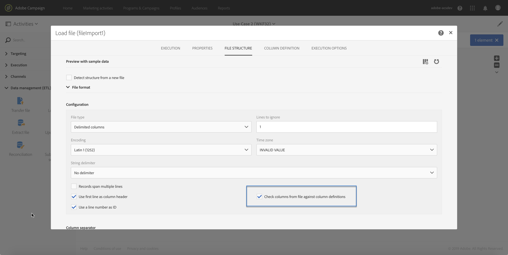
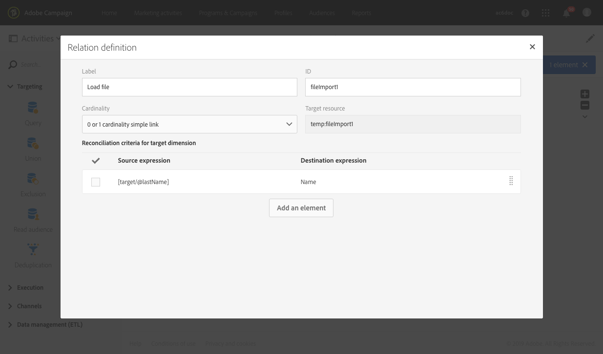
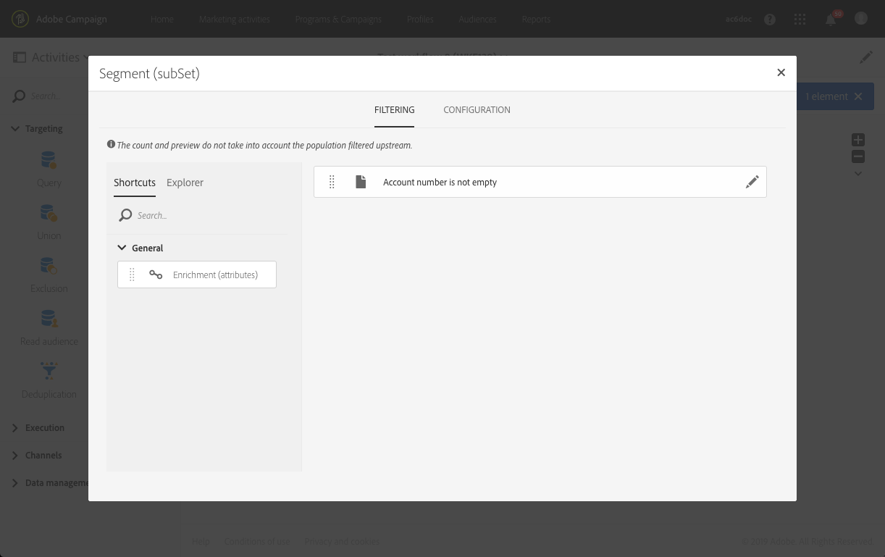

# Carregar arquivo{#load-file}

## Descrição {#description}

A **[!UICONTROL Load file]** atividade permite importar dados em um formulário estruturado para usar esses dados no Adobe Campaign. Os dados são importados temporariamente e outra atividade é necessária para integrá-la definitivamente no banco de dados do Adobe Campaign.

## Contexto de uso {#context-of-use}

A maneira como os dados serão extraídos é definida quando a atividade é configurada. O arquivo a ser carregado pode ser uma lista de contatos, por exemplo.

>[!CAUTION]
>
>Somente os arquivos de estrutura "simples" são considerados como, por exemplo, os arquivos.txt. csv etc., por exemplo.

Você pode:

* Use a estrutura do arquivo para aplicá-la aos dados de outro arquivo (recuperada usando **[!UICONTROL Transfer file]** a atividade) ou,
* Use a estrutura e os dados do arquivo para importá-lo para o Adobe Campaign.

## Configuração {#configuration}

A configuração da atividade envolve duas etapas. Primeiro, é necessário definir a estrutura do arquivo esperado fazendo upload de um arquivo de amostra. Uma vez feita, é possível especificar a origem do arquivo cujos dados serão importados.

>[!NOTE]
>
>Os dados do arquivo de amostra são usados para configurar a atividade, mas não são importados. Recomendamos usar um arquivo de amostra contendo poucos dados.

1. Arraste e solte uma **[!UICONTROL Load file]** atividade no seu fluxo de trabalho.
1. Selecione a atividade e abra-a usando o  botão das ações rápidas que aparecem.
1. Carregue o arquivo de amostra que permitirá definir a estrutura esperada ao importar o arquivo final.

   

   Quando o arquivo de dados é carregado, duas novas guias aparecem na atividade: **[!UICONTROL File structure]** e **[!UICONTROL Column definition]**.

1. Vá para **[!UICONTROL File structure]** a guia para exibir a estrutura detectada automaticamente do arquivo de amostra.

   Se a estrutura do arquivo foi detectada incorretamente, você tem várias opções para corrigir possíveis erros:

   * Você pode escolher usar a estrutura de outro arquivo selecionando a **[!UICONTROL Detect structure from a new file]** opção.
   * É possível modificar os parâmetros de detecção padrão para adaptá-los ao seu arquivo. O **[!UICONTROL File type]** campo permite especificar se o arquivo que você deseja importar é constituído por colunas com comprimento fixo. Nesse caso, você também deve especificar o número máximo de caracteres para cada coluna na **[!UICONTROL Column definition]** guia.

      Todas as opções de detecção necessárias para recuperar corretamente os dados do arquivo são recuperadas **[!UICONTROL File format]**. É possível modificá-los e redetectar a estrutura do último arquivo carregado na atividade levando em conta essas novas configurações. Para fazer isso, use o **[!UICONTROL Apply configuration]** botão. Por exemplo, você pode especificar um separador de coluna diferente.

      >[!NOTE]
      >
      >Esta operação considera o último arquivo carregado na atividade. Se o arquivo detectado for grande, a visualização de dados mostrará apenas as primeiras 30 linhas.

      

      Na **[!UICONTROL File format]** seção, a **[!UICONTROL Check columns from file against column definitions]** opção permite verificar se as colunas do arquivo que você está carregando correspondem à definição da coluna.

      Se o número e/ou o nome das colunas não corresponderem à definição da coluna, uma mensagem de erro será exibida durante a execução do fluxo de trabalho. Se a opção não estiver ativada, os avisos serão exibidos no arquivo de log.

      

1. Vá para **[!UICONTROL Column definition]** a guia para verificar o formato de dados de cada coluna e ajuste os parâmetros, se necessário.

   A **[!UICONTROL Column definition]** guia permite especificar com precisão a estrutura de dados de cada coluna para importar dados que não contêm erros (por exemplo, usando gerenciamento nulo) e fazer com que correspondam aos tipos que já estão presentes no banco de dados do Adobe Campaign para operações futuras.

   Por exemplo, é possível alterar o rótulo de uma coluna, selecionar o tipo (sequência, número inteiro, data etc.) ou até mesmo especificar o processamento de erros.

   Para obter mais informações, consulte a [seção de formato](../../automating/using/load-file.md#column-format) Coluna.

   

1. Na **[!UICONTROL Execution]** guia, especifique se o arquivo deve ser processado para carregar dados:

   * Vem de uma transição de entrada no fluxo de trabalho.
   * É aquele que você carregou durante a etapa anterior.
   * É um novo arquivo para carregar a partir da máquina local. A **[!UICONTROL Upload a new file from local machine]** opção é exibida se o carregamento de um primeiro arquivo já tiver sido definido no fluxo de trabalho. Isso permite que você carregue outro arquivo para ser processado se o arquivo atual não atender às suas necessidades.

      

1. Se o arquivo para o qual você deseja carregar os dados for compactado em um arquivo GZIP (.gz), selecione a **[!UICONTROL Decompression]** opção no **[!UICONTROL Add a pre-processing step]** campo. Isso permite descompactar o arquivo antes de carregar os dados. Essa opção só estará disponível se o arquivo vir da transição de entrada da atividade.
1. A **[!UICONTROL Keep the rejects in a file]** opção permite baixar um arquivo que contém erros ocorridos durante a importação e aplicar a ele um estágio pós-processamento.

   >[!NOTE]
   >
   >A **[!UICONTROL Add date and time to the file name]** opção permite adicionar um carimbo de data e hora no nome do arquivo que contém as rejeições.

   

1. Confirme a configuração da atividade e salve seu fluxo de trabalho.

## Formato de coluna {#column-format}

Quando um arquivo de amostra é carregado, o formato da coluna é detectado automaticamente com os parâmetros padrão para cada tipo de dados. Você pode modificar esses parâmetros padrão para especificar os processos específicos a serem aplicados aos seus dados, especialmente quando há um erro ou um valor vazio.

Para fazer isso, selecione **[!UICONTROL Edit properties]** uma das ações rápidas da coluna cujo formato você gostaria de definir. A janela de detalhes do formato de coluna será aberta.

Você pode modificar a formatação de cada coluna.

A formatação da coluna permite definir o processamento de valor de cada coluna:

* **[!UICONTROL Ignore column]**: não processa essa coluna durante o carregamento dos dados.
* **[!UICONTROL Data type]**: especifica o tipo de dados esperados para cada coluna.
* **[!UICONTROL Format and separators]**, **Propriedades**: especifique as propriedades de um texto, a hora, a data e o formato de valor numérico, bem como o separador especificado pelo contexto da coluna.

   * **[!UICONTROL Maximum number of characters]**: especifica o número máximo de caracteres para colunas de tipo de sequência de caracteres.

      Esse campo deve ser preenchido ao carregar arquivos constituídos de colunas com comprimento fixo.

   * **[!UICONTROL Letter case management]**: define se um processo de caso de caractere precisa ser aplicado aos dados **de Texto** .
   * **[!UICONTROL White space management]**: especifica se determinados espaços devem ser ignorados em uma string para dados **de Texto** .
   * **[!UICONTROL Time format]****[!UICONTROL Date format]**: especifique o formato para **Data**, **Hora** e **Dados de data** e hora.
   * **[!UICONTROL Format]**: permite definir o formato de valores numéricos para dados **inteiros** e **de número** flutuante.
   * **[!UICONTROL Separator]**: define o separador especificado pelo contexto da coluna (separador de milhares ou separador decimal para valores numéricos, separador para datas e hora) para **Data**, **Hora**, **Data e Hora**, **Número inteiro** e Dados **de número** flutuante.

* **[!UICONTROL Remapping of values]**: este campo está disponível apenas na configuração de detalhes da coluna. Permite transformar determinados valores quando eles são importados. Por exemplo, você pode transformar "três" em "3".
* **[!UICONTROL Error processing]**: define o comportamento se um erro for encontrado.

   * **[!UICONTROL Ignore the value]**: o valor é ignorado. Um aviso é gerado no log de execução do fluxo de trabalho.
   * **[!UICONTROL Reject the line]**: toda a linha não é processada.
   * **[!UICONTROL Use a default value]**: substitui o valor que causa o erro com um valor padrão, definido no **[!UICONTROL Default value]** campo.
   * **[!UICONTROL Use a default value in case the value is not remapped]**: substitui o valor que causa o erro com um valor padrão, definido no **[!UICONTROL Default value]** campo, a menos que um mapeamento tenha sido definido para o valor errado (consulte a **[!UICONTROL Remapping of values]** opção acima).
   * **[!UICONTROL Reject the line when there is no remapping value]**: a linha inteira não é processada a não ser que um mapeamento tenha sido definido para o valor errado (consulte a **[!UICONTROL Remapping of values]** opção acima).
   >[!NOTE]
   >
   >**[!UICONTROL Error processing]** refere-se a erros relacionados aos valores no arquivo importado. Por exemplo, um tipo de dados defeituoso encontrado ("quatro" todos em letras para uma coluna "Número inteiro"), uma string contendo mais caracteres do que o número máximo autorizado, uma data com separadores padrão etc. No entanto, essa opção não diz respeito a erros gerados pelo gerenciamento de valor vazio.

* **[!UICONTROL Default value]**: especifica o valor padrão de acordo com o processamento de erro escolhido.
* **[!UICONTROL Empty value management]**: especifica como gerenciar valores vazios durante o carregamento dos dados.

   * **[!UICONTROL Generate an error for numerical fields]**: gera um erro apenas para os campos numéricos; caso contrário, insere um valor NULL.
   * **[!UICONTROL Insert NULL in the corresponding field]**: autoriza valores vazios. Portanto, o valor NULL é inserido.
   * **[!UICONTROL Generate an error]**: gera um erro se um valor estiver vazio.

## Exemplo 1: Atualização do banco de dados {#example-1-update-the-database}

A atividade do arquivo de carregamento estrutura principalmente os dados de uma atividade de arquivo de transferência para integrá-la aos dados existentes.

O exemplo a seguir mostra o resultado de uma atividade de arquivo carregada automaticamente por meio de uma atividade de arquivo de transferência, seguida por uma atividade de dados de atualização. Esse fluxo de trabalho visa aprimorar o banco de dados do Adobe Campaign com novos perfis ou atualizar perfis existentes usando os dados recuperados do arquivo importado.

1. Arraste e solte uma **[!UICONTROL Transfer file]** atividade no seu fluxo de trabalho e configure-a de uma forma para recuperá-la.
1. Arraste e solte uma **[!UICONTROL Load file]** atividade no seu fluxo de trabalho e coloque-a após a **[!UICONTROL Transfer file]** atividade.
1. Selecione a atividade e abra-a usando o  botão das ações rápidas que aparecem.
1. Na **[!UICONTROL File to load]** seção da **[!UICONTROL Execution]** guia, verifique a **[!UICONTROL Use the file specified in the inbound transition]** opção.

   

1. Configure sua atividade como especificado anteriormente.
1. Arraste e solte uma **[!UICONTROL Update data]** atividade no seu fluxo de trabalho e coloque-a após a **[!UICONTROL Load file]** atividade e configurá-la. Consulte [Atualizar dados](../../automating/using/update-data.md).

Depois que o fluxo de trabalho é iniciado, os dados do arquivo carregado são extraídos e, em seguida, são usados para aprimorar o banco de dados do Adobe Campaign.

## Exemplo 2: Envio de um email com campos aprimorados {#example-2-email-with-enriched-fields}

<!--A new example showing how to send an email containing additional data retrieved from a load file activity has been added. [Read more](../../automating/using/load-file.md#example-2-email-with-enriched-fields)-->

A atividade do arquivo de carregamento também permite enviar um e-mail enriquecido com dados adicionais de um arquivo externo no mesmo fluxo de trabalho.

O exemplo abaixo mostra como enviar um email usando dados adicionais recuperados de um arquivo externo pela atividade do arquivo de carregamento. Neste exemplo, o arquivo externo contém uma lista de perfis com o número de conta associado. Você deseja importar esses dados para enviar um email para cada perfil com o número da conta.

1. Arraste e solte uma **[!UICONTROL Query]** atividade no seu fluxo de trabalho e abra-a para definir o destino principal.

   <!--The Query activity is presented in the [Query](../../automating/using/query.md) section.-->

1. Arraste e solte uma **[!UICONTROL Load file]** atividade para atribuir alguns dados a um perfil. Neste exemplo, carregue um arquivo contendo números de conta correspondentes a alguns perfis do banco de dados.

   

1. Arraste e solte uma **[!UICONTROL Enrichment]** atividade no seu fluxo de trabalho e vincule o arquivo de carregamento e atividades de consulta a ele.

1. Na **[!UICONTROL Advanced relations]** guia da atividade de enriquecimento, selecione **[!UICONTROL 0 or 1 cardinality simple link]** o e defina os campos a serem usados para a reconciliação. Aqui, usamos o sobrenome para reconciliar os dados com os perfis de banco de dados.

   

1. Na **[!UICONTROL Additional data]** guia, selecione os elementos que deseja usar em seu email. Aqui, selecione Número da conta (coluna do arquivo recuperado pela atividade do arquivo de carregamento).

   

   <!---->

   Para obter mais informações sobre isso, consulte a [seção Enriquecimento](../../automating/using/enrichment.md) .

1. Arraste e solte uma **[!UICONTROL Segmentation]** atividade no seu fluxo de trabalho e abra-a para refinar o destino principal.

   

   Para obter mais informações sobre isso, consulte a [seção Segmentação](../../automating/using/segmentation.md) .

1. Arraste e solte uma **[!UICONTROL Email delivery]** atividade no seu fluxo de trabalho e abra-a.

   <!--The Email delivery activity is presented in the [Email delivery](../../automating/using/email-delivery.md) section.-->

1. Adicione um campo de personalização e selecione os dados adicionais definidos na atividade de enriquecimento (aqui número da conta) do **[!UICONTROL Additional data (targetData)]** nó. Isso permite recuperar dinamicamente o número da conta de cada perfil no conteúdo de email.

   

1. Salve o email e inicie o fluxo de trabalho.

O email é enviado para o destino. Cada perfil recebe o e-mail com o número de conta correspondente.

