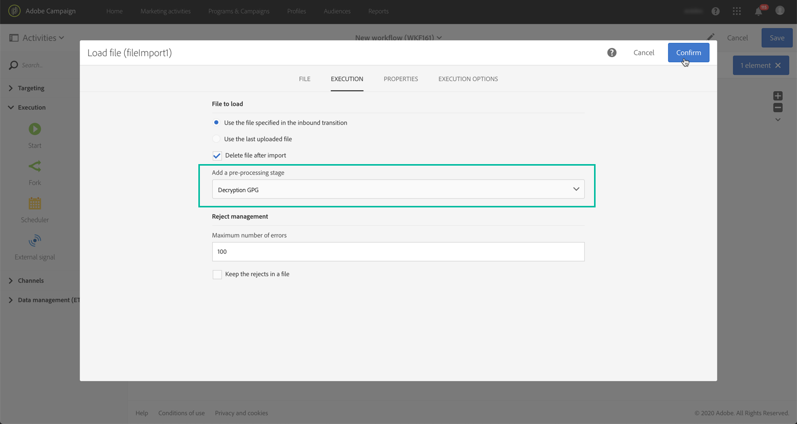
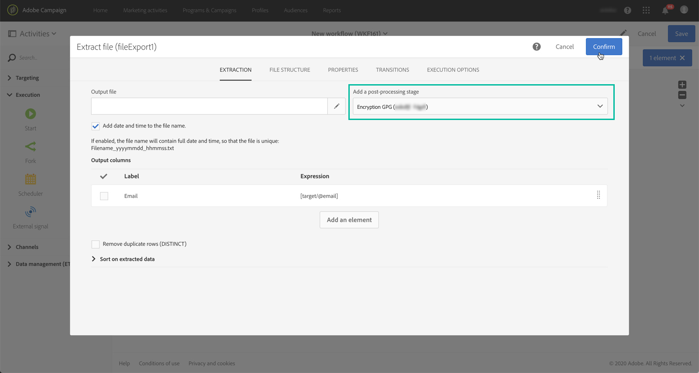
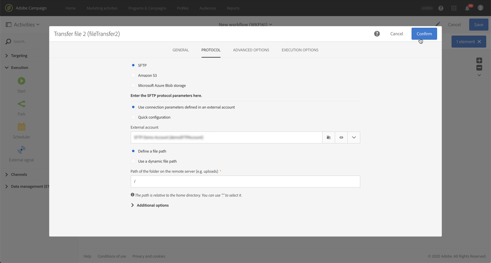

# Gerenciamento de dados criptografados {#managing-encrypted-data}

## Sobre as etapas de pré-processamento {#about-preprocessing-stages}

Em alguns casos, os dados que você deseja importar Servidores de Campanha podem precisar ser criptografados, por exemplo, se contiverem dados de PII.

Para importar ou exportar arquivos criptografados, primeiro é necessário entrar em contato com o Atendimento ao cliente da Adobe para que ele forneça à sua instância os comandos de criptografia/descriptografia necessários.

Para fazer isso, envie uma solicitação indicando:

* O **rótulo** que será exibido na interface de Campanha para usar o comando. Por exemplo, &quot;Criptografar arquivo&quot;.
* O **comando** a ser instalado em sua instância.

Depois que a solicitação for processada, os comandos de criptografia/descriptografia estarão disponíveis no **[!UICONTROL Pre-processing stage]** campo nas **[!UICONTROL Load file]** atividades **[!UICONTROL Extract file]** e . Você pode usá-los para descriptografar ou criptografar os arquivos que deseja importar ou exportar.

>[!NOTE]
>
>Observe que as chaves GPG podem ser adicionadas à sua instância usando o Painel de controle, que está disponível para todos os clientes hospedados no AWS (exceto para clientes que hospedam suas instâncias de marketing no local).
>
>For more on this, refer to [Control Panel documentation](https://docs.adobe.com/content/help/pt-BR/control-panel/using/control-panel-home.translate.html).

**Tópicos relacionados:**

* [Carregar arquivo](../../automating/using/load-file.md)
* [Extrair arquivo](../../automating/using/extract-file.md)

## Caso de uso: Importação de dados criptografados usando uma chave gerada pelo Painel de controle {#use-case-gpg-decrypt}

Nesse caso de uso, criaremos um fluxo de trabalho para importar dados que foram criptografados em um sistema externo, usando uma chave gerada no Painel de controle.

As etapas para executar esse caso de uso são as seguintes:

1. Use o Painel de controle para gerar um par de chaves (público/privado). As etapas detalhadas estão disponíveis na documentação [do Painel de](https://docs.adobe.com/content/help/en/control-panel/using/instances-settings/gpg-keys-management.html#decrypting-data)controle.

   * A chave pública será compartilhada com o sistema externo, que a usará para criptografar os dados a serem enviados para a Campanha.
   * A chave privada será usada pela Campanha para descriptografar os dados criptografados recebidos.
   

1. No sistema externo, use a chave pública baixada do Painel de controle para criptografar os dados a serem importados para o Campaign Standard.

   

1. No Campaign Standard, crie um fluxo de trabalho para importar os dados criptografados e descriptografá-los usando a chave privada que foi instalada por meio do Painel de controle. Para fazer isso, criaremos um fluxo de trabalho da seguinte maneira:

   

   * **[!UICONTROL Transfer file]** atividade: Transfere o arquivo de uma fonte externa para a Campanha. Neste exemplo, queremos transferir o arquivo de um servidor SFTP.
   * **[!UICONTROL Load file]** atividade: Carrega os dados do arquivo no banco de dados e os decodifica usando a chave privada gerada no Painel de controle.

1. Abra a **[!UICONTROL Transfer file]** atividade e configure-a de acordo com suas necessidades. Os conceitos globais sobre como configurar a atividade estão disponíveis [nesta seção](../../automating/using/load-file.md).

   Na **[!UICONTROL Protocol]** guia, especifique detalhes sobre o servidor sftp e o arquivo .gpg criptografado que você deseja transferir.

   

1. Abra a **[!UICONTROL Load file]** atividade e configure-a de acordo com suas necessidades. Os conceitos globais sobre como configurar a atividade estão disponíveis [nesta seção](../../automating/using/load-file.md).

   Adicione um estágio de pré-processamento à atividade para descriptografar os dados recebidos. Para fazer isso, selecione a **[!UICONTROL Decryption GPG]** opção na lista.

   >[!NOTE]
   >
   >Observe que não é necessário especificar a chave privada a ser usada para descriptografar os dados. A chave privada é armazenada no Painel de controle, que detectará automaticamente a chave a ser usada para descriptografar o arquivo.

   

1. Clique em **[!UICONTROL OK]** para confirmar a configuração da atividade.

1. Agora você pode executar o fluxo de trabalho.

## Caso de uso: Criptografar e exportar dados usando uma chave instalada no Painel de controle {#use-case-gpg-encrypt}

Nesse caso de uso, criaremos um fluxo de trabalho para criptografar e exportar dados usando uma chave instalada no Painel de controle.

As etapas para executar esse caso de uso são as seguintes:

1. Gere um par de chaves GPG (público/privado) usando um utilitário GPG e, em seguida, instale a chave pública no Painel de controle. As etapas detalhadas estão disponíveis na documentação [do Painel de](https://docs.adobe.com/content/help/en/control-panel/using/instances-settings/gpg-keys-management.html#encrypting-data)controle.

   

1. No Campaign Standard, crie um fluxo de trabalho para exportar os dados e exportá-los usando a chave privada que foi instalada por meio do Painel de controle. Para fazer isso, criaremos um fluxo de trabalho da seguinte maneira:

   

   * **[!UICONTROL Query]** atividade: Neste exemplo, queremos executar um query para público alvo dos dados do banco de dados que queremos exportar.
   * **[!UICONTROL Extract file]** atividade: Criptografa e extrai os dados em um arquivo.
   * **[!UICONTROL Transfer file]** atividade: Transfere o arquivo que contém os dados criptografados para um servidor SFTP.

1. Configure a **[!UICONTROL Query]** atividade para público alvo dos dados desejados do banco de dados. Para obter mais informações, consulte [esta seção](../../automating/using/query.md).

1. Abra a **[!UICONTROL Extract file]** atividade e configure-a de acordo com suas necessidades (arquivo de saída, colunas, formato etc.). Os conceitos globais sobre como configurar a atividade estão disponíveis [nesta seção](../../automating/using/extract-file.md).

   Adicione um estágio de pré-processamento à atividade para criptografar os dados a serem extraídos. Para fazer isso, selecione a chave GPG de criptografia a ser usada para criptografar os dados.

   

   >[!NOTE]
   >
   >O valor entre parênteses é o **comentário** que você definiu ao gerar o par de chaves usando a ferramenta de criptografia GPG. Certifique-se de selecionar a chave correspondente correta; caso contrário, o recipient não conseguirá descriptografar o arquivo.

1. Abra a **[!UICONTROL Transfer file]** atividade e especifique o servidor SFTP para o qual deseja enviar o arquivo. Os conceitos globais sobre como configurar a atividade estão disponíveis [nesta seção](../../automating/using/transfer-file.md).

   

1. Agora você pode executar o fluxo de trabalho. Depois de executado, o público alvo de dados pelo query será exportado para o servidor SFTP em um arquivo .gpg criptografado.

   
