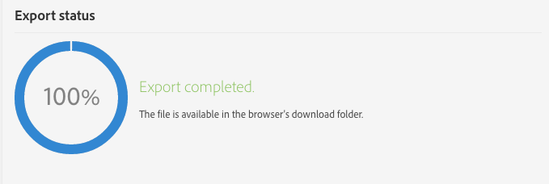
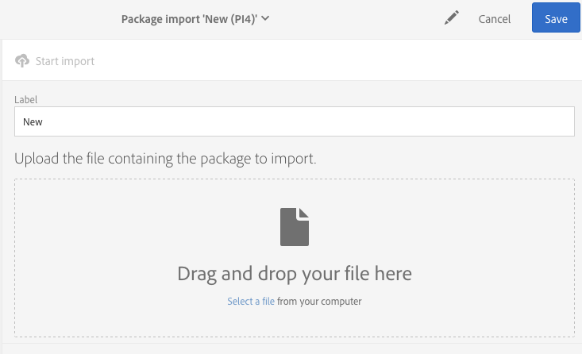

# Gerenciamento de pacotes{#managing-packages}

Os administradores podem definir pacotes para trocar recursos entre diferentes instâncias do Adobe Campaign usando arquivos XML estruturados. Eles podem ser parâmetros ou dados de configuração.

Isso pode ser útil para transferir dados de um servidor para outro ou replicar a configuração de uma instância.

Os pacotes estão disponíveis nos menus **[!UICONTROL Administration]** > **[!UICONTROL Deployment]** > **[!UICONTROL Package exports]** ou **[!UICONTROL Package imports]**. Os dois menus funcionam de modo semelhante.

Os elementos de cada lista são exibidos por padrão, de acordo com a data de modificação ou instalação, do mais ao menos recente.

Para exibir e modificar o conteúdo de um elemento, clique no rótulo correspondente. Consulte as seções [Exportação de um pacote](#exporting-a-package) e [Importação de um pacote](#importing-a-package).

## Exportações de pacotes {#package-exports}

### Pacotes padrão {#standard-packages}

**[!UICONTROL Platform]** e **[!UICONTROL Administration]** são dois pacotes incorporados contendo uma lista predefinida de recursos a serem exportados. Eles podem ser abertos no modo somente leitura e só são adequados para exportação.

>[!IMPORTANT]
>
>A exportação de pacotes não será autorizada se os recursos exportados tiverem IDs padrão. Portanto, as IDs dos recursos exportáveis devem ser alteradas usando um nome diferente dos templates fornecidos como padrão pelo Adobe Campaign Standard. Por exemplo, para exportar perfis de teste, não use uma ID contendo o valor “SDM” ou “sdm”.
>
>Ao tentar exportar pacotes que contêm IDs padrão, você pode ver erros como: “The &#39;Brands (branding)&#39; entity type uses a default ID (&#39;BRD1&#39;) that may cause a conflict when importing the package. Change this name and repeat the operation.”

As etapas de exportação de pacote são descritas na seção [Exportação de um pacote](#exporting-a-package).

* O pacote **[!UICONTROL Platform]** reúne todos os recursos adicionados durante a configuração técnica: recursos personalizados, conjuntos de recursos personalizados, acionadores e opções de aplicativo com o tipo **[!UICONTROL System]**.
* O pacote **[!UICONTROL Administration]** agrupa todos os objetos adicionados durante a configuração dos negócios como: templates de campanha, templates de conteúdo, templates de delivery, templates de landing page, templates de programa e templates de fluxo de trabalho.

   Ele também inclui estes objetos: blocos de conteúdo, target mappings, contas externas, unidades organizacionais, opções de aplicativo com o tipo **[!UICONTROL User]**, funções, tipologias, regras de tipologia e usuários.

>[!NOTE]
>
>O conteúdo desses dois pacotes não pode ser modificado. Por outro lado, esses pacotes sempre contêm os dados mais atualizados disponíveis. Você pode [criar seus próprios pacotes](#creating-a-package) para exportar elementos específicos.

### Criação de um pacote {#creating-a-package}

Você precisará criar um pacote se precisar exportar conjuntos específicos de dados.

Para criar um pacote, você precisa dos direitos de administração.

1. Em **[!UICONTROL Administration]** > **[!UICONTROL Deployment]** > **[!UICONTROL Package exports]**, clique no botão **[!UICONTROL Create]** na lista do conteúdo do pacote.

   O elemento é criado imediatamente. Para cancelar a criação, volte para a lista e marque a caixa correspondente para excluí-la.

1. Na tela de conteúdo do pacote, especifique um nome e uma ID.
1. Clique no botão **[!UICONTROL Edit properties]** se quiser adicionar uma descrição e restringir o acesso a determinados usuários.

   

1. Use o botão **[!UICONTROL Create element]** na guia **[!UICONTROL Export content]** para selecionar os recursos que deseja exportar.

   

1. Os recursos são mostrados em ordem alfabética e podem ser filtrados por nome. O nome técnico é exibido entre parênteses. Selecione um elemento da lista e confirme.

   

1. O nome do recurso é exibido na guia **[!UICONTROL Export content]**. Para modificar um recurso, marque a caixa correspondente e use o botão **[!UICONTROL Show detail of the element selected]**.

   

1. O uso do Editor de consultas permite filtrar os elementos a serem exportados. Para saber mais, consulte a seção [Edição de consultas](../../automating/using/editing-queries.md#creating-queries).

   

   >[!NOTE]
   >
   >É possível exportar até 5000 objetos por recurso.

1. Depois de especificar todos os recursos que serão exportados, salve a seleção.

O pacote foi criado e está pronto para ser exportado.

### Exportação de um pacote {#exporting-a-package}

A exportação de um pacote permite salvar um estado específico de um recurso que poderá ser reimportado em outra instância ou posteriormente na mesma instância.

>[!CAUTION]
>
>A exportação de pacotes não será autorizada se os recursos exportados tiverem IDs predefinidas. Portanto, as IDs dos recursos exportáveis devem ser alteradas usando um nome diferente dos templates fornecidos como padrão pelo Adobe Campaign Standard. Por exemplo, para exportar perfis de teste, não use uma ID contendo o valor “SDM” ou “sdm”.

1. Em **[!UICONTROL Administration]** > **[!UICONTROL Deployment]** > **[!UICONTROL Package exports]**, selecione um pacote para acessar os detalhes.
1. Verifique se o pacote contém os dados necessários.
1. Clique no botão **[!UICONTROL Start export]**.

O arquivo exportado é armazenado na pasta de download do navegador em uso. Ele é automaticamente denominado “package_xxx.xml”, em que “xxx” corresponde à ID do pacote.

Quando a operação for concluída, várias seções serão exibidas:

* **[!UICONTROL Export status]**: esta seção mostra se a operação foi realizada corretamente.

   

* Você pode consultar as diferentes etapas da exportação na guia **[!UICONTROL Log]**. Ela contém os status de todas as exportações anteriores.

   

>[!NOTE]
>
>Ao selecionar um elemento na lista de conteúdo do pacote que já foi exportada, as guias **[!UICONTROL Log]** e **[!UICONTROL Last export]** ainda estarão disponíveis.

## Importações de pacotes {#package-imports}

### Atualizações do sistema {#system-updates}

A lista de importações de pacotes contém as importações automáticas vinculadas às atualizações executadas pela Adobe.

A guia **[!UICONTROL Execution logs]** armazena todas as etapas de importação. Um painel lateral exibe as informações gerais.

>[!NOTE]
>
>Esses elementos podem ser acessados no modo somente leitura.

### Importação de um pacote {#importing-a-package}

Um administrador pode importar um pacote manualmente de uma exportação executada anteriormente de uma instância do Adobe Campaign. Para saber mais, consulte a seção [Exportações de pacotes](#package-exports).

A importação manual do pacote consiste em duas etapas: primeiro, é necessário fazer upload de um arquivo e depois importar o conteúdo dele.

1. Em **[!UICONTROL Administration]** > **[!UICONTROL Deployment]** > **[!UICONTROL Package imports]**, clique no botão **[!UICONTROL Create]** na lista de importações de pacotes.

   O elemento é criado imediatamente. Para cancelar a criação, volte para a lista e marque a caixa correspondente para excluí-la.

1. Especifique um nome e uma ID para a nova importação.
1. Selecione o arquivo que deseja fazer upload arrastando-o e soltando-o ou clicando no link **[!UICONTROL Select from folder]**.

   Os arquivos importados devem estar no formato XML ou ZIP (contendo um arquivo XML).

   

   >[!NOTE]
   >
   >Para substituir o documento carregado, comece excluindo o arquivo com o ícone X à direita do nome e repita a operação.

1. Depois que o arquivo for carregado, importe o conteúdo para o banco de dados usando o botão **[!UICONTROL Start import]**.

   

Quando a operação for concluída, várias seções serão exibidas:

* **[!UICONTROL Import status]**: esta seção mostra se a operação foi realizada corretamente.
* Você pode consultar as diferentes etapas da importação na guia **[!UICONTROL Execution logs]**. Isso é particularmente importante para ver os erros.

   

Depois que um pacote for importado, não será possível importá-lo novamente do mesmo elemento. Você só poderá modificar o rótulo e a ID dele.

Para reimportar o mesmo pacote, volte à lista de importações de pacotes, crie um elemento e faça upload novamente do arquivo selecionado.
