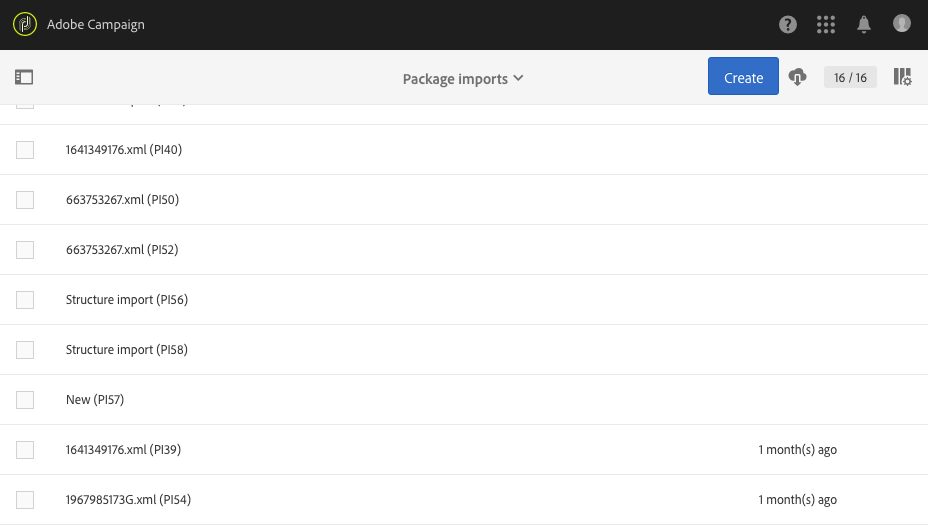

# Gerenciamento de pacotes{#managing-packages}

Os administradores podem definir pacotes para trocar recursos entre diferentes instâncias do Adobe Campaign por meio de arquivos XML estruturados. Podem ser parâmetros de configuração ou dados.

Isso pode ser útil para transferir dados de um servidor para outro ou para replicar a configuração de uma instância.

Os pacotes estão disponíveis nos menus **[!UICONTROL Administration]** &gt; **[!UICONTROL Deployment]** &gt; **[!UICONTROL Package exports]** ou **[!UICONTROL Package imports]** . Os dois menus funcionam da mesma forma.

Os elementos de cada lista são exibidos por padrão, de acordo com a data de modificação ou instalação, do mais recente ao menos recente.

Para exibir e modificar o conteúdo de um elemento, clique em seu rótulo. Consulte as seções [Exportar um pacote](#exporting-a-package) e [Importar um pacote](#importing-a-package) .

## Exportações de pacotes {#package-exports}

### Pacotes padrão {#standard-packages}

**[!UICONTROL Platform]** e **[!UICONTROL Administration]** são dois pacotes incorporados, cada um contendo uma lista predefinida de recursos a serem exportados. Eles podem ser abertos no modo somente leitura e são adequados apenas para exportação.

>[!CAUTION]
>
>A exportação de pacotes não é autorizada se os recursos exportados tiverem IDs padrão. Portanto, as IDs de recursos exportáveis devem ser alteradas usando um nome diferente dos modelos fornecidos como padrão pelo Adobe Campaign Standard. Por exemplo, para exportar perfis de teste, uma ID contendo o valor "SDM" ou "sdm" não deve ser usada. Ao tentar exportar pacotes que contêm IDs padrão, você pode ver erros como: "O tipo de entidade 'Marcas (marca)' usa uma ID padrão ('BRD1') que pode causar um conflito ao importar o pacote. Altere esse nome e repita a operação."

As etapas de exportação do pacote são descritas na seção [Exportando um pacote](#exporting-a-package) .

* O **[!UICONTROL Platform]** pacote reúne todos os recursos adicionados durante a configuração técnica: recursos personalizados, conjuntos de recursos personalizados, acionadores e opções de aplicativo com o **[!UICONTROL System]** tipo.
* O **[!UICONTROL Administration]** pacote agrupa todos os objetos adicionados durante a configuração de negócios, como: modelos de campanha, modelos de conteúdo, modelos de entrega, modelos de página inicial, modelos de programa e modelos de fluxo de trabalho.

   Também inclui os seguintes objetos: blocos de conteúdo, mapeamentos de metas, contas externas, unidades organizacionais, opções de aplicativos com o **[!UICONTROL User]** tipo, funções, tipologias, regras de tipologia e usuários.

>[!NOTE]
>
>O conteúdo destes dois pacotes não pode ser modificado. Por outro lado, esses pacotes sempre contêm os dados mais atualizados disponíveis. Você pode [criar seus próprios pacotes](#creating-a-package) para exportar elementos específicos.

### Criação de um pacote {#creating-a-package}

Você precisa criar um pacote se precisar exportar conjuntos específicos de dados.

Para criar um pacote, você precisa dos direitos administrativos.

1. Em **[!UICONTROL Administration]** &gt; **[!UICONTROL Deployment]** &gt; **[!UICONTROL Package exports]**, clique no **[!UICONTROL Create]** botão na lista de conteúdo do pacote.

   O elemento é criado imediatamente. Para cancelar a criação, volte à lista e marque a caixa correspondente para excluí-la.

1. Na tela de conteúdo do pacote, especifique um nome e uma ID.
1. Clique no **[!UICONTROL Edit properties]** botão se desejar adicionar uma descrição e restringir o acesso a determinados usuários.

   

1. Use o **[!UICONTROL Create element]** botão na **[!UICONTROL Export content]** guia para selecionar os recursos que deseja exportar.

   

1. Os recursos são mostrados em ordem alfabética e podem ser filtrados por nome. O nome técnico é exibido entre parênteses. Selecione um elemento da lista e confirme.

   

1. O nome do recurso é exibido na **[!UICONTROL Export content]** guia. Para modificar um recurso, marque a caixa correspondente e use o **[!UICONTROL Show detail of the element selected]** botão.

   

1. Usar o editor de consultas permite filtrar os elementos a serem exportados. For more on this, refer to the [Editing queries](../../automating/using/editing-queries.md#creating-queries) section.

   

   >[!NOTE]
   >
   >É possível exportar até 5000 objetos por recurso.

1. Depois de especificar todos os recursos a serem exportados, salve sua seleção.

Seu pacote agora é criado e está pronto para ser exportado.

### Exportar um pacote {#exporting-a-package}

Exportar um pacote permite salvar um estado específico de um recurso que poderá ser reimportado em outra instância ou posteriormente na mesma instância.

>[!CAUTION]
>
>A exportação de pacotes não é autorizada se os recursos exportados tiverem IDs prontas para uso. Portanto, as IDs de recursos exportáveis devem ser alteradas usando um nome diferente dos modelos fornecidos como padrão pelo Adobe Campaign Standard. Por exemplo, para exportar perfis de teste, uma ID contendo o valor "SDM" ou "sdm" não deve ser usada.

1. Em **[!UICONTROL Administration]** &gt; **[!UICONTROL Deployment]** &gt; **[!UICONTROL Package exports]**, selecione um pacote para acessar seus detalhes.
1. Verifique se o pacote contém os dados necessários.
1. Click the **[!UICONTROL Start export]** button.

O arquivo exportado é armazenado na pasta de download do navegador em uso. É automaticamente denominado "package_xxx.xml", em que "xxx" corresponde à ID do pacote.

Quando a operação for concluída, várias seções serão exibidas:

* **[!UICONTROL Export status]**: esta seção mostra se a operação foi realizada corretamente.

   

* Você pode consultar as diferentes etapas da exportação por meio da **[!UICONTROL Log]** guia. Este documento contém os estatutos de todas as exportações anteriores.

   

>[!NOTE]
>
>Ao selecionar um elemento da lista de conteúdo do pacote que já foi exportado, as guias **[!UICONTROL Log]** e **[!UICONTROL Last export]** ainda estão disponíveis.

## Importações de pacotes {#package-imports}

### Atualizações do sistema {#system-updates}

A lista de importação do pacote acima contém as importações automáticas vinculadas às atualizações executadas pela Adobe.

A **[!UICONTROL Execution logs]** guia armazena todas as etapas de importação. Um painel lateral exibe as informações gerais.

>[!NOTE]
>
>Esses elementos podem ser acessados no modo somente leitura.

### Importação de um pacote {#importing-a-package}

Um administrador pode importar manualmente um pacote de uma exportação executada anteriormente de uma instância do Adobe Campaign. For more on this, refer to the [Package exports](#package-exports) section.

A importação manual do pacote consiste em duas etapas: primeiro, é necessário carregar um arquivo e depois importar seu conteúdo.

1. Em **[!UICONTROL Administration]** &gt; **[!UICONTROL Deployment]** &gt; **[!UICONTROL Package imports]**, clique no **[!UICONTROL Create]** botão na lista de importação do pacote.

   O elemento é criado imediatamente. Para cancelar a criação, volte à lista e marque a caixa correspondente para excluí-la.

1. Especifique um nome e uma ID para a nova importação.
1. Selecione o arquivo que deseja carregar arrastando-o e soltando-o ou clicando no **[!UICONTROL Select from folder]** link.

   Os arquivos importados devem estar no formato XML ou ZIP (contendo um arquivo XML).

   

   >[!NOTE]
   >
   >Para substituir o documento carregado, comece excluindo o arquivo por meio do ícone X à direita do nome e repita a operação.

1. Depois que o arquivo for carregado, importe seu conteúdo para o banco de dados usando o **[!UICONTROL Start import]** botão.

   

Quando a operação for concluída, várias seções serão exibidas:

* **[!UICONTROL Import status]**: esta seção mostra se a operação foi realizada corretamente.
* Você pode consultar as diferentes etapas da importação por meio da **[!UICONTROL Execution logs]** guia. Isso é particularmente importante para visualizar erros.

   

Depois que um pacote é importado, não é possível importá-lo novamente do mesmo elemento. Você só pode modificar seu rótulo e ID.

Para reimportar o mesmo pacote, é necessário voltar à lista de importação do pacote, criar um elemento e carregar o arquivo selecionado novamente.
