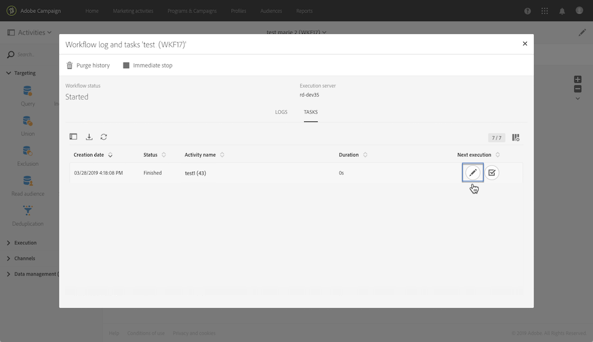

# Monitoramento das variáveis de eventos {#monitoring-the-events-variables}

É possível monitorar as variáveis de eventos disponíveis no workflow, incluindo os parâmetros externos declarados. Para fazer isso, siga as etapas abaixo:

1. Selecione a atividade que segue a atividade **[!UICONTROL External signal]** e clique no botão **[!UICONTROL Log and tasks]**.
1. Na guia **[!UICONTROL Tasks]**, clique no botão .

   

1. O contexto de execução da tarefa é exibido (ID, status, duração etc.), incluindo todas as variáveis de eventos que agora estão disponíveis para uso no workflow.

   
