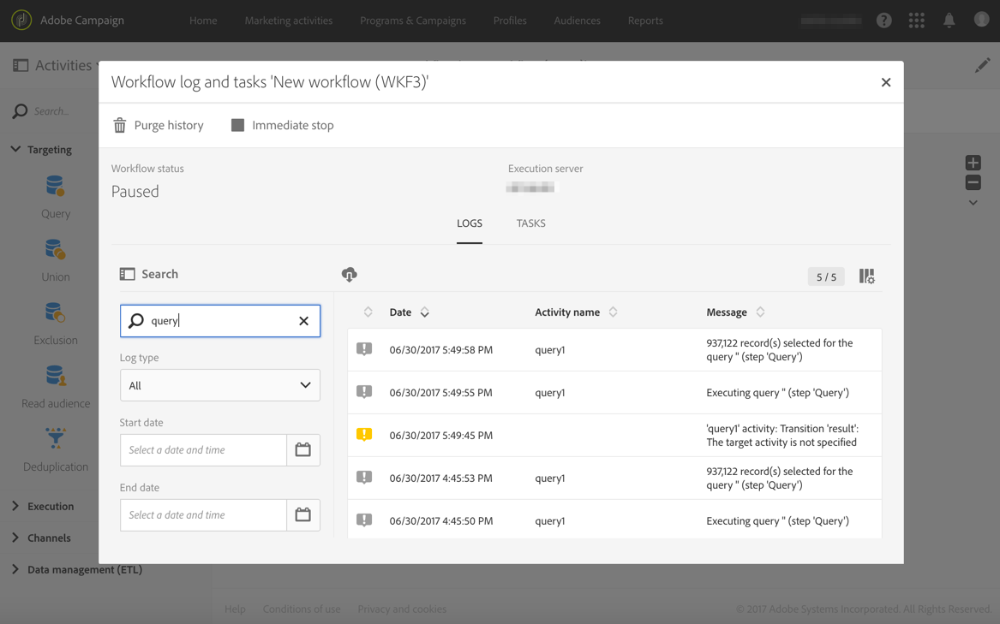

# Monitoramento da execução do workflow {#monitoring}

## Log e tarefas do workflow {#workflow-log-and-tasks}

O ícone  abre o log do fluxo de trabalho e o menu de tarefas.

O histórico do workflow é salvo pela duração especificada nas opções de execução do workflow (consulte [Workflow properties](../../automating/using/managing-execution-options.md)). Durante essa duração, todas as mensagens são salvas, mesmo após uma reinicialização. Se não quiser salvar as mensagens de uma execução anterior, é necessário limpar o histórico clicando no botão .

A guia **[!UICONTROL Log]** contém o histórico de execução de todas as atividades ou atividades selecionadas. Eles indicam as operações efetuadas e os erros de execução por ordem cronológica.

A guia **[!UICONTROL Tasks]** detalha a sequência de execução das atividades. Clique em uma tarefa para obter mais informações.

Nestas duas listas:

* Clique no contador para ver o número total de atividades de acordo com o filtro aplicado. O contador é exibido por padrão se o número de elementos na lista for menor que 30.
* O botão **[!UICONTROL Configure list]** permite escolher as informações exibidas, definir a ordem das colunas e classificar a lista.
* Você pode usar filtros para encontrar as informações necessárias mais rapidamente. Use o campo de pesquisa para procurar um texto específico em nomes de atividades de workflow (por exemplo: &quot;query&quot;) e logs.

## Gerenciamento de erros {#error-management}

Quando ocorre um erro, o workflow é pausado e a atividade que estava sendo executada quando o erro foi encontrado pisca em vermelho.

O status do workflow fica vermelho e o erro é registrado no log.

Você pode configurar o workflow para que ele não pause e continue a ser executado sem erros. Para fazer isso, vá para as propriedades do workflow por meio do botão  e, na seção **[!UICONTROL Execution]**, selecione a opção **Ignore** no campo **In case of error**.

Nesse caso, a tarefa incorreta é abortada. Esse modo é particularmente adequado para workflows projetados para tentar novamente a operação mais tarde (ações periódicas).

>[!NOTE]
>
>Você pode aplicar essa configuração individualmente para cada atividade. Para fazer isso, selecione uma atividade e a abra usando a ação rápida . Em seguida, selecione o modo de gerenciamento de erros na guia **Execution options**. Consulte [Opções de execução de atividade](../../automating/using/activity-properties.md).

Nas propriedades do [workflow](../../automating/using/managing-execution-options.md), opções adicionais relacionadas ao gerenciamento de erros estão disponíveis.

As opções possíveis são:

* **[!UICONTROL Supervisors]**: O permite definir o grupo de pessoas a serem notificadas (email e notificação no aplicativo) se o workflow encontrar um erro. Se nenhum grupo for definido, ninguém será notificado. Para obter mais informações sobre notificações do Adobe Campaign, consulte [Notificações do Adobe Campaign](../../administration/using/sending-internal-notifications.md).

* **[!UICONTROL In case of error]**: permite especificar a ação a ser executada caso a atividade encontre um erro. Há duas opções disponíveis para isso:

   * **Suspender o processo**: o workflow é suspenso automaticamente. O status do workflow é então **Errrado** e a cor associada fica vermelha. Depois que o problema for resolvido, reinicie o workflow.
   * **Ignorar**: a atividade não é executada e, como resultado, nenhuma das atividades a sucede (na mesma ramificação). Isso pode ser útil para tarefas recorrentes. Se a ramificação tiver um programador a montante, ele deverá ser acionado na próxima data de execução.

* **[!UICONTROL Consecutive errors]** : O permite definir um número de erros consecutivos autorizados antes da suspensão automática da execução do workflow.

   * Se o número especificado for **[!UICONTROL 0]**, ou enquanto o número especificado não for atingido, as atividades que encontram erros serão ignoradas. As outras ramificações de workflow são executadas normalmente.

   * Se o número especificado for atingido, o workflow inteiro será suspenso e se tornará **[!UICONTROL Erroneous]**. Se os supervisores tiverem sido definidos, eles serão notificados automaticamente por um email. Consulte [Notificações do Adobe Campaign](../../administration/using/sending-internal-notifications.md).
