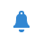

# Entrega por notificação por push{#push-notification-delivery}

## Descrição {#description}

A atividade **[!UICONTROL Push notification]** permite configurar o envio de uma notificação por push em um fluxo de trabalho. Esta pode ser uma única notificação de envio e enviada apenas uma vez, ou pode ser uma notificação recorrente.

* **As notificações do** Singlesend são delivery padrão de notificação por push do aplicativo móvel, enviados uma vez.
* **As notificações** recorrentes permitem enviar o mesmo delivery de notificação por push do aplicativo móvel várias vezes para públicos alvos diferentes em um período definido. Você pode agregar os deliveries por período para obter relatórios que correspondam às suas necessidades.

## Contexto de uso {#context-of-use}

A atividade **[!UICONTROL Push notification]** geralmente é usada para automatizar o envio de uma notificação para um público alvo calculado no mesmo fluxo de trabalho.

Quando vinculado a um scheduler, você pode definir notificações por push recorrentes.

Os recipient são definidos como upstream da atividade no mesmo fluxo de trabalho, por meio de atividades de definição de metas, como query, interseções etc.

A preparação da mensagem é acionada de acordo com os parâmetros de execução do workflow. No painel da mensagem, você pode selecionar se deseja solicitar ou não uma confirmação manual para enviar a mensagem (obrigatório por padrão). Você pode iniciar o workflow manualmente ou colocar uma atividade de scheduler no workflow para automatizar a execução.

**Tópicos relacionados**

* [Envio de uma notificação por push recorrente com um fluxo de trabalho](../../automating/using/recurring-push-notifications.md)

## Configuração {#configuration}

1. Arraste e solte uma atividade **[!UICONTROL Push notification]** no seu fluxo de trabalho.
1. Selecione e abra a atividade usando o botão  das ações rápidas exibidas.

   >[!NOTE]
   >
   >Você pode acessar as propriedades gerais e as opções avançadas da atividade (e não do delivery propriamente dito) por meio do botão  nas ações rápidas da atividade. Esse botão é específico para a atividade **[!UICONTROL Push notification]**. As propriedades da notificação por push podem ser acessadas pela barra de ação no painel de push.

1. Selecione o modo de envio de notificação por push:

   * **[!UICONTROL Single notification]**: a notificação por push é enviada uma única vez. Aqui, você pode especificar se deseja ou não adicionar uma transição de saída à atividade. Os diferentes tipos de transições estão detalhados na etapa 7 deste procedimento.
   * **[!UICONTROL Recurring notification]**: a notificação por push é enviada várias vezes, de acordo com a frequência definida em uma  **[!UICONTROL Scheduler]** atividade. Selecione o período de agregação dos envios. Isso permite que você reagrupe todos os envios que ocorrem durante o período definido em uma única notificação por push que também é chamada de **execução recorrente** e que podem ser acessados a partir da lista de atividade de marketing do aplicativo.

      Por exemplo, para uma notificação de aniversário recorrente, que é enviada diariamente, você pode optar por agregação dos envios por mês. Isso permite que você receba relatórios sobre seu delivery mensalmente, embora a notificação seja enviada todos os dias.

1. Selecione um tipo de notificação. Esses tipos vêm de modelos de notificações por push definidos no menu **[!UICONTROL Resources]** > **[!UICONTROL Templates]** > **[!UICONTROL Delivery templates]**.
1. Insira as propriedades gerais para a notificação por push. Também é possível anexá-la a uma campanha existente. A etiqueta da atividade de delivery do fluxo de trabalho é atualizada com a etiqueta de notificação por push.
1. Defina o conteúdo da notificação por push. Consulte [Criação de uma notificação por push](../../channels/using/preparing-and-sending-a-push-notification.md)
1. Por padrão, a atividade **[!UICONTROL Push notification]** não inclui transições de saída. Se quiser adicionar uma transição de saída à sua atividade **[!UICONTROL Push Notification]**, acesse a guia **[!UICONTROL General]** das opções avançadas da atividade (o botão  nas ações rápidas da atividade) e depois marque uma das seguintes opções:

   * **[!UICONTROL Add outbound transition without the population]**: permite gerar uma transição de saída que contém exatamente a mesma população da transição de entrada.
   * **[!UICONTROL Add outbound transition with the population]**: isso permite gerar uma transição de saída contendo a população para a qual a notificação foi enviada. Os membros do público alvo excluídos durante a preparação do delivery são excluídos desta transição.

1. Confirme a configuração da sua atividade e salve o fluxo de trabalho.

Ao reabrir a atividade, você será direcionado diretamente para o painel de notificação por push. Somente seu conteúdo pode ser editado.

Por padrão, iniciar um workflow de delivery aciona somente a preparação da mensagem. O envio de mensagens criadas a partir de um workflow ainda precisará ser confirmado depois que o workflow for iniciado. Porém, no painel de mensagens, e somente se a mensagem tiver sido criada a partir de um workflow, você poderá desativar a opção **[!UICONTROL Request confirmation before sending messages]**. Ao desmarcar essa opção, as mensagens são enviadas sem aviso prévio após a preparação.

## Observações {#remarks}

Os deliveries criados em um workflow podem ser acessados na lista de atividade de marketing do aplicativo. Você pode visualizar o status de execução do workflow usando o painel. Os links no painel de resumo da notificação por push permitem acessar diretamente os elementos vinculados (fluxo de trabalho, campanha etc.).

Nos delivery principais, que podem ser acessados a partir da lista de atividade de marketing, é possível visualização o número total de envios que foram processados (de acordo com o período de agregação especificado quando a atividade **[!UICONTROL Push notification]** foi configurada). Para fazer isso, abra a visualização detalhada do bloco **[!UICONTROL Deployment]** da entrega pai, selecionando .
