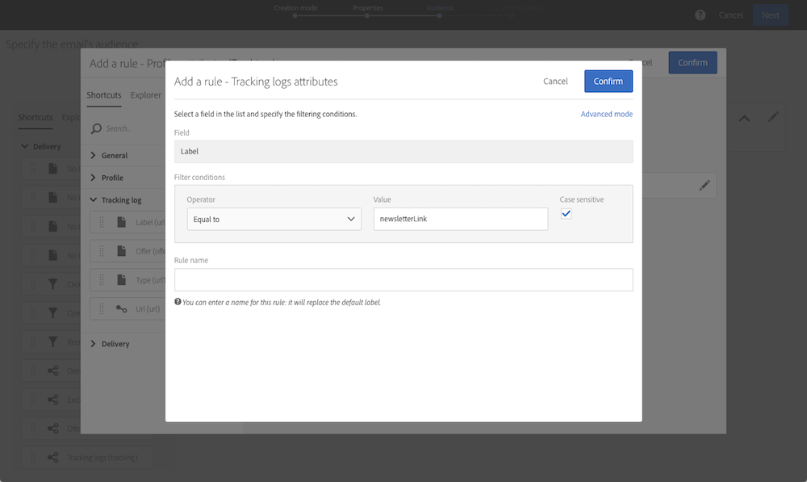

# Amostras de queries {#query-samples}

Esta seção apresenta um caso de uso ao usar uma atividade **[!UICONTROL Query]**. Para obter mais informações sobre como usar uma atividade **[!UICONTROL Query]**, consulte [esta seção](../../automating/using/query.md).

## Direcionamento em atributos simples de perfil {#targeting-on-simple-profile-attributes}

O exemplo a seguir mostra uma atividade de query configurada para direcionar homens entre 18 e 30 anos, que moram em Londres.

## Direcionamento em atributos de email {#targeting-on-email-attributes}

O exemplo a seguir mostra uma atividade de query configurada para direcionar perfis com o domínio de endereço de email “orange.co.uk”.

O exemplo a seguir mostra uma atividade de query configurada direcionar perfis cujo endereço de email foi fornecido.

## Direcionamento de perfis cuja data de nascimento é hoje {#targeting-profiles-whose-birthday-is-today}

O exemplo a seguir mostra uma atividade de query configurada para direcionar perfis cuja data de nascimento é hoje.

1. Arraste o filtro **[!UICONTROL Birthday]** no seu query.

   

1. Defina **[!UICONTROL Filter type]** como **[!UICONTROL Relative]** e selecione **[!UICONTROL Today]**.

   

## Direcionamento de perfis que abriram um delivery específico {#targeting-profiles-who-opened-a-specific-delivery}

O exemplo a seguir mostra uma atividade de query configurada para filtrar perfis que abriram o delivery com o rótulo “Hora de verão”.

1. Arraste o filtro **[!UICONTROL Opened]** no seu query.

   

1. Selecione o delivery e clique em **[!UICONTROL Confirm]**.

   

## Direcionamento de perfis com falha de deliveries por um motivo específico {#targeting-profiles-for-whom-deliveries-failed-for-a-specific-reason}

O exemplo a seguir mostra uma atividade de query configurada para filtrar perfis com falha de deliveries porque a caixa de entrada estava cheia. Esse query só está disponível para usuários com direitos administrativos e pertencentes a unidades organizacionais **[!UICONTROL All (all)]** (consulte [esta seção](../../administration/using/organizational-units.md)).

1. Selecione o recurso **[!UICONTROL Delivery logs]** para filtrar diretamente na tabela de logs do delivery (consulte [Uso de recursos diferentes dos targeting dimensions](../../automating/using/using-resources-different-from-targeting-dimensions.md)).

   

1. Arraste o filtro **[!UICONTROL Nature of failure]** no seu query.

   

1. Selecione o tipo de falha que deseja direcionar. No nosso caso, o tipo de falha é **[!UICONTROL Mailbox full]**.

   

## Direcionamento de perfis não contatados nos últimos sete dias {#targeting-profiles-not-contacted-during-the-last-7-days}

O exemplo a seguir mostra uma atividade de query configurada para filtrar perfis que não foram contatados nos últimos sete dias.

1. Arraste o filtro **[!UICONTROL Delivery logs (logs)]** no seu query.

   

   Selecione **[!UICONTROL Does not exist]** na lista suspensa e arraste o filtro **[!UICONTROL Delivery]**.

   

1. Configure o filtro como abaixo.

   

## Direcionamento de perfis que clicaram em um link específico {#targeting-profiles-who-clicked-a-specific-link-}

1. Arraste o filtro **[!UICONTROL Tracking logs (tracking)]** no seu query.

   

1. Arraste o filtro **[!UICONTROL Label (urlLabel)]**.

   

1. No campo **[!UICONTROL Value]**, digite o rótulo que foi definido na inserção do link no delivery e, em seguida, confirme.

   
