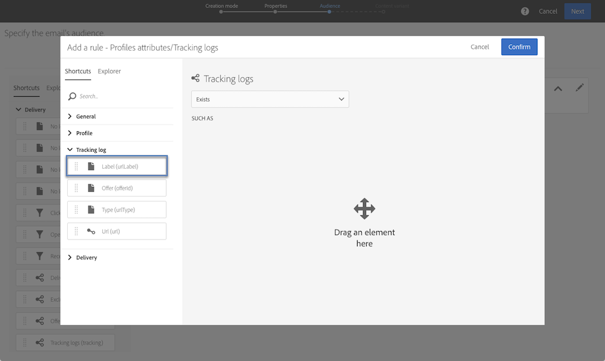

# Amostras de query {#query-samples}

Esta seção apresenta o caso de uso ao usar uma **[!UICONTROL Query]** atividade. For more on how to use a **[!UICONTROL Query]** activity, refer to [this section](../../automating/using/query.md).

## Targeting on simple profile attributes {#targeting-on-simple-profile-attributes}

O exemplo a seguir mostra uma atividade de query configurada para homens públicos alvos entre 18 e 30 anos, morando em Londres.

## Definição de metas em atributos de email {#targeting-on-email-attributes}

O exemplo a seguir mostra uma atividade de query configurada para público alvo de perfis com o domínio de endereço de email &quot;orange.co.uk&quot;.

O exemplo a seguir mostra uma atividade de query configurada para públicos alvos cujo endereço de email foi fornecido.

## Direcionando perfis cujo aniversário é hoje {#targeting-profiles-whose-birthday-is-today}

O exemplo a seguir mostra uma atividade de query configurada para públicos alvos cujo aniversário é hoje.

1. Arraste o **[!UICONTROL Birthday]** filtro em seu query.

   

1. Defina **[!UICONTROL Filter type]** como **[!UICONTROL Relative]** e selecione **[!UICONTROL Today]**.

   

## perfis de definição de metas que abriram um delivery específico {#targeting-profiles-who-opened-a-specific-delivery}

O exemplo a seguir mostra uma atividade de query configurada para filtrar perfis que abriram o delivery com o rótulo &quot;Hora de verão&quot;.

1. Arraste o **[!UICONTROL Opened]** filtro em seu query.

   

1. Selecione o delivery e clique em **[!UICONTROL Confirm]**.

   

## perfis de definição de metas para os quais delivery falharam por um motivo específico {#targeting-profiles-for-whom-deliveries-failed-for-a-specific-reason}

O exemplo a seguir mostra uma atividade de query configurada para filtrar perfis para os quais os delivery falharam porque sua caixa de correio estava cheia. Este query só está disponível para usuários com direitos administrativos e pertencentes às unidades organizacionais (consulte **[!UICONTROL All (all)]** esta seção ).

1. Selecione o **[!UICONTROL Delivery logs]** recurso para filtrar diretamente na tabela de log de delivery (consulte [Uso de recursos diferentes dos targeting dimension](../../automating/using/using-resources-different-from-targeting-dimensions.md)).

   

1. Arraste o **[!UICONTROL Nature of failure]** filtro em seu query.

   

1. Selecione o tipo de falha que deseja público alvo. No nosso caso **[!UICONTROL Mailbox full]**.

   

## perfis de definição de metas não contatados nos últimos 7 dias {#targeting-profiles-not-contacted-during-the-last-7-days}

O exemplo a seguir mostra uma atividade de query configurada para filtrar perfis que não foram contatados nos últimos 7 dias.

1. Arraste o **[!UICONTROL Delivery logs (logs)]** filtro em seu query.

   

   Selecione **[!UICONTROL Does not exist]** na lista suspensa e arraste o **[!UICONTROL Delivery]** filtro.

   

1. Configure o filtro como abaixo.

   

## perfis de definição de metas que clicaram em um link específico {#targeting-profiles-who-clicked-a-specific-link-}

1. Arraste o **[!UICONTROL Tracking logs (tracking)]** filtro em seu query.

   

1. Arraste o **[!UICONTROL Label (urlLabel)]** filtro.

   

1. No **[!UICONTROL Value]** campo, digite o rótulo que foi definido ao inserir o link no delivery e, em seguida, confirme.

   
