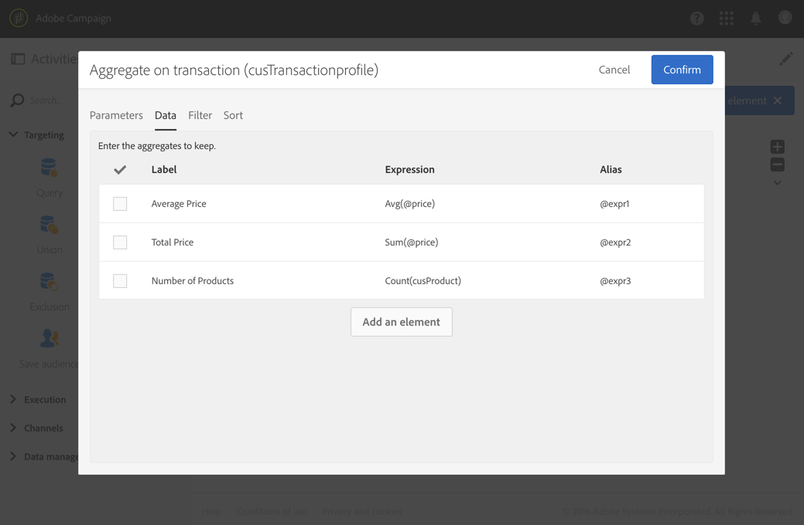
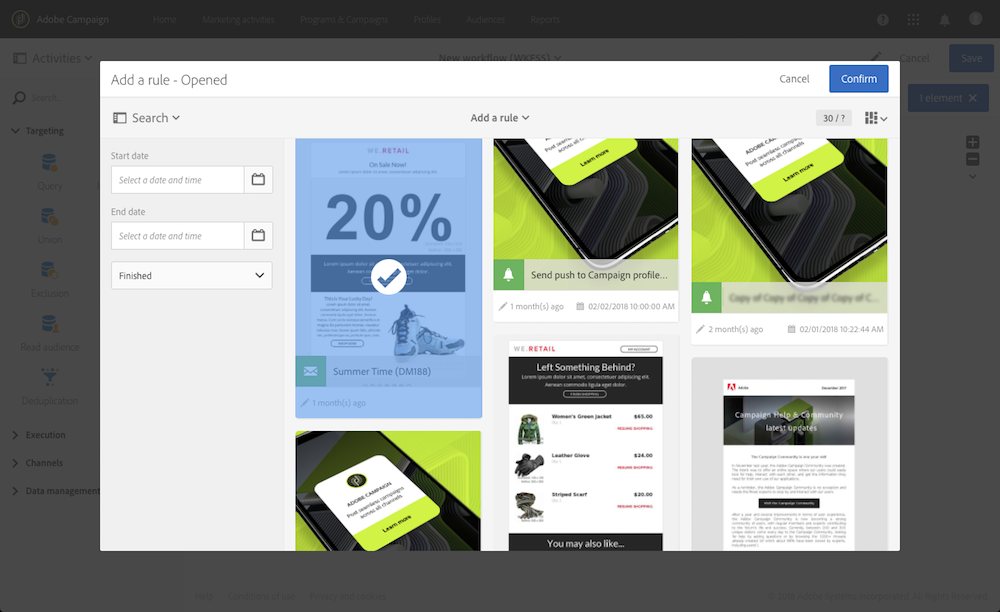

# Consulta{#query}

## Descrição {#description}

A **[!UICONTROL Query]** atividade permite filtrar e extrair um preenchimento de elementos do banco de dados do Adobe Campaign. É possível definir **[!UICONTROL Additional data]** para a população direcionada por meio de uma guia dedicada. Esses dados são armazenados em colunas adicionais e só podem ser usados para o fluxo de trabalho em andamento.

A atividade usa a ferramenta do editor de consultas. Essa ferramenta é detalhada em uma seção dedicada.

## Contexto de utilização {#context-of-use}

A **[!UICONTROL Query]** atividade pode ser usada para vários tipos de usos:

* Segmentação de indivíduos para definir o destino de uma mensagem, público-alvo etc.
* Enriquecendo dados de toda a tabela do banco de dados do Adobe Campaign.
* Exportação de dados.

## Configuração {#configuration}

1. Arraste e solte uma **[!UICONTROL Query]** atividade em seu fluxo de trabalho.
1. Selecione a atividade e abra-a usando o  botão das ações rápidas que aparecem. Por padrão, a atividade é pré-configurada para procurar perfis.
1. Se você deseja executar uma consulta em um recurso diferente do recurso de perfil, vá para a **[!UICONTROL Properties]** guia da atividade e selecione um **[!UICONTROL Resource]** e um **[!UICONTROL Targeting dimension]**.

   O **[!UICONTROL Resource]** permite refinar os filtros exibidos na paleta, enquanto o **[!UICONTROL Targeting dimension]**, contextual em relação ao recurso selecionado, corresponde ao tipo de população que você deseja obter (perfis identificados, entregas, dados vinculados ao recurso selecionado etc.).

   Para obter mais informações, consulte Dimensões e recursos [de](#targeting-dimensions-and-resources)definição de metas.

1. Na **[!UICONTROL Target]** guia, execute sua consulta definindo e combinando regras.
1. É possível definir **[!UICONTROL Additional data]** para a população direcionada por meio de uma guia dedicada. Esses dados são armazenados em colunas adicionais e só podem ser usados para o fluxo de trabalho em andamento. Em particular, você pode adicionar dados das tabelas de banco de dados do Adobe Campaign vinculadas à dimensão de definição de metas da consulta. Consulte a seção [Enriquecendo dados](#enriching-data) .

   >[!NOTE]
   >
   >Por padrão, a **[!UICONTROL Remove duplicate rows (DISTINCT)]** opção é marcada na guia **[!UICONTROL Advanced options]** da **[!UICONTROL Additional data]** consulta. Se a **[!UICONTROL Query]** atividade contiver muitos (de 100) dados adicionais definidos, é recomendável desmarcar essa opção por motivos de desempenho. Observe que desmarcar essa opção pode resultar na obtenção de duplicatas, dependendo dos dados consultados.

1. Na **[!UICONTROL Transition]** guia, a **[!UICONTROL Enable an outbound transition]** opção permite adicionar uma transição de saída após a atividade de consulta, mesmo se ela não recuperar dados.

   O código de segmento da transição de saída pode ser personalizado usando uma expressão padrão e variáveis de eventos (consulte [Personalizar atividades com variáveis](../../automating/using/calling-a-workflow-with-external-parameters.md#customizing-activities-with-events-variables)de eventos).

1. Confirme a configuração da atividade e salve o fluxo de trabalho.

## Dimensões e recursos de definição de metas {#targeting-dimensions-and-resources}

Dimensões de definição de metas e recursos permitem definir em quais elementos uma consulta será baseada para determinar o destino de uma entrega.

As dimensões de definição de metas são definidas em mapeamentos de metas. Para obter mais informações, consulte [esta seção](../../administration/using/target-mappings-in-campaign.md).

### Definição da dimensão de definição de metas e do recurso de uma consulta {#defining-the-targeting-dimension-and-resource-of-a-query}

A dimensão de definição de metas e os recursos são definidos ao criar um fluxo de trabalho, na **[!UICONTROL Properties]** guia de uma atividade de Consulta.

>[!NOTE]
>
>A dimensão de definição de metas também pode ser definida ao criar um público-alvo (consulte [esta seção](../../audiences/using/creating-audiences.md)).

As dimensões e os recursos de definição de metas estão vinculados. As dimensões de definição de metas disponíveis dependem, portanto, do recurso selecionado.

Por exemplo, para o Recurso **[!UICONTROL Profiles (profile)]**, as seguintes dimensões de direcionamento estarão disponíveis:

Para **[!UICONTROL Deliveries (delivery)]** o, a lista conterá as seguintes dimensões de direcionamento:

Depois que a dimensão de definição de metas e o recurso são especificados, diferentes filtros estão disponíveis na consulta.

Exemplo de filtros disponíveis para o **[!UICONTROL Profiles (profile)]** recurso:

Exemplo de filtros disponíveis para o **[!UICONTROL Deliveries (delivery)]** recurso:

### Uso de recursos diferentes das dimensões de definição de metas {#using-resources-different-from-targeting-dimensions}

Por padrão, a dimensão de definição de metas e o recurso são definidos para definir perfis de definição de metas.

No entanto, pode ser útil usar um recurso diferente da dimensão de definição de metas se você quiser procurar um registro específico em uma tabela distante.

**Exemplo 1: identificação de perfis direcionados pela entrega com o rótulo &quot;Bem-vindo de volta !&quot;**.

* Nesse caso, queremos direcionar perfis. Definiremos a dimensão de definição de metas como **[!UICONTROL Profiles (profile)]**.
* Queremos filtrar os perfis selecionados de acordo com o rótulo de entrega. Por isso, vamos definir o recurso para **[!UICONTROL Delivery logs]**. Dessa forma, estamos filtrando diretamente na tabela de log de entrega, o que oferecerá melhor desempenho.

**Exemplo 2: identificação de perfis que não foram alvo da entrega com o rótulo &quot;Bem-vindo de volta!&quot;**

No exemplo anterior, usamos um recurso diferente da dimensão de definição de metas. Essa operação só é possível se você quiser encontrar um registro que **esteja presente** na tabela distante (registros de entrega em nosso exemplo).

Se desejarmos encontrar um registro que não **esteja presente** na tabela distante (por exemplo, perfis que não foram direcionados por uma entrega específica), será necessário usar a mesma dimensão de recurso e direcionamento, já que o registro não estará presente na tabela distante (registros de entrega).

* Nesse caso, queremos direcionar perfis. Definiremos a dimensão de definição de metas como **[!UICONTROL Profiles (profile)]**.
* Queremos filtrar os perfis selecionados de acordo com o rótulo de entrega. Não é possível filtrar diretamente nos registros de entrega, pois estamos procurando um registro não presente na tabela de registros de entrega. Portanto, definiremos o recurso para **[!UICONTROL Profile (profile)]** e construiremos nossa consulta na tabela de perfis.

## Enriquecimento de dados {#enriching-data}

A **[!UICONTROL Additional data]** guia das atividades **[!UICONTROL Query]**, **[!UICONTROL Incremental query]** e **[!UICONTROL Enrichment]** permite que você aprimore os dados direcionados e transfira esses dados para as seguintes atividades de fluxo de trabalho, onde eles podem ser utilizados. Em particular, você pode adicionar:

* Dados simples
* Agregados
* Coleções

Para agregações e coleções, uma ID **[!UICONTROL Alias]** é definida automaticamente para fornecer uma ID técnica a uma expressão complexa. Esse alias, que deve ser exclusivo, permite que os agregados e as coleções sejam encontrados facilmente depois. Você pode modificá-la para dar a ela um nome facilmente reconhecível.

>[!NOTE]
>
>Os aliases devem respeitar as seguintes regras de sintaxe: Apenas caracteres alfanuméricos e os caracteres &quot;_&quot; são autorizados. Os aliases fazem distinção entre maiúsculas e minúsculas. O alias deve começar com o caractere &quot;@&quot;. O caractere imediatamente após &quot;@&quot; não deve ser numérico. Por exemplo: @myAlias_1 e @_1Alias estão corretos; considerando que @myAlias#1 e @1Alias estão incorretas.

Depois de adicionar quaisquer dados adicionais, você pode aplicar um nível de filtro adicional aos dados inicialmente direcionados criando condições com base nos dados adicionais definidos.

>[!NOTE]
>
>Por padrão, a **[!UICONTROL Remove duplicate rows (DISTINCT)]** opção é marcada na guia **[!UICONTROL Advanced options]** da **[!UICONTROL Additional data]** consulta. Se a **[!UICONTROL Query]** atividade contiver muitos (de 100) dados adicionais definidos, é recomendável desmarcar essa opção por motivos de desempenho. Observe que desmarcar essa opção pode resultar na obtenção de duplicatas, dependendo dos dados consultados.

### Adicionar um campo simples {#adding-a-simple-field}

Ao adicionar um campo simples como dados adicionais, esse campo se torna diretamente visível na transição de saída da atividade. Isso permite que o usuário verifique, por exemplo, se os dados da consulta são os dados desejados.

1. Na **[!UICONTROL Additional data]** guia, adicione um novo elemento.
1. Na janela que é aberta, no **[!UICONTROL Expression]** campo, selecione um dos campos disponíveis diretamente na dimensão de definição de metas ou em uma das dimensões vinculadas. É possível editar expressões e usar funções ou cálculos simples (exceto agregados) dos campos de dimensão.

   Uma expressão **[!UICONTROL Alias]** será criada automaticamente se você editar uma expressão que não seja um caminho XPATH simples (por exemplo: &quot;Year(&lt;@bornDate>)&quot;). Se quiser, você pode modificá-la. Se você selecionar apenas um campo (por exemplo: &quot;@age&quot;), você não precisa definir um **[!UICONTROL Alias]**.

1. Selecione **[!UICONTROL Add]** para confirmar a adição do campo aos dados adicionais. Quando a consulta for executada, uma coluna adicional correspondente ao campo adicionado estará presente na transição de saída da atividade.

### Adicionar um agregado {#adding-an-aggregate}

Os agregados permitem que os valores sejam calculados a partir de campos da dimensão de definição de metas ou de campos de dimensões vinculados à dimensão de definição de metas. Por exemplo: a quantia média adquirida por um perfil.
Ao usar a agregação com a consulta, sua função pode retornar a zero, que é então considerada NULL. Use a **[!UICONTROL Output filtering]** guia de sua consulta para filtrar o valor agregado:

* se quiser valores zero, você deve filtrar **[!UICONTROL is null]**.
* se você não quiser que valores zero filtrem **[!UICONTROL is not null]**.

Observe que, se você precisar aplicar a classificação no seu agregado, deverá filtrar valores zero ou o valor NULL será exibido como o maior número.

1. Na **[!UICONTROL Additional data]** guia, adicione um novo elemento.
1. Na janela que é aberta, selecione a coleção que deseja usar para criar sua agregação no **[!UICONTROL Expression]** campo.

   Um evento **[!UICONTROL Alias]** é criado automaticamente. Se desejar, você pode modificá-la voltando para a **[!UICONTROL Additional data]** guia da consulta.

   A janela de definição agregada é aberta.

1. Defina um agregado na **[!UICONTROL Data]** guia. Dependendo do tipo de agregado selecionado, somente os elementos cujos dados são compatíveis estão disponíveis no **[!UICONTROL Expression]** campo. Por exemplo, uma soma só pode ser calculada com dados numéricos.

   

   É possível adicionar várias agregações para os campos da coleção selecionada. Certifique-se de definir rótulos explícitos para diferenciar as diferentes colunas nos detalhes dos dados de saída da atividade.

   Você também pode alterar os aliases que são definidos automaticamente para cada agregado.

   

1. Se necessário, é possível adicionar um filtro para limitar os dados considerados.

   Consulte a seção [Filtragem de dados](#filtering-added-data) adicionados.

1. Selecione **[!UICONTROL Confirm]** para adicionar agregados.

>[!NOTE]
>
>Não é possível criar uma expressão que contenha um agregado diretamente do **[!UICONTROL Expression]** campo da **[!UICONTROL New additional data]** janela.

### Adicionar uma coleção {#adding-a-collection}

1. Na **[!UICONTROL Additional data]** guia, adicione um novo elemento.
1. Na janela que é aberta, selecione a coleção que deseja adicionar no **[!UICONTROL Expression]** campo. Um evento **[!UICONTROL Alias]** é criado automaticamente. Se desejar, você pode modificá-la voltando para a **[!UICONTROL Additional data]** guia da consulta.
1. Select **[!UICONTROL Add]**. Uma nova janela é aberta, permitindo que você refine os dados de coleta que deseja exibir.
1. Na **[!UICONTROL Parameters]** guia, selecione **[!UICONTROL Collection]** e defina o número de linhas da coleção que deseja adicionar. Por exemplo, se você deseja obter as três compras mais recentes realizadas por cada perfil, digite &quot;3&quot; no **[!UICONTROL Number of lines to return]** campo.

   >[!NOTE]
   >
   >É necessário digitar um número maior ou igual a 1.

1. Na **[!UICONTROL Data]** guia, defina os campos da coleção que deseja exibir para cada linha.

   

1. Se desejar, você pode adicionar um filtro para limitar as linhas de coleta consideradas.

   Consulte a seção [Filtragem de dados](#filtering-added-data) adicionados.

1. Se desejar, você pode definir uma classificação de dados.

   Por exemplo, se você selecionou três linhas para retornar na guia **[!UICONTROL Parameters]** e deseja determinar as três compras mais recentes, é possível definir uma classificação decrescente no campo &quot;data&quot; da coleção que corresponde às transações.

1. Consulte a seção [Classificação de dados](#sorting-additional-data) adicionais.
1. Selecione **[!UICONTROL Confirm]** para adicionar a coleção.

### Filtragem de dados adicionados {#filtering-added-data}

Ao adicionar um agregado ou uma coleção, você pode especificar um filtro adicional para limitar os dados que deseja exibir.

Por exemplo, se você deseja processar apenas as linhas de coleta de transações com quantias de 50 dólares ou superiores, é possível adicionar uma condição no campo correspondente à quantia da transação na **[!UICONTROL Filter]** guia.

### Classificação de dados adicionais {#sorting-additional-data}

Ao adicionar um agregado ou uma coleção aos dados de uma consulta, você pode especificar se deseja aplicar uma classificação - ascendente ou descendente - com base no valor do campo ou da expressão definida.

Por exemplo, se você deseja salvar apenas a transação que foi realizada mais recentemente por um perfil, digite &quot;1&quot; no **[!UICONTROL Number of lines to return]** campo da guia **[!UICONTROL Parameters]** e aplique uma classificação decrescente no campo correspondente à data da transação por meio da **[!UICONTROL Sort]** guia.

### Filtrar os dados direcionados de acordo com dados adicionais {#filtering-the-targeted-data-according-to-additional-data}

Depois que você tiver adicionado dados adicionais, uma nova **[!UICONTROL Output filtering]** guia aparecerá no **[!UICONTROL Query]**. Essa guia permite que você aplique um filtro adicional aos dados inicialmente direcionados na **[!UICONTROL Target]** guia, levando em conta os dados adicionados.

Por exemplo, se você tiver direcionado todos os perfis que realizaram pelo menos uma transação e um agregado que calcule a quantia média da transação realizada para cada perfil tiver sido adicionado ao perfil, **[!UICONTROL Additional data]** você poderá refinar a população calculada inicialmente usando essa média.

Para fazer isso, na **[!UICONTROL Output filtering]** guia, basta adicionar uma condição a esses dados adicionais.

### Exemplo: personalização de um email com dados adicionais {#example--personalizing-an-email-with-additional-data}

O exemplo a seguir ilustra a adição de diferentes tipos de dados adicionais a uma consulta e seu uso como campo de personalização em um email.

Neste exemplo, recursos  personalizados são usados:

* O recurso de **perfil** foi estendido para adicionar um campo que permite que os pontos de fidelidade de cada perfil sejam salvos.
* Um recurso de **transações** foi criado e identifica todas as compras realizadas pelos perfis no banco de dados. A data, o preço e o produto comprados são salvos para cada transação.
* Um recurso de **produtos** foi criado e faz referência aos produtos disponíveis para compra.

O objetivo é enviar um email para os perfis para os quais pelo menos uma transação foi salva. Através deste e-mail, os clientes receberão um lembrete da última transação realizada, bem como uma visão geral de todas as suas transações: o número de produtos comprados, o total gasto, um lembrete do número total de pontos de fidelidade acumulados.

O fluxo de trabalho é apresentado da seguinte forma:

1. Adicione uma **[!UICONTROL Query]** atividade, que permite direcionar os perfis que realizaram pelo menos uma transação.

   

   Na **[!UICONTROL Additional data]** guia da consulta, defina os diferentes dados a serem exibidos no email final:

   * O campo simples da dimensão de **perfil** correspondente aos pontos de fidelidade. Consulte a seção [Adicionar um campo](#adding-a-simple-field) simples.
   * Dois agregados com base na coleção de transações: O número de produtos comprados e o montante total gasto. É possível adicioná-los na **[!UICONTROL Data]** guia da janela de configuração agregada, usando os agregados **Contagem** e **Soma** . Consulte a seção [Adicionar uma agregação](#adding-an-aggregate) .
   * Uma coleção que retorna a quantia gasta, a data e o produto da última transação realizada.

      Para fazer isso, é necessário adicionar os diferentes campos que deseja exibir na **[!UICONTROL Data]** guia da janela de configuração da coleção.

      Para retornar apenas a transação mais recente, é necessário digitar &quot;1&quot; para o **[!UICONTROL Number of lines to return]** e aplicar uma classificação decrescente no campo **Data** da coleção na **[!UICONTROL Sort]** guia.

      Consulte [Adicionar uma coleção](#adding-a-collection) e [Classificar seções de dados](#sorting-additional-data) adicionais.
   

   Se você quiser verificar se os dados foram transferidos corretamente pela transição de saída da atividade, inicie o fluxo de trabalho pela primeira vez (sem a **[!UICONTROL Email delivery]** atividade) e abra a transição de saída da consulta.

   

1. Adicionar uma **[!UICONTROL Email delivery]** atividade. No conteúdo do email, insira os campos de personalização correspondentes aos dados calculados na consulta. Você pode encontrá-lo por meio do **[!UICONTROL Additional data (targetData)]** link do explorador de campos de personalização.

   

Seu fluxo de trabalho está pronto para ser executado. Os perfis direcionados na consulta receberão um email personalizado contendo os dados calculados de suas transações.

## Amostras de consulta {#query-samples}

### Targeting on simple profile attributes {#targeting-on-simple-profile-attributes}

O exemplo a seguir mostra uma atividade de consulta configurada para direcionar homens entre 18 e 30 anos, que vivem em Londres.

### Definição de metas em atributos de email {#targeting-on-email-attributes}

O exemplo a seguir mostra uma atividade de consulta configurada para direcionar perfis com o domínio de endereço de email &quot;orange.co.uk&quot;.

O exemplo a seguir mostra uma atividade de consulta configurada para direcionar perfis cujo endereço de email foi fornecido.

### Direcionando perfis cujo aniversário é hoje {#targeting-profiles-whose-birthday-is-today}

O exemplo a seguir mostra uma atividade de consulta configurada para direcionar perfis cujo aniversário é hoje.

1. Arraste o **[!UICONTROL Birthday]** filtro em sua consulta.

   

1. Defina **[!UICONTROL Filter type]** como **[!UICONTROL Relative]** e selecione **[!UICONTROL Today]**.

   

### Perfis de definição de metas que abriram uma entrega específica {#targeting-profiles-who-opened-a-specific-delivery}

O exemplo a seguir mostra uma atividade de consulta configurada para filtrar perfis que abriram a entrega com o rótulo &quot;Hora de Verão&quot;.

1. Arraste o **[!UICONTROL Opened]** filtro em sua consulta.

   

1. Selecione a entrega e clique em **[!UICONTROL Confirm]**.

   

### Perfis de direcionamento para os quais as entregas falharam por um motivo específico {#targeting-profiles-for-whom-deliveries-failed-for-a-specific-reason}

O exemplo a seguir mostra uma atividade de consulta configurada para filtrar perfis para os quais as entregas falharam porque sua caixa de correio estava cheia. Esta consulta só está disponível para usuários com direitos administrativos e pertencentes às unidades organizacionais (consulte **[!UICONTROL All (all)]** esta seção ).

1. Selecione o **[!UICONTROL Delivery logs]** recurso para filtrar diretamente na tabela de log de entrega (consulte [Uso de recursos diferentes das dimensões](#using-resources-different-from-targeting-dimensions)de direcionamento).

   

1. Arraste o **[!UICONTROL Nature of failure]** filtro em sua consulta.

   

1. Selecione o tipo de falha que deseja direcionar. No nosso caso **[!UICONTROL Mailbox full]**.

   

### Perfis de definição de metas não contatados nos últimos 7 dias {#targeting-profiles-not-contacted-during-the-last-7-days}

O exemplo a seguir mostra uma atividade de consulta configurada para filtrar perfis que não foram contatados nos últimos 7 dias.

1. Arraste o **[!UICONTROL Delivery logs (logs)]** filtro em sua consulta.

   

   Selecione **[!UICONTROL Does not exist]** na lista suspensa e arraste o **[!UICONTROL Delivery]** filtro.

   

1. Configure o filtro como abaixo.

   

### Perfis de definição de metas que clicaram em um link específico {#targeting-profiles-who-clicked-a-specific-link-}

1. Arraste o **[!UICONTROL Tracking logs (tracking)]** filtro em sua consulta.

   

1. Arraste o **[!UICONTROL Label (urlLabel)]** filtro.

   

1. No **[!UICONTROL Value]** campo, digite o rótulo que foi definido ao inserir o link na entrega e, em seguida, confirme.

   

