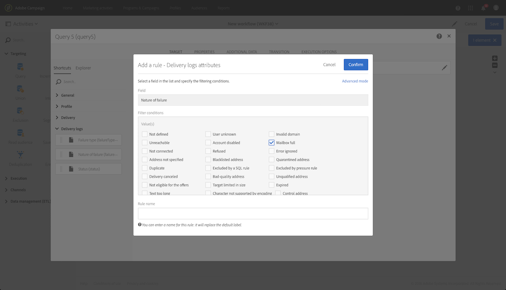

# Query{#query}

## Description {#description}

The **[!UICONTROL Query]** activity allows you to filter and extract a population of elements from the Adobe Campaign database. You can define **[!UICONTROL Additional data]** for the targeted population via a dedicated tab. Esses dados são armazenados em colunas adicionais e podem ser usados apenas para o fluxo de trabalho em andamento.

A atividade usa a ferramenta do editor de consulta. This tool is detailed in a [dedicated section](../../automating/using/editing-queries.md#about-query-editor).

## Context of use {#context-of-use}

**[!UICONTROL Query]** A atividade pode ser usada para vários tipos de uso:

* Segmentação de indivíduos para definir a meta de uma mensagem, público-alvo, etc.
* Enriqueça os dados de toda a tabela de banco de dados do Adobe Campaign.
* Exportação de dados.

## Configuration {#configuration}

1. Drag and drop a **[!UICONTROL Query]** activity into your workflow.
1. Select the activity, then open it using the  button from the quick actions that appear. Por padrão, a atividade é pré-configurada para pesquisar perfis.
1. If you would like to run a query on a resource other than the profile resource, go to the activity's **[!UICONTROL Properties]** tab and select a **[!UICONTROL Resource]** and a **[!UICONTROL Targeting dimension]**.

   The **[!UICONTROL Resource]** allows you to refine the filters displayed in the palette whereas the **[!UICONTROL Targeting dimension]**, contextual with regard to the resource selected, corresponds to the type of population that you would like to obtain (identified profiles, deliveries, data linked to the selected resource, etc.).

   For more on this, refer to [Targeting dimensions and resources](../../automating/using/query.md#targeting-dimensions-and-resources)

1. In the **[!UICONTROL Target]** tab, run your query by defining and combining rules.
1. You can define **[!UICONTROL Additional data]** for the targeted population via a dedicated tab. Esses dados são armazenados em colunas adicionais e podem ser usados apenas para o fluxo de trabalho em andamento. Especificamente, você pode adicionar dados das tabelas de banco de dados do Adobe Campaign relacionadas à dimensão de direcionamento da consulta. Consult the [Enriching data](../../automating/using/query.md#enriching-data) section.

   >[!NOTE]
   >
   >By default, the **[!UICONTROL Remove duplicate rows (DISTINCT)]** option is checked in the **[!UICONTROL Advanced options]** of the **[!UICONTROL Additional data]** tab of the query. If the **[!UICONTROL Query]** activity contains many (from 100) additional data defined, it is recommended to uncheck this option, for performance reasons. O sinal de que desmarcar essa opção pode resultar na obtenção duplicata de duplicatas, dependendo dos dados consultados.

1. In the **[!UICONTROL Transition]** tab, the **[!UICONTROL Enable an outbound transition]** option lets you add an outbound transition after the query activity, even if it retrieves no data.

   The outbound transition's segment code can be personalized using a standard expression and events variables (see [Customizing activities with events variables](../../automating/using/calling-a-workflow-with-external-parameters.md#customizing-activities-with-events-variables)).

1. Confirme a configuração da atividade e salve seu fluxo de trabalho.

## Targeting dimensions and resources {#targeting-dimensions-and-resources}

As dimensões e os recursos de definição de metas permitem definir em quais elementos uma consulta será baseada para determinar a meta de uma entrega.

As dimensões de definição de metas são definidas em mapeamentos de destino. For more on this, refer to [this section](../../administration/using/target-mappings-in-campaign.md).

### Defining the targeting dimension and resource of a query {#defining-the-targeting-dimension-and-resource-of-a-query}

Targeting dimension and resources are defined when creating a workflow, in the **[!UICONTROL Properties]** tab of a Query activity.

>[!NOTE]
>
>The targeting dimension can also be defined when creating an audience (see [this section](../../audiences/using/creating-audiences.md)).

As dimensões e os recursos de definição de metas são vinculados. Portanto, as dimensões de definição de metas disponíveis dependem do recurso selecionado.

For example, for the Resource **[!UICONTROL Profiles (profile)]**, the following targeting dimensions will be available:

While for **[!UICONTROL Deliveries (delivery)]**, the list will contain the following targeting dimensions:

Uma vez que a dimensão e o recurso de definição de metas são especificados, os filtros diferentes estão disponíveis na consulta.

Example of available filters for the **[!UICONTROL Profiles (profile)]** resource:

Example of available filters for the **[!UICONTROL Deliveries (delivery)]** resource:

### Using resources different from targeting dimensions {#using-resources-different-from-targeting-dimensions}

Por padrão, a dimensão e o recurso de definição de metas são definidos para direcionar perfis.

No entanto, pode ser útil usar um recurso diferente da dimensão de definição de metas se quiser procurar um registro específico em uma tabela distante.

**Exemplo 1: identificação de perfis direcionados pela entrega com o rótulo "Bem-vindo! »**.

* Nesse caso, queremos direcionar perfis. We will set the targeting dimension to **[!UICONTROL Profiles (profile)]**.
* Queremos filtrar os perfis selecionados de acordo com o rótulo de entrega. We will therefore set the resource to **[!UICONTROL Delivery logs]**. Dessa forma, estamos filtrando diretamente na tabela de log de entrega, o que oferece melhor desempenho.

**Exemplo 2: identificação de perfis que não foram direcionados pela entrega com a etiqueta "Bem-vindo! »**

No exemplo anterior, usamos um recurso diferente da dimensão de definição de metas. This operation is only possible if you want to find a record that **is present** in the distant table (delivery logs in our example).

If we want to find a record that **is not present** in the distant table (for example, profiles who were not targeted by a specific delivery), you must use the same resource and targeting dimension, as the record will not be present in the distant table (delivery logs).

* Nesse caso, queremos direcionar perfis. We will set the targeting dimension to **[!UICONTROL Profiles (profile)]**.
* Queremos filtrar os perfis selecionados de acordo com o rótulo de entrega. Não é possível filtrar diretamente nos registros de entrega, pois estamos buscando um registro não presente na tabela de registros de entrega. We will therefore set the resource to **[!UICONTROL Profile (profile)]** and build our query on the profiles table.

## Enriching data {#enriching-data}

**[!UICONTROL Additional data]** A guia **[!UICONTROL Query]** e **[!UICONTROL Incremental query]****[!UICONTROL Enrichment]** as atividades permitem aprimorar os dados direcionados e transferir esses dados para as seguintes atividades do fluxo de trabalho, onde pode ser usado. Em particular, você pode adicionar:

* Dados simples
* Agregados
* Coleções

For aggregates and collections, an **[!UICONTROL Alias]** is automatically defined to give a technical ID to a complex expression. Esse alias, que deve ser exclusivo, permite que os agregados e coleções sejam encontrados facilmente depois. Você pode modificá-lo para dar um nome fácil reconhecível.

>[!NOTE]
>
>Os alias devem respeitar as seguintes regras de sintaxe: Apenas caracteres alfanuméricos e os caracteres "_" são autorizados. Os alias fazem distinção entre maiúsculas e minúsculas. O alias deve começar com o caractere " @". O caractere imediatamente após o " @" não deve ser numérico. Por exemplo: @ Myalias_ 1 e @_ 1 Alias estão corretos; enquanto @ myalias # 1 e @ 1 alias estão incorretos.

Após adicionar quaisquer dados adicionais, é possível aplicar um nível de filtro adicional aos dados inicialmente direcionados ao criar condições com base nos dados adicionais definidos.

>[!NOTE]
>
>By default, the **[!UICONTROL Remove duplicate rows (DISTINCT)]** option is checked in the **[!UICONTROL Advanced options]** of the **[!UICONTROL Additional data]** tab of the query. If the **[!UICONTROL Query]** activity contains many (from 100) additional data defined, it is recommended to uncheck this option, for performance reasons. O sinal de que desmarcar essa opção pode resultar na obtenção duplicata de duplicatas, dependendo dos dados consultados.

### Adding a simple field {#adding-a-simple-field}

Ao adicionar um campo simples como dados adicionais, esse campo fica visível diretamente na transição de saída da atividade. Isso permite que o usuário verifique, por exemplo, que os dados da consulta são os dados desejados.

1. From the **[!UICONTROL Additional data]** tab, add a new element.
1. In the window that opens, in the **[!UICONTROL Expression]** field, select one of the fields available directly in the targeting dimension or in one of the linked dimensions. É possível editar expressões e usar funções ou cálculos simples (exceto agregados) dos campos de dimensão.

   An **[!UICONTROL Alias]** is automatically created if you edit an expression that is not a simple XPATH path (for example: "Year(&lt;@birthDate&gt;)"). Se desejar, você pode modificá-lo. If you only select one field (for example: "@age"), you do not need to define an **[!UICONTROL Alias]**.

1. Select **[!UICONTROL Add]** to confirm adding the field to the additional data. Quando a consulta é executada, uma coluna adicional correspondente ao campo adicionado estará presente na transição de saída da atividade.

### Adding an aggregate {#adding-an-aggregate}

Os agregados permitem que valores sejam calculados de campos da dimensão de definição de metas ou de campos de dimensões vinculados à dimensão de definição de metas. Por exemplo: a quantidade média comprada por um perfil.

1. From the **[!UICONTROL Additional data]** tab, add a new element.
1. In the window that opens, select the collection that you want to use to create your aggregate in the **[!UICONTROL Expression]** field.

   An **[!UICONTROL Alias]** is created automatically. If you like, you can modify it by going back to the query's **[!UICONTROL Additional data]** tab.

   A janela de definição agregada é aberta.

1. Define an aggregate from the **[!UICONTROL Data]** tab. Depending on the type of aggregate selected, only the elements whose data is compatible are available in the **[!UICONTROL Expression]** field. Por exemplo, uma soma só pode ser calculada com dados numéricos.

   

   É possível adicionar vários agregados para os campos da coleção selecionados. Certifique-se de definir rótulos explícitos para diferenciar as diferentes colunas dos detalhes dos dados de saída da atividade.

   Também é possível alterar os alias definidos automaticamente para cada agregado.

   

1. Se necessário, você pode adicionar um filtro para limitar os dados considerados.

   Refer to the [Filtering added data](../../automating/using/query.md#filtering-added-data) section.

1. Select **[!UICONTROL Confirm]** to add aggregates.

>[!NOTE]
>
>You cannot create an expression containing an aggregate directly from the **[!UICONTROL Expression]** field of the **[!UICONTROL New additional data]** window.

### Adding a collection {#adding-a-collection}

1. From the **[!UICONTROL Additional data]** tab, add a new element.
1. In the window that opens, select the collection that you want to add in the **[!UICONTROL Expression]** field. An **[!UICONTROL Alias]** is created automatically. If you like, you can modify it by going back to the query's **[!UICONTROL Additional data]** tab.
1. Select **[!UICONTROL Add]**. Uma nova janela é aberta, permitindo refinar os dados da coleção que você deseja exibir.
1. In the **[!UICONTROL Parameters]** tab, select **[!UICONTROL Collection]** and define the number of lines of the collection that you want to add. For example, if you want to get the three most recent purchases carried out by each profile, enter "3" in the **[!UICONTROL Number of lines to return]** field.

   >[!NOTE]
   >
   >Você deve inserir um número maior ou igual a 1.

1. From the **[!UICONTROL Data]** tab, define the fields of the collection that you want to display for each line.

   

1. Se desejar, você pode adicionar um filtro para limitar as linhas de coleta consideradas.

   Refer to the [Filtering added data](../../automating/using/query.md#filtering-added-data) section.

1. Se desejar, você pode definir uma classificação de dados.

   For example, if you have selected 3 lines to return in the **[!UICONTROL Parameters]** tab, and you want to determine the three most recent purchases, you can define a descending sort on the "date" field of the collection that corresponds to the transactions.

1. Refer to the [Sorting additional data](../../automating/using/query.md#sorting-additional-data) section.
1. Select **[!UICONTROL Confirm]** to add the collection.

### Filtering added data {#filtering-added-data}

Quando você adiciona uma coleção agregada ou uma coleção, pode especificar um filtro adicional para limitar os dados que deseja exibir.

For example, if you want to only process the collection lines of transactions with amounts of 50 dollars and above, you can add a condition on the field corresponding to the transaction amount from the **[!UICONTROL Filter]** tab.

### Sorting additional data {#sorting-additional-data}

Quando você adiciona uma coleção ou uma coleção aos dados de uma consulta, pode especificar se deseja aplicar uma classificação - seja ela crescente ou decrescente - com base no valor do campo ou na expressão definida.

For example, if you want to save only the transaction that was carried out most recently by a profile, enter "1" in the **[!UICONTROL Number of lines to return]** field of the **[!UICONTROL Parameters]** tab, and apply a descending sort on the field corresponding to the transaction date via the **[!UICONTROL Sort]** tab.

### Filtering the targeted data according to additional data {#filtering-the-targeted-data-according-to-additional-data}

Once you have added additional data, a new **[!UICONTROL Output filtering]** tab appears in the **[!UICONTROL Query]**. This tab allows you to apply an additional filter on the data initially targeted in the **[!UICONTROL Target]** tab, by taking into account the added data.

For example, if you have targeted all of the profiles that carried out at least one transaction and an aggregate calculating the average transaction amount carried out for each profile was added to the **[!UICONTROL Additional data]**, you can refine the population initially calculated using this average.

To do this, in the **[!UICONTROL Output filtering]** tab, simply add a condition on this additional data.

### Example: personalizing an email with additional data {#example--personalizing-an-email-with-additional-data}

O exemplo a seguir ilustra a adição de diferentes tipos de dados adicionais a uma consulta e sua utilização como campo de personalização em um email.

For this example, [custom resources](../../developing/using/data-model-concepts.md) are used:

* The **profile** resource was extended in order to add a field which allows each profile's loyalty points to be saved.
* A **transactions** resource was created and identifies all purchases carried out by the profiles in the database. A data, o preço e o produto comprados são salvos para cada transação.
* A **products** resource was created and references the products available for purchase.

O objetivo é enviar um email para os perfis para os quais pelo menos uma transação foi salva. Por meio desse email, os clientes receberão um lembrete da última transação realizada, bem como uma visão geral de todas as transações: o número de produtos comprados, o total gasto, um lembrete do número total de pontos de fidelidade que eles acumularam.

O fluxo de trabalho é apresentado da seguinte maneira:

1. Add a **[!UICONTROL Query]** activity, which allows you to target the profiles that have carried out at least one transaction.

   

   From the query's **[!UICONTROL Additional data]** tab, define the different data to be displayed in the final email:

   * The simple field of the **profile** dimension corresponding to the loyalty points. Refer to the [Adding a simple field](../../automating/using/query.md#adding-a-simple-field) section.
   * Dois agregados com base na coleção de transações: o número de produtos comprados e o valor total gasto. You can add them from the **[!UICONTROL Data]** tab of the aggregate configuration window, using the **Count** and **Sum** aggregates. Refer to the [Adding an aggregate](../../automating/using/query.md#adding-an-aggregate) section.
   * Uma coleção que retorna o valor gasto, a data e o produto da última transação executada.

      To do this, you have to add the different fields that you want to display from the **[!UICONTROL Data]** tab of the collection configuration window.

      To return only the most recent transaction, you have to enter "1" for the **[!UICONTROL Number of lines to return]** and apply a descending sort on the **Date** field of the collection from the **[!UICONTROL Sort]** tab.

      Refer to the [Adding a collection](../../automating/using/query.md#adding-a-collection) and [Sorting additional data](../../automating/using/query.md#sorting-additional-data) sections.
   

   If you would like to check that the data is correctly transferred by the activity's outbound transition, start the workflow for the first time (without the **[!UICONTROL Email delivery]** activity) and open the query's outbound transition.

   

1. Add an **[!UICONTROL Email delivery]** activity. No conteúdo de email, insira os campos de personalização correspondentes aos dados calculados na consulta. You can find it via the **[!UICONTROL Additional data (targetData)]** link of the personalization fields explorer.

   

Seu fluxo de trabalho está pronto para ser executado. Os perfis direcionados na consulta receberão um email personalizado que contém os dados calculados de suas transações.

## Query samples {#query-samples}

### Targeting on simple profile attributes {#targeting-on-simple-profile-attributes}

O exemplo a seguir mostra uma atividade de consulta configurada para direcionar homens entre 18 e 30 anos, morando em Londres.

### Targeting on email attributes {#targeting-on-email-attributes}

O exemplo a seguir mostra uma atividade de consulta configurada para direcionar perfis com o domínio de endereço de email "orange.co.uk".

O exemplo a seguir mostra uma atividade de consulta configurada para direcionar perfis cujo endereço de email foi fornecido.

### Targeting profiles whose birthday is today {#targeting-profiles-whose-birthday-is-today}

O exemplo a seguir mostra uma atividade de consulta configurada para direcionar perfis cujo aniversário é hoje.

1. Drag the **[!UICONTROL Birthday]** filter in your query.

   

1. Set the **[!UICONTROL Filter type]** to **[!UICONTROL Relative]** and select **[!UICONTROL Today]**.

   

### Targeting profiles who opened a specific delivery {#targeting-profiles-who-opened-a-specific-delivery}

O exemplo a seguir mostra uma atividade de consulta configurada para filtrar perfis que abriram a entrega com a etiqueta "Hora de verão".

1. Drag the **[!UICONTROL Opened]** filter in your query.

   

1. Select the delivery then click **[!UICONTROL Confirm]**.

   

### Targeting profiles for whom deliveries failed for a specific reason {#targeting-profiles-for-whom-deliveries-failed-for-a-specific-reason}

O exemplo a seguir mostra uma atividade de consulta configurada para filtrar perfis para os quais a entrega falhou porque a caixa de entrada estava cheia. This query is only available for users with administration rights and belonging to the **[!UICONTROL All (all)]** organizational units (see [this section](../../administration/using/organizational-units.md)).

1. Select the **[!UICONTROL Delivery logs]** resource in order to filter directly in the delivery log table (see [Using resources different from targeting dimensions](../../automating/using/query.md#using-resources-different-from-targeting-dimensions)).

   

1. Drag the **[!UICONTROL Nature of failure]** filter in your query.

   

1. Selecione o tipo de falha que deseja definir como meta. In our case **[!UICONTROL Mailbox full]**.

   

### Targeting profiles not contacted during the last 7 days {#targeting-profiles-not-contacted-during-the-last-7-days}

O exemplo a seguir mostra uma atividade de consulta configurada para filtrar perfis que não se contem nos últimos 7 dias.

1. Drag the **[!UICONTROL Delivery logs (logs)]** filter in your query.

   

   Select **[!UICONTROL Does not exist]** in the drop-down list, then drag the **[!UICONTROL Delivery]** filter.

   

1. Configure o filtro como abaixo.

   

### Targeting profiles who clicked a specific link {#targeting-profiles-who-clicked-a-specific-link-}

1. Drag the **[!UICONTROL Tracking logs (tracking)]** filter in your query.

   

1. Drag the **[!UICONTROL Label (urlLabel)]** filter.

   

1. In the **[!UICONTROL Value]** field, type the label that was defined when inserting the link in the delivery, then confirm.

   

