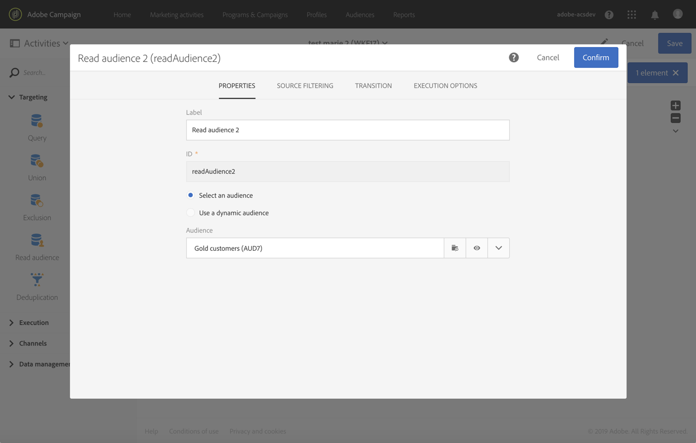

# Read audience{#read-audience}

## Description {#description}


The **[!UICONTROL Read audience]** activity allows you to retrieve an existing audience and to refine it by applying additional filtering conditions.

## Context of use {#context-of-use}

**[!UICONTROL Read audience]** A atividade é uma versão simples da **[!UICONTROL Query]** atividade projetada para casos em que você só precisa selecionar um público existente.

## Configuration {#configuration}

1. Drop a **[!UICONTROL Read audience]** activity into your workflow.
1. Select the activity, then open it using the  button from the quick actions that appear.
1. Select the audience you want to retrieve from the **[!UICONTROL Properties]** tab.

   You can retrieve audiences of the following types: **[!UICONTROL List]**, **[!UICONTROL Query]**, **[!UICONTROL File]** and **[!UICONTROL Experience Cloud]**. For more information on audience types, refer to the [Audiences](../../audiences/using/about-audiences.md) documentation.

   The **[!UICONTROL Use a dynamic audience]** option lets you define the name of the audience to target based on the workflow's events variables. For more on this, refer to the [Customizing activities with events variables](../../automating/using/calling-a-workflow-with-external-parameters.md#customizing-activities-with-events-variables) section.

   

1. If you want to apply additional filtering to the selected audience, add conditions via the **[!UICONTROL Source filtering]** tab of the activity.

   For more information about creating filtering conditions, refer to the [Creating queries](../../automating/using/editing-queries.md#creating-queries) documentation.

1. Confirme a configuração da atividade e salve seu fluxo de trabalho.

## Example: Reconcile a File audience with the database {#example--reconcile-a-file-audience-with-the-database}

This example shows how to use the **[!UICONTROL Read audience]** activity to reconcile an audience directly created from a file import.

Ao realizar uma importação de arquivo, você pode salvar diretamente seu conteúdo em um público-alvo. Esse público é um público-alvo de arquivo e seus dados não estão vinculados a nenhum recurso de banco de dados.

O fluxo de trabalho de importação foi projetado da seguinte maneira:


* A [Load file](../../automating/using/load-file.md) activity uploads a file containing profiles data that were extracted from an external tool.

   Por exemplo:

   ```
   lastname;firstname;birthdate;email;crmID
   Smith;Hayden;23/05/1989;hayden.smith@example.com;124365
   Mars;Daniel;17/11/1987;dannymars@example.com;123545
   Smith;Clara;08/02/1989;hayden.smith@example.com;124567
   Durance;Allison;15/12/1978;allison.durance@example.com;120987
   Lucassen;Jody;28/03/1988;jody.lucassen@example.com;127634
   Binder;Tom;19/01/1982;tombinder@example.com;128653
   Binder;Tommy;19/01/1915;tombinder@example.com;134576
   Connor;Jade;10/10/1979;connor.jade@example.com;132452
   Mack;Clarke;02/03/1985;clarke.mack@example.com;149876
   Ross;Timothy;04/07/1986;timross@example.com;157643
   ```

* A [Save audience](../../automating/using/save-audience.md) activity saves the incoming data as an audience. Como os dados ainda não foram conciliados, o público é um público-alvo de arquivo e seus dados ainda não são reconhecidos como dados de perfil.

O fluxo de trabalho de reconciliação foi projetado da seguinte maneira:


* A **[!UICONTROL Read audience]** activity uploads the File audience created in the import workflow. Os dados do público-alvo ainda não se reconciliam com o banco de dados do Adobe Campaign.
* A [Reconciliation](../../automating/using/reconciliation.md) activity identifies the incoming data as profiles through its **[!UICONTROL Identification]** tab. For example by using the **email** field as reconciliation criteria.
* An [Update data](../../automating/using/update-data.md) activity inserts and updates the profiles resource of the database with the incoming data. As the data is already identified as profiles, you can select the **[!UICONTROL Directly using the targeting dimension]** option and select **[!UICONTROL Profiles]** in the **[!UICONTROL Identification]** tab of the activity. Em seguida, basta adicionar a lista de campos que precisam ser atualizados na guia de acordo.

## Example: Union on two refined audiences {#example--union-on-two-refined-audiences}

The workflow defined in this example shows the union of two **[!UICONTROL Read audience]** activities. O objetivo deste fluxo de trabalho é enviar um email para os membros Gold ou Silver que têm entre 18 e 30 anos.

Públicos-alvo específicos já foram criados no sistema para acompanhar os membros Gold e Silver.

O fluxo de trabalho foi projetado da seguinte maneira:


* A first **[!UICONTROL Read audience]** activity that retrieves the Gold members audience and refines it by selecting only profiles that are between 18 and 30 years old.
* A second **[!UICONTROL Read audience]** activity that retrieves the Silver members audience and refines it by selecting only profiles that are between 18 and 30 years old.
* **[!UICONTROL Union]** Uma atividade que une populações de ambas **[!UICONTROL Read audiences]** as atividades em uma população final.
* **[!UICONTROL Email delivery]** Uma atividade que envia o email para a população proveniente da **[!UICONTROL Union]** atividade.

