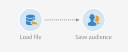

# Reconciliar uma audiência de arquivo com o banco de dados {#example--reconcile-a-file-audience-with-the-database}

Este exemplo mostra como usar a **[!UICONTROL Read audience]** atividade para reconciliar uma audiência criada diretamente de uma importação de arquivo.

Ao executar uma importação de arquivo, é possível salvar diretamente seu conteúdo em uma audiência. Esta audiência é uma audiência de Arquivo e seus dados não estão vinculados a nenhum recurso do banco de dados.

O fluxo de trabalho de importação foi projetado da seguinte forma:



* Uma atividade [Carregar arquivo](../../automating/using/load-file.md) carrega um arquivo contendo dados de perfis que foram extraídos de uma ferramenta externa.

   Por exemplo:

   ```
   lastname;firstname;birthdate;email;crmID
   Smith;Hayden;23/05/1989;hayden.smith@example.com;124365
   Mars;Daniel;17/11/1987;dannymars@example.com;123545
   Smith;Clara;08/02/1989;hayden.smith@example.com;124567
   Durance;Allison;15/12/1978;allison.durance@example.com;120987
   Lucassen;Jody;28/03/1988;jody.lucassen@example.com;127634
   Binder;Tom;19/01/1982;tombinder@example.com;128653
   Binder;Tommy;19/01/1915;tombinder@example.com;134576
   Connor;Jade;10/10/1979;connor.jade@example.com;132452
   Mack;Clarke;02/03/1985;clarke.mack@example.com;149876
   Ross;Timothy;04/07/1986;timross@example.com;157643
   ```

* Uma atividade [Salvar audiência](../../automating/using/save-audience.md) salva os dados recebidos como uma audiência. Como os dados ainda não foram reconciliados, a audiência é uma audiência de Arquivo e seus dados ainda não são reconhecidos como dados de perfil.

O fluxo de trabalho de reconciliação foi projetado da seguinte forma:


* Uma atividade [Ler audiência](../../automating/using/read-audience.md) carrega a audiência Arquivo criada no fluxo de trabalho de importação. Os dados de audiência ainda não foram reconciliados com o banco de dados de Adobe Campaign.
* Uma atividade de [Reconciliação](../../automating/using/reconciliation.md) identifica os dados recebidos como perfis por meio de sua **[!UICONTROL Identification]** guia. Por exemplo, usando o campo de **email** como critérios de reconciliação.
* Uma atividade de dados [](../../automating/using/update-data.md) Update insere e atualiza o recurso de perfis do banco de dados com os dados recebidos. Como os dados já estão identificados como perfis, você pode selecionar a **[!UICONTROL Directly using the targeting dimension]** opção e selecionar **[!UICONTROL Profiles]** na guia **[!UICONTROL Identification]** da atividade. Em seguida, basta adicionar a lista de campos que precisam ser atualizados na guia de acordo.
