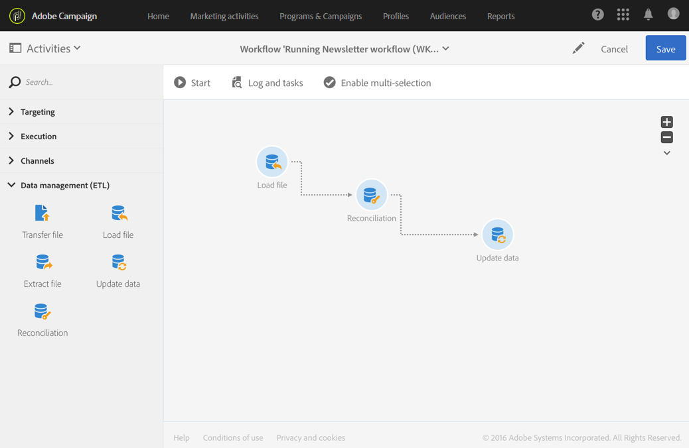
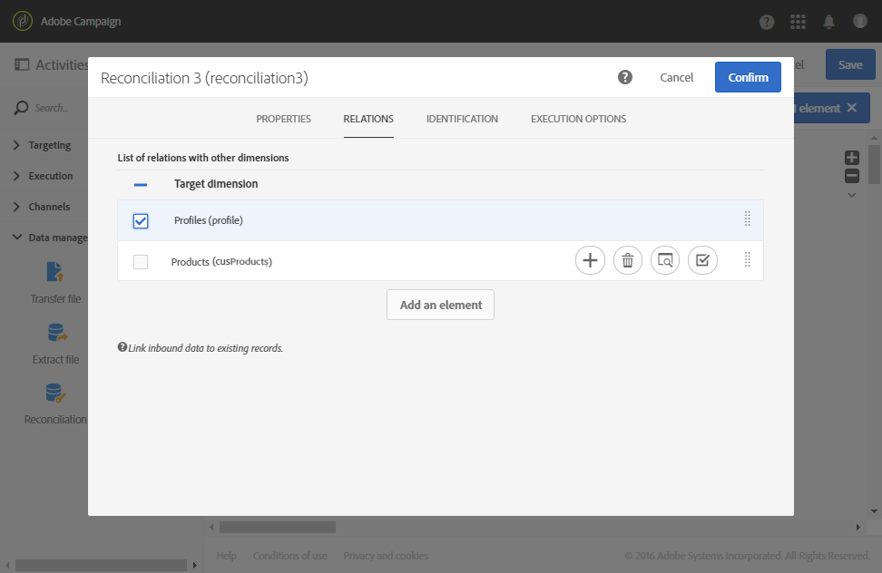
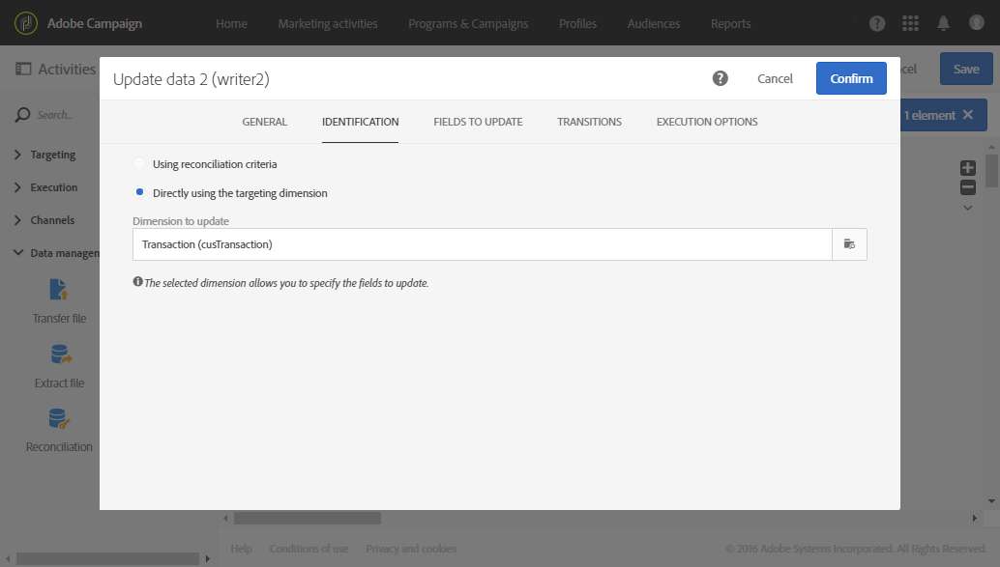
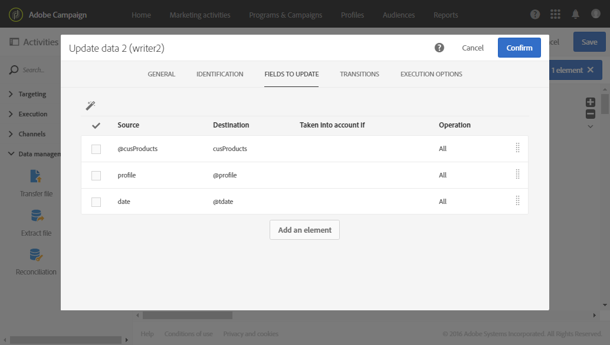

# Reconciliação de dados usando relações {#reconciliation-relations}

O exemplo a seguir demonstra um fluxo de trabalho que atualiza o banco de dados usando os dados de compra de um arquivo. Esses dados contêm informações que fazem referência aos elementos de outras dimensões, como emails de clientes e códigos de produto.

>[!NOTE]
>
>Por padrão, os recursos **Transactions** e **Products** usados no exemplo não existem no banco de dados do Adobe Campaign. Eles foram previamente criados com a função [Custom resources](../../developing/using/data-model-concepts.md). Os perfis que correspondem aos endereços de email no arquivo importado, e também os produtos, foram carregados no banco de dados antecipadamente.

O fluxo de trabalho é composto das seguintes atividades:



* Uma atividade [Load file](../../automating/using/load-file.md), que carrega e detecta os dados do arquivo a ser importado. O arquivo importado contém os seguintes dados:

   * Data da transação
   * Endereço de email do cliente
   * Código do produto comprado

  ```
  date;client;product
  2015-05-19 09:00:00;mail1@email.com;ZZ1
  2015-05-19 09:01:00;mail2@email.com;ZZ2
  2015-05-19 09:01:01;mail3@email.com;ZZ2
  2015-05-19 09:01:02;mail4@email.com;ZZ2
  2015-05-19 09:02:00;mail5@email.com;ZZ3
  2015-05-19 09:03:00;mail6@email.com;ZZ4
  2015-05-19 09:04:00;mail7@email.com;ZZ5
  2015-05-19 09:05:00;mail8@email.com;ZZ7
  2015-05-19 09:06:00;mail9@email.com;ZZ6
  ```

* Uma atividade [Reconciliation](../../automating/using/reconciliation.md) para associar dados de compra a perfis de banco de dados e produtos. Portanto, é necessário definir uma relação dos dados do arquivo com a tabela de perfis e a tabela de produtos. Essa configuração é realizada na guia **[!UICONTROL Relations]** da atividade:

   * Relação com **Perfis**: a coluna **cliente** do arquivo é vinculada ao campo **email** da dimensão **Perfis**.
   * Relação com **Produtos**: a coluna **product** do arquivo é vinculada ao campo **productCode** da dimensão **Perfis**.

  As colunas são adicionadas aos dados de entrada para fazer referência às chaves estrangeiras das dimensões vinculadas.

  

* Uma atividade [Atualizar dados](../../automating/using/update-data.md) permite definir os campos do banco de dados a serem atualizados usando os dados importados. Como os dados já foram identificados como pertencentes à dimensão **Transactions** na atividade anterior, aqui você pode usar a opção de identificação **[!UICONTROL Directly using the targeting dimension]**.

  Na opção que detecta automaticamente os campos a serem atualizados, os links configurados na atividade anterior (para perfis e produtos) são adicionados à lista de **[!UICONTROL Fields to update]**. Você também deve verificar se o campo que corresponde à data da transação foi adicionado corretamente a essa lista.

  

  
