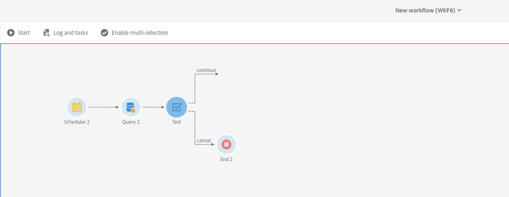

# Execução de sobreposição de workflows agendados{#preventing-overlapping-execution-of-scheduled-workflows}

## Sobre a execução de workflows agendados

No Campaign Standard, o motor de workflow garante que uma instância de fluxo de trabalho seja executada por apenas um processo. Bloquear atividades como importações, query de longa duração ou gravações no banco de dados impede a execução de qualquer outra tarefa durante a execução.

Por outro lado, atividades que não estão bloqueando não bloqueiam a execução de outras tarefas (normalmente, atividades que aguardam um evento como a atividade **[!UICONTROL Scheduler]**).

Isso pode levar a um cenário em que um fluxo de trabalho baseado em agendamento pode ser executado de start mesmo quando a execução anterior desse mesmo fluxo de trabalho ainda não foi concluída, o que pode resultar em problemas inesperados de dados.

Portanto, ao projetar um fluxo de trabalho programado que inclui várias atividades, é necessário verificar se o fluxo de trabalho não é reprogramado até que seja concluído. Para fazer isso, é necessário configurar seu fluxo de trabalho para impedir sua execução se uma ou mais tarefas de uma execução anterior ainda estiverem pendentes.

## Configuração do fluxo de trabalho

Para verificar se uma ou mais tarefas de uma execução de fluxo de trabalho anterior ainda estão pendentes, é necessário usar uma atividade **[!UICONTROL Query]** e **[!UICONTROL Test]**.

1. Adicione uma atividade **[!UICONTROL Query]** após a atividade **[!UICONTROL Scheduler]** e configure-a da seguinte maneira.

1. Altere o recurso de atividade para **[!UICONTROL WorkflowTaskDetail]**, o que significa que ele público alvo as tarefas atuais do fluxo de trabalho.

   

1. Configure o query com as regras abaixo:

   

   * A primeira regra filtros a tarefa atual (query2), bem como a tarefa de programação seguinte (programação2) pertencente ao fluxo de trabalho atual.

      >[!NOTE]
      >
      >Quando uma atividade **[!UICONTROL Scheduler]** é start, ela imediatamente adiciona outra tarefa agendada para execução na próxima hora agendada e start o fluxo de trabalho. Portanto, é importante filtrar tanto o query quanto programar tarefas ao procurar tarefas pendentes de uma execução anterior.

   * A segunda regra determina se qualquer tarefa de uma execução anterior do fluxo de trabalho ainda está ativa (pendente), o que corresponde ao status de execução 0.

1. Adicione uma atividade **[!UICONTROL Test]** para verificar o número de tarefas pendentes retornadas pela atividade **[!UICONTROL Query]**. Para fazer isso, configure duas transições de saída.

   

   * A primeira transição continua a execução do fluxo de trabalho se não houver tarefas pendentes,
   * A segunda transição cancela a execução do fluxo de trabalho se houver tarefas pendentes.

   

Agora é possível configurar o restante do fluxo de trabalho, conforme necessário. Se a execução do fluxo de trabalho for cancelada devido a tarefas pendentes, quando o fluxo de trabalho for executado novamente de acordo com a programação, ele poderá passar por essas etapas. Isso garantirá que a execução do fluxo de trabalho continue somente se não houver tarefas ativas (pendentes) de uma execução anterior.
