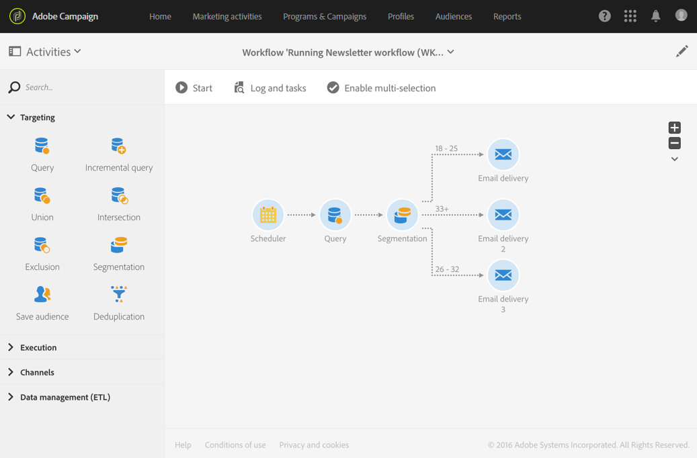
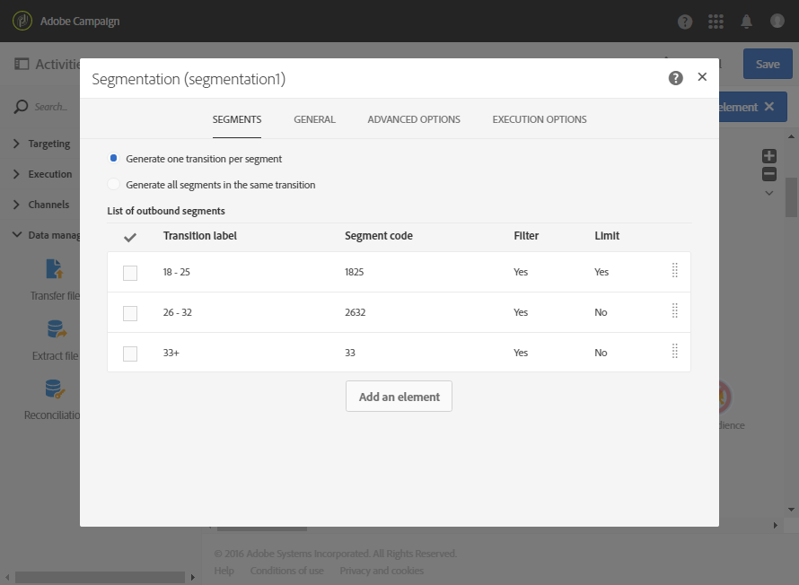
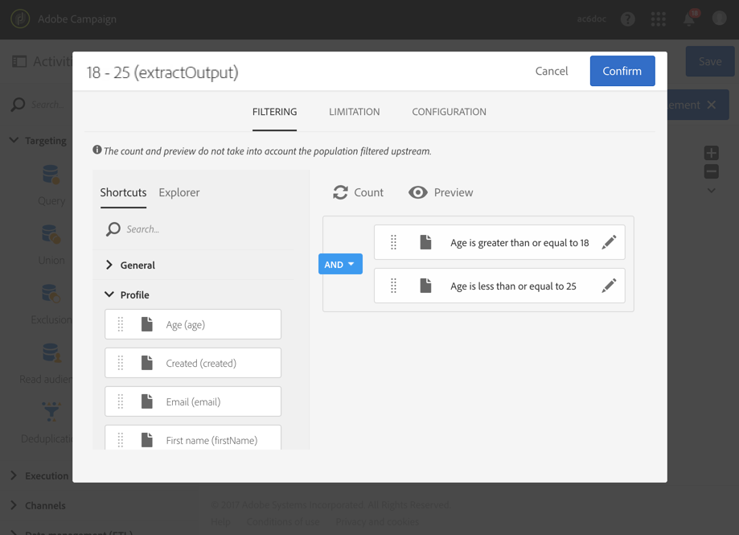
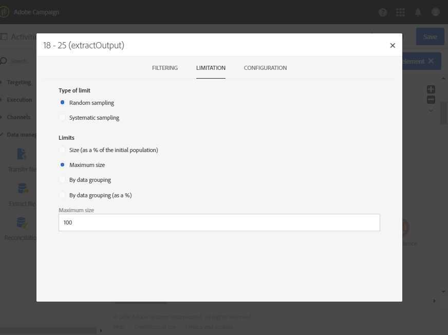

# Segmentação por faixa etária {#segmentation-age-groups}

O exemplo a seguir mostra uma segmentação de perfis de banco de dados de acordo com a faixa etária.

O objetivo do fluxo de trabalho é enviar um email específico para cada faixa etária. Considerando que esse fluxo de trabalho faz parte de uma campanha de teste, cada segmento só pode conter um máximo de 100 perfis selecionados aleatoriamente para que seja possível usar públicos-alvo limitados e representativos ao mesmo tempo.

O fluxo de trabalho é composto dos seguintes elementos:

* Uma [Atividade Scheduler](../../automating/using/segmentation.md) para especificar a data de execução do fluxo de trabalho.
* Uma atividade [Query](../../automating/using/query.md) para direcionar perfis de pessoas cujas datas de nascimento e endereços de email foram inseridos.
* Uma atividade [Segmentação](../../automating/using/segmentation.md) para criar três segmentos divididos em transições de saída diferentes: 18-25 anos, 26-32 anos e perfis acima de 32 anos. Os segmentos são definidos de acordo com os seguintes parâmetros:

  

   * Um filtro na idade para definir a faixa etária do segmento

     

   * Um limite do tipo **[!UICONTROL Random sampling]** vinculado a um limite 100 para **[!UICONTROL Maximum size]**

     

* Uma atividade de [Entrega de email](../../automating/using/email-delivery.md) por segmento.
