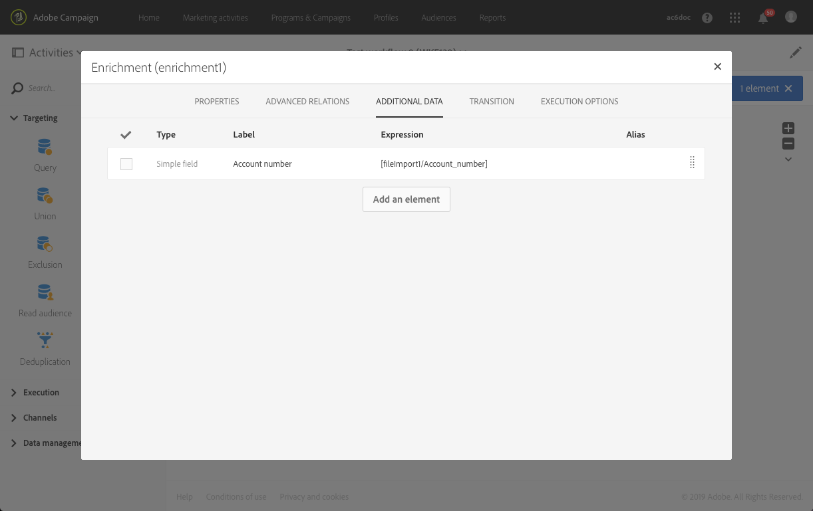

# Envio de email com campos enriquecidos {#sending-email-enriched-fields}

<!--A new example showing how to send an email containing additional data retrieved from a load file activity has been added. [Read more](example-2-email-with-enriched-fields)-->

A atividade de carregamento de arquivo também permite enviar um email enriquecido com dados adicionais de um arquivo externo no mesmo fluxo de trabalho.

O exemplo abaixo mostra como enviar um email usando dados adicionais recuperados de um arquivo externo por meio da atividade de carregamento de arquivo. No exemplo, o arquivo externo contém uma lista de perfis e os números de conta associados. Você deseja importar esses dados para enviar um email a cada perfil com o número da conta.

Para criar o fluxo de trabalho, siga estas etapas:

1. Drag and drop a [Query](../../automating/using/query.md) activity into your workflow and open it to define the main target.

   <!--The Query activity is presented in the [Query](../../automating/using/query.md) section.-->

1. Drag and drop a [Load file](../../automating/using/load-file.md) activity to assign some data to a profile. No exemplo, carregue um arquivo com os números de conta correspondentes a alguns perfis do banco de dados.

   

1. Drag and drop an [Enrichment](../../automating/using/enrichment.md) activity into your workflow and link the load file and query activities to it.

1. Na guia **[!UICONTROL Advanced relations]** da atividade de enriquecimento, selecione o **[!UICONTROL 0 or 1 cardinality simple link]** e defina os campos que serão usados para reconciliação. Aqui usamos o sobrenome para reconciliar os dados com os perfis do banco de dados.

   

1. Na guia **[!UICONTROL Additional data]**, selecione os elementos que deseja usar no email. Aqui, selecione Account number (coluna do arquivo que você recuperou por meio da atividade de carregamento de arquivo).

   

   <!---->

   Para saber mais, consulte a seção [Enriquecimento](../../automating/using/enrichment.md).

1. Drag and drop a [Segmentation](../../automating/using/segmentation.md) activity into your workflow and open it to refine the main target.

   

   Para saber mais, consulte a seção [Segmentação](../../automating/using/segmentation.md).

1. Drag and drop an [Email delivery](../../automating/using/email-delivery.md) activity into your workflow and open it.

   <!--The Email delivery activity is presented in the [Email delivery](../../automating/using/email-delivery.md) section.-->

1. Adicione um campo de personalização e selecione os dados adicionais definidos na atividade de enriquecimento (aqui é Account number) do nó **[!UICONTROL Additional data (targetData)]**. Assim, é possível recuperar dinamicamente o número de conta de cada perfil no conteúdo do email.

   

1. Salve o email e inicie o fluxo de trabalho.

O email é enviado para o público-alvo. Cada perfil recebe o email com o número de conta correspondente.

