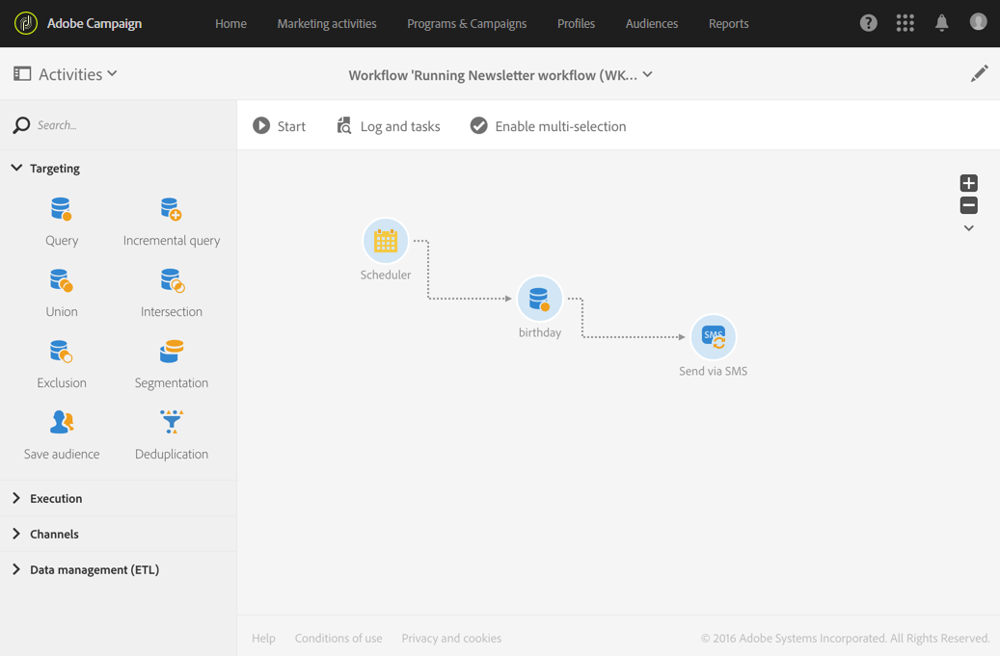

# Entrega por SMS{#sms-delivery}

## Descrição {#description}

A **[!UICONTROL SMS delivery]** atividade permite configurar o envio de um SMS em um fluxo de trabalho. Isto pode ser um **único SMS enviado** e enviado apenas uma vez, ou pode ser um SMS **recorrente** .

As mensagens SMS de envio único são SMS padrão, enviadas uma vez.

Mensagens SMS recorrentes permitem enviar o mesmo SMS várias vezes para diferentes destinos em um período definido. Você pode agregar as entregas por período para obter relatórios que correspondam às suas necessidades.

## Contexto de utilização {#context-of-use}

A **[!UICONTROL SMS delivery]** atividade é geralmente usada para automatizar o envio de um SMS para um destino calculado no mesmo fluxo de trabalho.

Quando vinculado a um programador, você pode definir mensagens SMS recorrentes.

Os destinatários SMS são definidos como upstream da atividade no mesmo fluxo de trabalho, por meio de atividades de definição de metas, como consultas, interseções etc.

A preparação da mensagem é acionada de acordo com os parâmetros de execução do fluxo de trabalho. No painel de mensagens, você pode selecionar se deseja solicitar ou não uma confirmação manual para enviar a mensagem (obrigatório por padrão). Você pode iniciar o fluxo de trabalho manualmente ou colocar uma atividade do programador no fluxo de trabalho para automatizar a execução.

## Configuração {#configuration}

1. Arraste e solte uma **[!UICONTROL SMS delivery]** atividade em seu fluxo de trabalho.
1. Selecione a atividade e abra-a usando o  botão das ações rápidas que aparecem.

   >[!NOTE]
   >
   >Você pode acessar as propriedades gerais e as opções avançadas da atividade (e não da entrega em si) por meio do  botão na barra de ação do fluxo de trabalho. Esse botão é específico para a **[!UICONTROL SMS delivery]** atividade. As propriedades SMS podem ser acessadas pela barra de ação no painel SMS.

1. Selecione o modo de envio SMS:

   * **[!UICONTROL SMS]**: o SMS é enviado uma única vez. Você pode especificar aqui se deseja ou não adicionar uma transição de saída à atividade. Os diferentes tipos de transição estão detalhados na etapa 7 deste procedimento.
   * **[!UICONTROL Recurring SMS]**: o SMS é enviado várias vezes, de acordo com a frequência definida numa **[!UICONTROL Scheduler]** atividade. Selecione o período de agregação dos envios. Isso permite que você reagrupe todas as envios que ocorrem durante o período definido em uma única exibição, também chamada de Execução **** recorrente e que podem ser acessadas da lista de atividades de marketing do aplicativo.

      Por exemplo, para um SMS de aniversário recorrente, que é enviado diariamente, você pode escolher agregar os envios por mês. Isso permite que você receba relatórios sobre sua entrega mensalmente, embora o SMS seja enviado todos os dias.

1. Selecione um tipo de SMS. Os tipos SMS vêm de modelos SMS definidos no menu **[!UICONTROL Resources]** &gt; **[!UICONTROL Templates]** &gt; **[!UICONTROL Delivery templates]** .
1. Insira as propriedades gerais do SMS. Você também pode anexá-la a uma campanha existente. O rótulo da atividade de entrega do fluxo de trabalho é atualizado com o rótulo SMS.
1. Defina o conteúdo do SMS. Consulte a seção sobre como [criar uma mensagem](../../channels/using/creating-an-sms-message.md)SMS.
1. Por padrão, a **[!UICONTROL SMS delivery]** atividade não inclui nenhuma transição de saída. Se você deseja adicionar uma transição de saída à sua **[!UICONTROL SMS delivery]** atividade, vá para a **[!UICONTROL General]** guia das opções de atividade avançada (  botão nas ações rápidas da atividade) e verifique uma das seguintes opções:

   * **[!UICONTROL Add outbound transition without the population]**: isso permite gerar uma transição de saída que contém exatamente a mesma população da transição de entrada.
   * **[!UICONTROL Add outbound transition with the population]**: isso permite gerar uma transição de saída contendo a população para a qual o SMS foi enviado. Os membros do alvo excluídos durante a preparação de entrega (quarentena, número inválido, etc.) são excluídos desta transição.

1. Confirme a configuração da atividade e salve o fluxo de trabalho.

Ao reabrir a atividade, você é levado diretamente para o painel SMS. Somente seu conteúdo pode ser editado.

Por padrão, iniciar um fluxo de trabalho de entrega aciona somente a preparação da mensagem. O envio de mensagens criadas a partir de um fluxo de trabalho ainda precisa ser confirmado depois que o fluxo de trabalho for iniciado. Mas no painel de mensagens, e somente se a mensagem foi criada a partir de um fluxo de trabalho, você pode desativar a **[!UICONTROL Request confirmation before sending messages]** opção. Ao desmarcar essa opção, as mensagens são enviadas sem aviso prévio após a preparação.

## Observações {#remarks}

As entregas criadas em um fluxo de trabalho podem ser acessadas na lista de atividades de marketing do aplicativo. Você pode exibir o status de execução do fluxo de trabalho usando o painel. Os links no painel de resumo do SMS permitem acessar diretamente os elementos vinculados (fluxo de trabalho, campanha, entrega principal no caso de um SMS recorrente).

No entanto, as execuções de entregas recorrentes são mascaradas por padrão. Para exibi-los, marque a opção no painel de pesquisa das atividades de marketing. **[!UICONTROL Show recurring executions]**

Nas entregas principais, que podem ser acessadas da lista de atividades de marketing ou diretamente por meio das execuções recorrentes associadas, você pode exibir o número total de envios que foram processados (de acordo com o período de agregação especificado quando a **[!UICONTROL SMS delivery]** atividade foi configurada). Para fazer isso, abra a exibição detalhada do **[!UICONTROL Deployment]** bloco da entrega pai selecionando .

## Exemplo {#example}

Este exemplo é um fluxo de trabalho de aniversário. Todos os dias um SMS é enviado para perfis cujo aniversário é naquele dia. Para fazer isso:

* O **[!UICONTROL Scheduler]** permite que você inicie o fluxo de trabalho todos os dias às 8h.

   

* A **[!UICONTROL Query]** atividade permite calcular os perfis que forneceram um número de telefone celular e cujo aniversário é no dia atual, sempre que o fluxo de trabalho é executado. O cálculo de aniversário é realizado usando um filtro predefinido disponível na paleta na ferramenta de edição de consulta.

   

* O **[!UICONTROL SMS]** é recorrente. Os envios são agregados por mês. Assim, todas as mensagens SMS enviadas em um mês são agregadas em uma única exibição. Em um ano, 365 entregas são executadas, mas são agrupadas em 12 exibições (também chamadas de execuções **** recorrentes) na interface do Adobe Campaign. Os detalhes do histórico e do relatório são exibidos todos os meses e não para cada envio.

   

Para obter outro exemplo de entrega de SMS em um fluxo de trabalho, consulte Caso de [uso: Fluxo de trabalho de redefinição de metas enviando uma nova entrega para não iniciantes](../../automating/using/workflow-cross-channel-retargeting.md).
