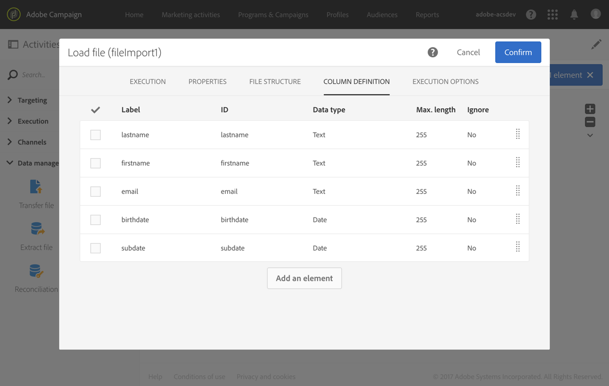

# Subscribing profiles to a specific service after importing a file {#subscribing-profiles-to-a-specific-service-after-importing-a-file}

Este exemplo ilustra como importar um arquivo contendo perfis e fazer a assinatura de todos eles para um serviço existente. Após a importação do arquivo, é necessário fazer uma reconciliação para que os dados importados possam ser identificados como perfis. Para garantir que o arquivo não contenha nenhuma duplicata, uma atividade de desduplicação é executada nos dados.

O fluxo de trabalho é apresentado da seguinte forma:


* A [Load file](../../automating/using/load-file.md) activity loads the profile file and defines the structure of the imported columns.

   Neste exemplo, o arquivo carregado está no formato .csv e contém os seguintes dados:

   ```
   lastname;firstname;email;birthdate;subdate
   jackman;megan;megan.jackman@testmail.com;07/08/1975;10/08/2017
   phillips;edward;phillips@testmail.com;09/03/1986;10/08/2017
   weaver;justin;justin_w@testmail.com;11/15/1990;10/08/2017
   martin;babeth;babeth_martin@testmail.net;11/25/1964;10/08/2017
   reese;richard;rreese@testmail.com;02/08/1987;11/08/2017
   cage;nathalie;cage.nathalie227@testmail.com;07/03/1989;11/08/2017
   xiuxiu;andrea;andrea.xiuxiu@testmail.com;09/12/1992;11/08/2017
   grimes;daryl;daryl_890@testmail.com;12/06/1979;12/08/2017
   tycoon;tyreese;tyreese_t@testmail.net;10/08/1971;12/08/2017
   ```

   

* A [Reconciliation](../../automating/using/reconciliation.md) activity identifies the data from the file as belonging to the profile dimension of the Adobe Campaign database. Somente a guia **[!UICONTROL Identification]** está configurada. Ela identifica os dados do arquivo de acordo com os endereços de email dos perfis.

   

* A [Deduplication](../../automating/using/deduplication.md) based on the **email** field of the temporary resource (resulting from the reconciliation) identifies any duplicates. Se os dados importados do arquivo tiverem duplicatas, a assinatura para um serviço falhará para todos os dados.

   

* A [Subscription Services](../../automating/using/subscription-services.md) activity lets you select the service to which the profiles must be subscribed, the field corresponding to the subscription date, and the origin of the subscription.

   
