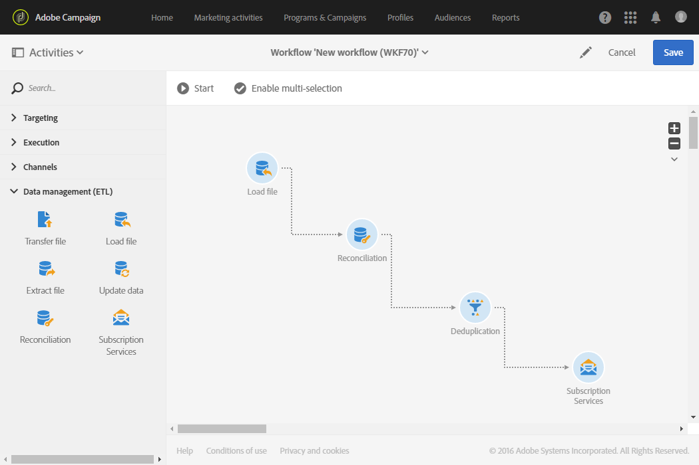

# Assinatura de perfis para um serviço específico após a importação de um arquivo {#subscribing-profiles-to-a-specific-service-after-importing-a-file}

Este exemplo ilustra como importar um arquivo contendo perfis e fazer a assinatura de todos eles para um serviço existente. Após a importação do arquivo, é necessário fazer uma reconciliação para que os dados importados possam ser identificados como perfis. Para garantir que o arquivo não contenha nenhum duplicado, uma atividade de desduplicação é executada nos dados.

O fluxo de trabalho é apresentado da seguinte forma:



* Uma atividade [Load file](../../automating/using/load-file.md) carrega o arquivo de perfil e define a estrutura das colunas importadas.

  Neste exemplo, o arquivo carregado está no formato .csv e contém os seguintes dados:

  ```
  lastname;firstname;email;birthdate;subdate
  jackman;megan;megan.jackman@testmail.com;07/08/1975;10/08/2017
  phillips;edward;phillips@testmail.com;09/03/1986;10/08/2017
  weaver;justin;justin_w@testmail.com;11/15/1990;10/08/2017
  martin;babeth;babeth_martin@testmail.net;11/25/1964;10/08/2017
  reese;richard;rreese@testmail.com;02/08/1987;11/08/2017
  cage;nathalie;cage.nathalie227@testmail.com;07/03/1989;11/08/2017
  xiuxiu;andrea;andrea.xiuxiu@testmail.com;09/12/1992;11/08/2017
  grimes;daryl;daryl_890@testmail.com;12/06/1979;12/08/2017
  tycoon;tyreese;tyreese_t@testmail.net;10/08/1971;12/08/2017
  ```

  

* Uma atividade [Reconciliation](../../automating/using/reconciliation.md) identifica os dados do arquivo como pertencente à dimensão do perfil do banco de dados do Adobe Campaign. Somente a guia **[!UICONTROL Identification]** está configurada. Ela identifica os dados do arquivo de acordo com os endereços de email dos perfis.

  

* Uma [Eliminação de Duplicação](../../automating/using/deduplication.md) baseada no campo **email** do recurso temporário (resultante da reconciliação) identifica duplicatas. Se os dados importados do arquivo tiverem duplicados, a assinatura para um serviço falhará para todos os dados.

  

* Uma atividade de [Serviços de assinatura](../../automating/using/subscription-services.md) permite selecionar o serviço para o qual os perfis devem ser assinados, o campo correspondente à data da assinatura e a origem da assinatura.

  
