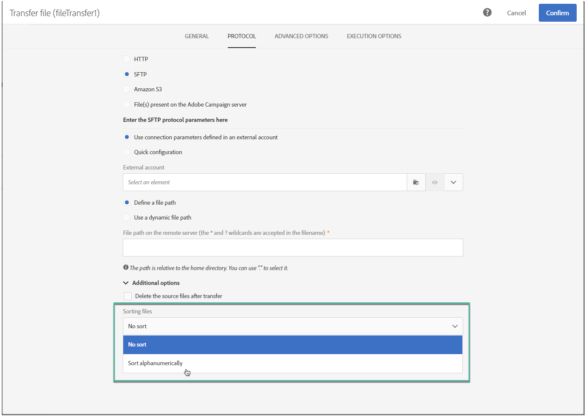

# Transferir arquivo{#transfer-file}

## Descrição {#description}

A **[!UICONTROL Transfer file]** atividade permite que você receba ou envie arquivos, teste se há arquivos presentes ou liste arquivos no Adobe Campaign.

## Contexto de utilização {#context-of-use}

A forma como os dados serão extraídos é definida quando a atividade é configurada. O arquivo a ser carregado pode ser uma lista de contatos, por exemplo.

Você pode usar essa atividade para recuperar dados que serão estruturados com a **[!UICONTROL Load file]** atividade.

## Configuração {#configuration}

1. Solte uma **[!UICONTROL Transfer file]** atividade em seu fluxo de trabalho.
1. Selecione a atividade e abra-a usando o  botão das ações rápidas que aparecem.
1. Use a lista suspensa no **[!UICONTROL Action]** campo para selecionar uma das seguintes ações de atividade:

   

   * **Download** do arquivo: permite baixar um arquivo.
   * **Carregamento** de arquivo: permite carregar um arquivo. Fazer upload de um arquivo do Adobe Campaign gera uma entrada de log no **[!UICONTROL Export audits]** menu. Para obter mais informações sobre auditorias de exportação, consulte a seção [Auditando exportações](../../administration/using/auditing-export-logs.md) .
   * **Teste para verificar se o arquivo existe**: permite verificar se há um arquivo.
   * **Lista** de arquivos: permite listar os arquivos presentes no Adobe Campaign.
   Dependendo da ação selecionada, um ou vários protocolos estão disponíveis:

   * **HTTP**: este protocolo permite que você comece a baixar um arquivo de uma conta externa ou de um URL.

      * Clique na **[!UICONTROL Use connection parameters defined in an external account]** opção, selecione a conta que deseja e especifique o caminho do arquivo para download.

         

      * Clique na **[!UICONTROL Quick configuration]** opção e insira o URL no campo exibido.

         
   * **S3**: este protocolo permite que você comece a baixar um arquivo de um URL ou de uma conta externa por meio do Amazon Simple Storage Service (S3).

      * Selecione a conta externa e especifique o caminho do arquivo a ser baixado.

         
   * **SFTP**: este protocolo permite que você comece a baixar um arquivo de um URL ou de uma conta externa.

      * Clique na **[!UICONTROL Use connection parameters defined in an external account]** opção, selecione a conta que deseja e especifique o caminho do arquivo para download.

         

         >[!CAUTION]
         >
         >Caracteres curinga são suportados.

      * Clique na **[!UICONTROL Quick configuration]** opção e insira o URL no campo exibido.
      * Se desejar classificar os arquivos importados, selecione a **[!UICONTROL Sort alphanumerically]** opção na **[!UICONTROL Additional options]** seção. Os arquivos serão processados em ordem sequencial.

         
   * **Arquivo(s) presente(s) no servidor** do Adobe Campaign: este protocolo corresponde ao repositório que contém os arquivos a serem recuperados.

      Metacaracteres ou curingas (por exemplo * ou ?) pode ser usado para filtrar arquivos.

      Preencha este campo e confirme sua atividade para usar este protocolo.

      >[!NOTE]
      >
      >O caminho deve ser relativo ao diretório de espaço de armazenamento do servidor do Adobe Campaign. Os arquivos estão localizados no diretório **sftp&lt;yourinstancename&gt;/** . Você também não pode navegar pelos diretórios acima do espaço de armazenamento.  Por exemplo: **user&lt;yourinstancename&gt;/my_recipients.csv** está correto. **../hello/my_recipients.csv** está incorreto. **/myserver/hello/myrecipients.csv** está incorreto.
   Selecione o protocolo e preencha os campos associados.

   A **[!UICONTROL Use a dynamic file path]** opção, disponível para cada protocolo, permite que você use uma expressão padrão e variáveis de eventos para personalizar o nome do arquivo a ser transferido. Para obter mais informações, consulte a seção [Personalizar atividades com variáveis](../../automating/using/calling-a-workflow-with-external-parameters.md#customizing-activities-with-events-variables) de eventos.

1. A **[!UICONTROL Additional options]** seção, disponível dependendo do protocolo selecionado, permite que você adicione parâmetros ao seu protocolo. É possível:

   * **[!UICONTROL Delete the source files after transfer]**
   * **[!UICONTROL Disable passive mode]**
   * **[!UICONTROL List all files]**: essa opção está disponível ao selecionar a **[!UICONTROL File listing]** ação. Ele permite indexar todos os arquivos presentes no servidor na variável de evento **vars.filennames** na qual os nomes dos arquivos são separados pelos caracteres **'n'** .

1. A **[!UICONTROL If no files are found]** seção da **[!UICONTROL Advanced options]** guia permite configurar ações específicas se forem detectados erros ou arquivos inexistentes quando a atividade for iniciada.

   Você também pode definir novas tentativas. As diferentes tentativas são exibidas no log de execução do fluxo de trabalho.

   

1. Confirme a configuração da atividade e salve o fluxo de trabalho.

## Configurações de histórico {#historization-settings}

Toda vez que uma **[!UICONTROL Transfer file]** atividade é executada, ela armazena os arquivos carregados ou baixados em uma pasta dedicada. Uma pasta é criada para cada **[!UICONTROL Transfer file]** atividade de um fluxo de trabalho. Portanto, é importante poder limitar o tamanho desta pasta para preservar o espaço físico no servidor.

Para fazer isso, você pode definir **[!UICONTROL Historization settings]** no **[!UICONTROL Advanced options]** da **[!UICONTROL Transfer File]** atividade.

**[!UICONTROL Historization settings]** permite definir um número máximo de arquivos ou o tamanho total para a pasta da atividade. Por padrão, 100 arquivos e 50 MB são autorizados.

Toda vez que a atividade é executada, a pasta é verificada da seguinte maneira:

* Somente os arquivos criados mais de 24 horas antes da execução da atividade são considerados.
* Se o número de arquivos considerados for maior que o valor do **[!UICONTROL Maximum number of files]** parâmetro, os arquivos mais antigos serão excluídos até que o **[!UICONTROL Maximum number of files]** permitido seja atingido.
* Se o tamanho total de arquivos considerados for maior que o valor do **[!UICONTROL Maximum size (in MB)]** parâmetro, os arquivos mais antigos serão excluídos até que o **[!UICONTROL Maximum size (in MB)]** permitido seja atingido.

>[!NOTE]
Se a atividade não for executada novamente, sua pasta não será verificada nem removida. Pensando nisso, tenha cuidado ao transferir arquivos grandes.

## Exemplo {#example}

O exemplo a seguir mostra a configuração de uma atividade de transferência **de** Arquivo que será seguida por uma atividade de arquivo **** Carregar e depois uma atividade de dados **** Atualizar. O objetivo deste fluxo de trabalho é adicionar ou atualizar os perfis de banco de dados do Adobe Campaign com os dados recuperados pelo fluxo de trabalho.

1. Arraste e solte uma atividade de arquivo **de** transferência no fluxo de trabalho.
1. Selecione a atividade e abra-a usando o  botão das ações rápidas que aparecem.
1. Na **[!UICONTROL Protocol]** guia, selecione **SFTP**.
1. Selecione **Usar parâmetros de conexão definidos em uma opção de conta** externa.
1. Insira o nome da conta externa.
1. Digite o caminho **Arquivo no servidor** remoto.

   

1. Confirme sua atividade e salve seu fluxo de trabalho.

