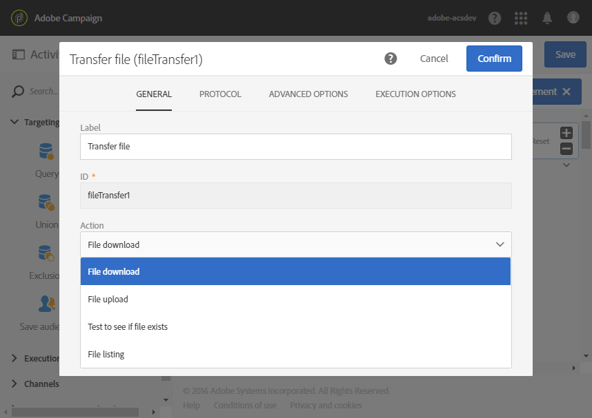

# Transferir arquivo{#transfer-file}

## Descrição {#description}

A atividade **[!UICONTROL Transfer file]** permite receber ou enviar arquivos, testar se há arquivos ou listar arquivos no Adobe Campaign.

>[!CAUTION]
>
>A partir da versão 20.3, os arquivos baixados com a atividade **[!UICONTROL Transfer File]** serão excluídos após X dias, em que X é determinado pelo campo **[!UICONTROL History in days]** no menu **[!UICONTROL Execution]** nas propriedades do fluxo de trabalho.

## Contexto de uso {#context-of-use}

O modo de extração de dados é definido quando a atividade é configurada. O arquivo que será carregado pode ser uma lista de contatos, por exemplo.

Você pode usar essa atividade para recuperar dados que serão estruturados com a atividade **[!UICONTROL Load file]**.

**Tópicos relacionados:**

* [Caso de uso: Atualização de dados com base em um download automático de arquivo](../../automating/using/update-data-automatic-download.md)

## Configuração {#configuration}

1. Solte uma atividade **[!UICONTROL Transfer file]** no seu fluxo de trabalho.
1. Selecione e abra a atividade usando o botão  das ações rápidas exibidas.
1. Use a lista suspensa no campo **[!UICONTROL Action]** para selecionar uma das seguintes ações da atividade:

   

   * **File download**: permite baixar um arquivo.
   * **File upload**: permite fazer upload de um arquivo. O upload de um arquivo do Adobe Campaign gera uma entrada de log no menu **[!UICONTROL Export audits]**. Para obter mais informações sobre auditorias de exportação, consulte a seção [Auditar exportações](../../administration/using/auditing-export-logs.md).
   * **Test to see if file exists**: permite verificar se há um arquivo.
   * **File listing**: permite listar os arquivos no servidor definido na guia **[!UICONTROL Protocol]**. Essa ação é usada principalmente para fins de depuração, para verificar se a atividade está configurada de acordo com suas necessidades antes de baixar os arquivos do servidor remoto.

1. Selecione o protocolo que deseja usar:
   * [HTTP](#HTTP-configuration-wf)
   * [SFTP](#SFTP-configuration-wf)
   * [Amazon S3](#S3-configuration-wf)
   * [Armazenamento de blobs do Microsoft Azure](#azure-blob-configuration-wf)
   * [Arquivos presentes no servidor do Adobe Campaign](#files-server-configuration-wf)

1. A seção **[!UICONTROL Additional options]**, disponível dependendo do protocolo selecionado, permite que adicionar parâmetros ao seu protocolo. Você pode:

   * **[!UICONTROL Delete the source files after transfer]**
   * **[!UICONTROL Disable passive mode]**
   * **[!UICONTROL List all files]**: esta opção está disponível ao selecionar a ação **[!UICONTROL File listing]** na guia **[!UICONTROL General]**. Ela permite indexar todos os arquivos no servidor na variável de evento **vars.filenames** na qual os nomes de arquivo são separados pelos caracteres **&#39;n&#39;**.

1. A seção **[!UICONTROL If no files are found]** da guia **[!UICONTROL Advanced options]** permite configurar ações específicas se forem detectados erros ou arquivos inexistentes quando a atividade for iniciada.

   Você também pode definir tentativas. As diferentes tentativas são exibidas no log de execução do fluxo de trabalho.

   

1. Confirme a configuração da sua atividade e salve o fluxo de trabalho.

### Configuração com HTTP {#HTTP-configuration-wf}

O protocolo HTTP permite iniciar o download de um arquivo de uma conta externa ou de um URL.

Com esse protocolo, você pode optar por **[!UICONTROL Use connection parameters defined in an external account]**. Nesse caso, selecione a conta desejada e especifique o caminho do arquivo para download.

Você também pode escolher a opção **[!UICONTROL Quick configuration]**. Você só precisa inserir o URL no campo URL.

### Configuração com SFTP {#SFTP-configuration-wf}

O protocolo SFTP permite iniciar o download de um arquivo de uma conta externa ou de um URL.

Com esse protocolo, você pode escolher a opção **[!UICONTROL Use connection parameters defined in an external account]**, selecionar a conta desejada e especificar o caminho do arquivo a ser baixado.

>[!CAUTION]
>
>São aceitos curingas.

Você também pode escolher a opção **[!UICONTROL Quick configuration]**. Você só precisa inserir o URL no campo URL.

### Configuração com o Amazon S3 {#S3-configuration-wf}

O protocolo Amazon S3 permite iniciar o download de um arquivo de um URL ou de uma conta externa por meio do Amazon Simple Storage Service (S3).

1. Selecione uma conta externa Amazon S3. Para obter mais informações, consulte esta [página](../../administration/using/external-accounts.md#amazon-s3-external-account).

2. Escolha se deseja **[!UICONTROL Define a file path]** ou **[!UICONTROL Use a dynamic file path]**.

3. Especifique o caminho do arquivo a ser baixado.

   

4. Se quiser excluir os arquivos de origem quando a transferência for concluída, marque **[!UICONTROL Delete the source files after transfer]**.

### Configuração com o armazenamento de blobs do Microsoft Azure {#azure-blob-configuration-wf}

O protocolo Blob do Microsoft Azure permite acessar o blob localizado em uma conta de armazenamento de blobs do Microsoft Azure.

1. Selecione uma conta externa **[!UICONTROL Microsoft Azure Blob]**. Para obter mais informações, consulte esta [página](../../administration/using/external-accounts.md#microsoft-azure-external-account).

1. Escolha se deseja **[!UICONTROL Define a file path]** ou **[!UICONTROL Use a dynamic file path]**.

   

1. Especifique o caminho do arquivo a ser baixado. Ele pode corresponder a vários blobs. Nesse caso, a atividade **[!UICONTROL File transfer]** ativará a transição de saída uma vez por blob encontrado. Depois eles serão processados em ordem alfabética.

   >[!CAUTION]
   >
   >Não são aceitos curingas correspondentes a vários nomes de arquivo. Nesse caso, insira um prefixo. Todos os nomes de blob correspondentes a esse prefixo serão qualificados.

   Você encontrará abaixo uma lista de exemplos de caminhos de arquivo:

   * **&quot;campaign/&quot;**: corresponde a todos os blobs na pasta do Campaign localizada na raiz do container.
   * **&quot;campaign/new-&quot;**: corresponde a todos os blobs com nome de arquivo começando com “new-” e localizados na pasta do Campaign.
   * **&quot;&quot;**: a adição de um caminho vazio permite fazer a correspondência de todos os blobs disponíveis no container.

### Configuração com os arquivos do servidor do Adobe Campaign {#files-server-configuration-wf}

O protocolo **[!UICONTROL File(s) present on the Adobe Campaign server]** corresponde ao repositório que contém os arquivos a serem recuperados.
É possível usar metacaracteres ou curingas (por exemplo, * ou ?) para filtrar arquivos.

Escolha se deseja **[!UICONTROL Define a file path]** ou **[!UICONTROL Use a dynamic file path]**.
A opção **[!UICONTROL Use a dynamic file path]** permite usar uma expressão padrão e variáveis de eventos para personalizar o nome do arquivo a ser transferido. Para obter mais informações, consulte esta seção: .

Observe que o caminho deve ser relativo ao diretório do espaço de armazenamento do servidor do Adobe Campaign. Os arquivos estão localizados no diretório **sftp&lt;yourinstancename>/**. Você também não pode pesquisar os diretórios acima do espaço de armazenamento. Por exemplo:

    >**user&amp;lt;yourinstancename>/my_recipients.csv** está correto.
    >
    >**../hello/my_recipients.csv** está incorreto.
    >
    >**//myserver/hello/myrecipients.csv** está incorreto.

## Configurações de histórico {#historization-settings}

Toda vez que uma atividade **[!UICONTROL Transfer file]** é executada, ela armazena os arquivos carregados ou baixados em uma pasta dedicada. Uma pasta é criada para cada atividade **[!UICONTROL Transfer file]** de um fluxo de trabalho. Portanto, é importante poder limitar o tamanho dessa pasta para preservar o espaço físico no servidor.

Para isso, você pode definir **[!UICONTROL Historization settings]** nas **[!UICONTROL Advanced options]** da atividade **[!UICONTROL Transfer File]**.

**[!UICONTROL Historization settings]** permite definir um número máximo de arquivos ou o tamanho total da pasta da atividade. Por padrão, 100 arquivos e 50 MB são autorizados.

Toda vez que a atividade é executada, a pasta é verificada da seguinte maneira:

* Somente os arquivos criados mais de 24 horas antes da execução da atividade são considerados.
* Se o número de arquivos considerados for maior que o valor do parâmetro **[!UICONTROL Maximum number of files]**, os arquivos mais antigos serão excluídos até que o **[!UICONTROL Maximum number of files]** permitido seja atingido.
* Se o tamanho total dos arquivos considerados for maior que o valor do parâmetro **[!UICONTROL Maximum size (in MB)]**, os arquivos mais antigos serão excluídos até que o **[!UICONTROL Maximum size (in MB)]** permitido seja atingido.

>[!NOTE]
>
>Se a atividade não for executada novamente, a pasta correspondente não será verificada nem eliminada. Por isso, tenha cuidado ao transferir arquivos grandes.
