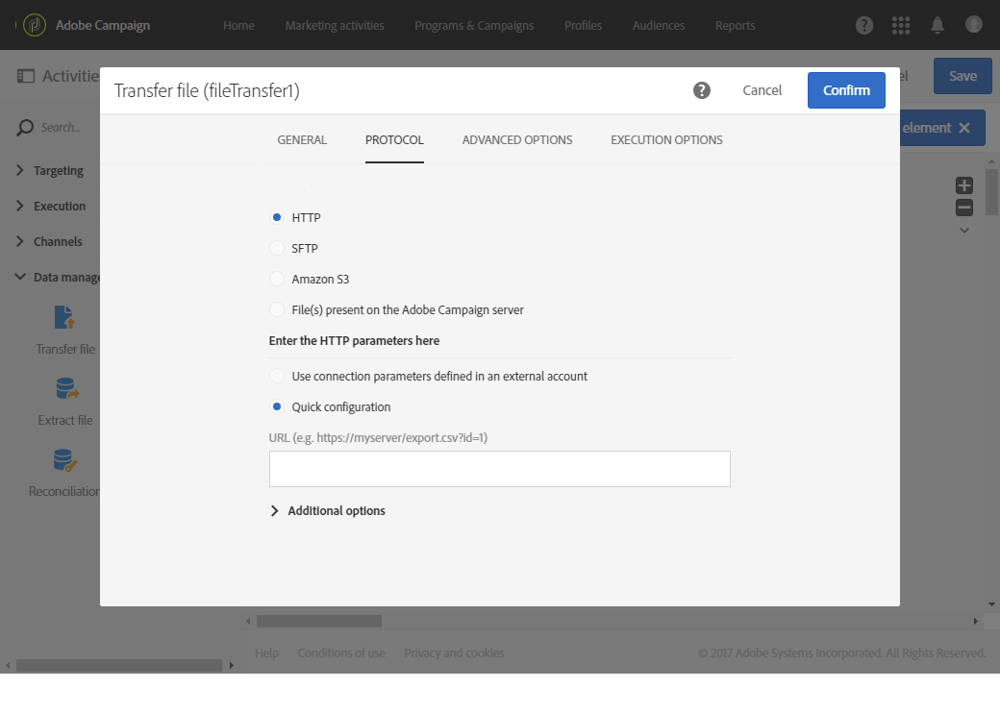

# Transferir arquivo{#transfer-file}

## Descrição {#description}

A **[!UICONTROL Transfer file]** atividade permite que você receba ou envie arquivos, teste se há arquivos presentes ou arquivos de lista no Adobe Campaign.

>[!CAUTION]
>
>A partir da versão 20.3, os arquivos baixados com a **[!UICONTROL Transfer File]** atividade serão excluídos após X dias, onde X é determinado pelo **[!UICONTROL History in days]** campo sob o **[!UICONTROL Execution]** menu nas propriedades do Workflow.

## Contexto de utilização {#context-of-use}

A forma como os dados serão extraídos é definida quando a atividade for configurada. O arquivo a ser carregado pode ser uma lista de contatos, por exemplo.

Você pode usar essa atividade para recuperar dados que serão estruturados com a **[!UICONTROL Load file]** atividade.

## Configuração {#configuration}

1. Solte uma **[!UICONTROL Transfer file]** atividade em seu fluxo de trabalho.
1. Selecione a atividade e abra-a usando o  botão das ações rápidas que aparecem.
1. Use a lista suspensa no **[!UICONTROL Action]** campo para selecionar uma das seguintes ações de atividade:

   

   * **Download** do arquivo: permite baixar um arquivo.
   * **Carregamento** de arquivo: permite carregar um arquivo. Fazer upload de um arquivo do Adobe Campaign gera uma entrada de registro no **[!UICONTROL Export audits]** menu. Para obter mais informações sobre auditorias de exportação, consulte a seção [Auditando exportações](../../administration/using/auditing-export-logs.md) .
   * **Teste para verificar se o arquivo existe**: permite verificar se há um arquivo.
   * **Lista** de arquivos: permite que você lista os arquivos presentes no servidor definido na **[!UICONTROL Protocol]** guia. Essa ação é usada principalmente para fins de depuração, para verificar se a atividade está configurada de acordo com suas necessidades antes de baixar os arquivos do servidor remoto.

1. Selecione o protocolo que deseja usar:
   * [HTTP](#HTTP-configuration-wf)
   * [SFTP](#SFTP-configuration-wf)
   * [Amazon S3](#S3-configuration-wf)
   * [armazenamento Blob do Microsoft Azure](#azure-blob-configuration-wf)
   * [Arquivo(s) presente(s) no servidor Adobe Campaign](#files-server-configuration-wf)

1. A **[!UICONTROL Additional options]** seção, disponível dependendo do protocolo selecionado, permite que você adicione parâmetros ao seu protocolo. É possível:

   * **[!UICONTROL Delete the source files after transfer]**
   * **[!UICONTROL Disable passive mode]**
   * **[!UICONTROL List all files]**: essa opção está disponível ao selecionar a **[!UICONTROL File listing]** ação.na **[!UICONTROL General]** guia. Ele permite indexar todos os arquivos presentes no servidor na variável de evento **vars.filennames** na qual os nomes de arquivos são separados pelos caracteres **&#39;n&#39;** .

1. A **[!UICONTROL If no files are found]** seção da **[!UICONTROL Advanced options]** guia permite configurar ações específicas se forem detectados erros ou arquivos inexistentes quando a atividade for iniciada.

   Você também pode definir tentativas. As diferentes tentativas são exibidas no log de execução do fluxo de trabalho.

   

1. Confirme a configuração da atividade e salve o fluxo de trabalho.

### Configuração com HTTP {#HTTP-configuration-wf}

O protocolo HTTP permite que você faça o start de um download de um arquivo de uma conta externa ou de um URL.

Com esse protol, você pode optar por **[!UICONTROL Use connection parameters defined in an external account]** . Nesse caso, selecione a conta que deseja e especifique o caminho do arquivo para download.

Você também pode escolher a **[!UICONTROL Quick configuration]** opção. Você só precisa digitar o URL no campo URL.

### Configuração com SFTP {#SFTP-configuration-wf}

O protocolo SFTP permite que você start o download de um arquivo a partir de um URL ou de uma conta externa.

Com esse procotol, você pode escolher a **[!UICONTROL Use connection parameters defined in an external account]** opção, em seguida, selecionar a conta que deseja e especificar o caminho do arquivo a ser baixado.

>[!CAUTION]
>
>Caracteres curinga são suportados.

Você também pode escolher a **[!UICONTROL Quick configuration]** opção. Você só precisa digitar o URL no campo URL.

### Configuração com o Amazon S3 {#S3-configuration-wf}

O protocolo Amazon S3 permite que você faça o start de baixar um arquivo de um URL ou de uma conta externa por meio do Amazon Simple Armazenamento Service (S3).

1. Selecione uma conta externa Amazon S3. Para obter mais informações, consulte esta [página](../../administration/using/external-accounts.md#amazon-s3-external-account).

2. Escolha se quiser **[!UICONTROL Define a file path]** ou **[!UICONTROL Use a dynamic file path]**.

3. Especifique o caminho do arquivo a ser baixado.

   

4. Se desejar excluir os arquivos de origem quando a transferência for concluída, marque **[!UICONTROL Delete the source files after transfer]**.

### Configuração com o armazenamento Blob do Microsoft Azure {#azure-blob-configuration-wf}

O protocolo Blob do Microsoft Azure permite acessar blob localizado em uma conta de Armazenamento Blob do Microsoft Azure.

1. Selecione uma **[!UICONTROL Microsoft Azure Blob]** conta externa. Para obter mais informações, consulte esta [página](../../administration/using/external-accounts.md#microsoft-azure-external-account).

1. Escolha se quiser **[!UICONTROL Define a file path]** ou **[!UICONTROL Use a dynamic file path]**.

   

1. Especifique o caminho do arquivo a ser baixado, ele pode corresponder a vários blobs. Nesse caso, a **[!UICONTROL File transfer]** atividade ativará a transição de saída uma vez por blob encontrado. Em seguida, serão processados em ordem alfabética.

   >[!CAUTION]
   >
   >Não há suporte para curingas que correspondam a vários nomes de arquivo. Em vez disso, é necessário inserir um prefixo. Todos os nomes de blob correspondentes a esse prefixo serão elegíveis.

   Você pode encontrar abaixo uma lista de exemplos de caminhos de arquivo:

   * **&quot;campanha/&quot;**: corresponde a todos os blobs na pasta de Campanha localizada na raiz do container.
   * **&quot;campanha/novo-&quot;**: corresponde a todos os blobs com um nome de arquivo que começa com &quot;new-&quot; e está localizado na pasta da Campanha.
   * **&quot;&quot;**: adicionar um caminho vazio permite que você corresponda a todos os blobs disponíveis no container.

### Configuração com arquivos presentes no servidor Adobe Campaign {#files-server-configuration-wf}

O **[!UICONTROL File(s) present on the Adobe Campaign server]** protocolo corresponde ao repositório que contém os arquivos a serem recuperados.
Metacaracteres ou curingas (por exemplo, * ou ?) pode ser usado para filtrar arquivos.

Escolha se você deseja ou **[!UICONTROL Define a file path]** A **[!UICONTROL Use a dynamic file path]****[!UICONTROL Use a dynamic file path]** opção permite que você use uma expressão padrão e variáveis de eventos para personalizar o nome do arquivo a ser transferido. Para obter mais informações, consulte a seção [Personalizar atividades com variáveis](../../automating/using/calling-a-workflow-with-external-parameters.md#customizing-activities-with-events-variables) de eventos.

Observe que o caminho deve ser relativo ao diretório de espaço do armazenamento do servidor Adobe Campaign. Os arquivos estão localizados no diretório **sftp&lt;yourinstancename>/** . Você também não pode navegar pelos diretórios acima do espaço do armazenamento. Por exemplo:

    >**user&amp;lt;yourinstancename>/my_recipients.csv** está correto.
    >
    >**../hello/my_recipients.csv** está incorreto.
    >
    >**//myserver/hello/myrecipients.csv** está incorreto.

## Configurações de histórico {#historization-settings}

Toda vez que uma **[!UICONTROL Transfer file]** atividade é executada, ela armazena os arquivos carregados ou baixados em uma pasta dedicada. Uma pasta é criada para cada **[!UICONTROL Transfer file]** atividade de um fluxo de trabalho. Portanto, é importante poder limitar o tamanho desta pasta para preservar o espaço físico no servidor.

Para fazer isso, você pode definir **[!UICONTROL Historization settings]** na parte **[!UICONTROL Advanced options]** da **[!UICONTROL Transfer File]** atividade.

**[!UICONTROL Historization settings]** permite definir um número máximo de arquivos ou o tamanho total para a pasta atividade. Por padrão, 100 arquivos e 50 MB são autorizados.

Toda vez que a atividade é executada, a pasta é verificada da seguinte maneira:

* Somente os arquivos criados mais de 24 horas antes da execução da atividade são considerados.
* Se o número de arquivos considerados for maior que o valor do **[!UICONTROL Maximum number of files]** parâmetro, os arquivos mais antigos serão excluídos até que o **[!UICONTROL Maximum number of files]** permitido seja atingido.
* Se o tamanho total de arquivos considerados for maior que o valor do **[!UICONTROL Maximum size (in MB)]** parâmetro, os arquivos mais antigos serão excluídos até que o **[!UICONTROL Maximum size (in MB)]** permitido seja atingido.

>[!NOTE]
>
>Se a atividade não for executada novamente, sua pasta não será verificada nem removida. Pensando nisso, tenha cuidado ao transferir arquivos grandes.

## Exemplo {#example}

O exemplo a seguir mostra a configuração de uma atividade de transferência **de** Arquivo que será seguida por uma atividade de arquivo **** Carregar e depois por uma atividade de dados **** Atualizar. O objetivo desse fluxo de trabalho é adicionar ou atualizar os perfis do banco de dados do Adobe Campaign com os dados recuperados pelo fluxo de trabalho.

1. Arraste e solte uma atividade de arquivo **de** transferência no seu fluxo de trabalho.
1. Selecione a atividade e abra-a usando o  botão das ações rápidas que aparecem.
1. Na **[!UICONTROL Protocol]** guia, selecione **SFTP**.
1. Selecione **Usar parâmetros de conexão definidos em uma opção de conta externa** .
1. Digite o nome da conta externa.
1. Digite o caminho **Arquivo no servidor** remoto.

   

1. Confirme sua atividade e salve seu fluxo de trabalho.

